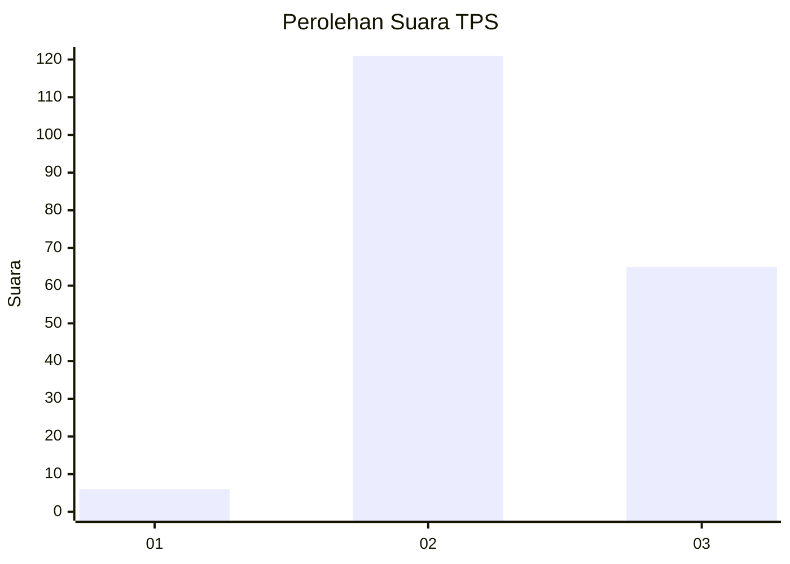
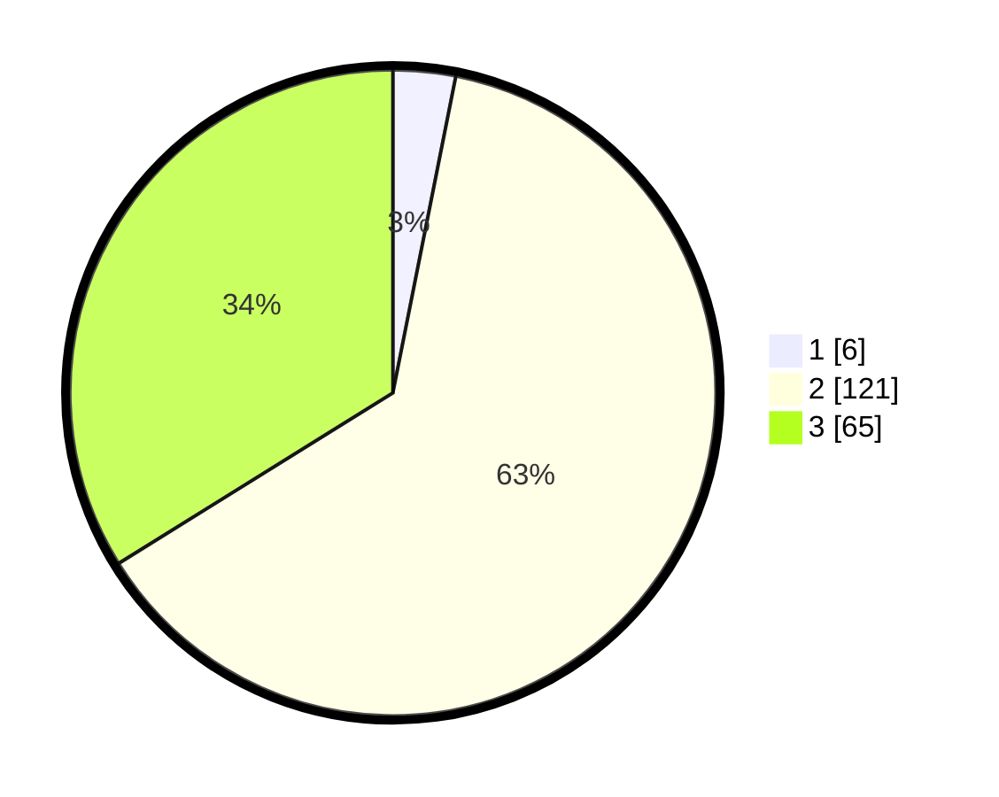

# Hasil

## Grafik

## Tabel

| No. | Nama Paslon    | Suara | Suara (raw) | Persentase |
|:--- |:-------------- | -----:| -----------:| ----------:|
| 1   | ANIES MUHAIMIN | 6     | [6][p-1]    | 3,13       |
| 2   | PRABOWO GIBRAN | 121   | [121][p-2]  | 63,02      |
| 3   | GANJAR MAHFUD  | 65    | [65][p-3]   | 33,85      |

[p-1]: https://github.com/gigit-pemilu/pemilu-2024/blob/main/pilpres/hitung-suara/sub/12-sumatera-utara/sub/04-nias/sub/05-hiliduho/sub/2028-lasara-tanose'o/sub/002-tps/sub/paslon-1.txt
[p-2]: https://github.com/gigit-pemilu/pemilu-2024/blob/main/pilpres/hitung-suara/sub/12-sumatera-utara/sub/04-nias/sub/05-hiliduho/sub/2028-lasara-tanose'o/sub/002-tps/sub/paslon-2.txt
[p-3]: https://github.com/gigit-pemilu/pemilu-2024/blob/main/pilpres/hitung-suara/sub/12-sumatera-utara/sub/04-nias/sub/05-hiliduho/sub/2028-lasara-tanose'o/sub/002-tps/sub/paslon-3.txt

## Foto C Plano

https://sirekap-obj-formc.kpu.go.id/9ba0/pemilu/ppwp/12/04/05/20/28/1204052028002-20240215-042737--70cb1d27-b7cc-4c7f-bfbf-2925083cbaba.jpg

https://sirekap-obj-formc.kpu.go.id/9ba0/pemilu/ppwp/12/04/05/20/28/1204052028002-20240215-042512--27f1de26-c905-459c-84fd-a165c7129eb4.jpg

https://sirekap-obj-formc.kpu.go.id/9ba0/pemilu/ppwp/12/04/05/20/28/1204052028002-20240215-042931--dc4686e7-a468-4234-b669-ba7e334c02d5.jpg

## Metadata

| Key        | Value               |
| ---------- | ------------------- |
| Time Stamp | 2024-02-15 15:00:29 |

