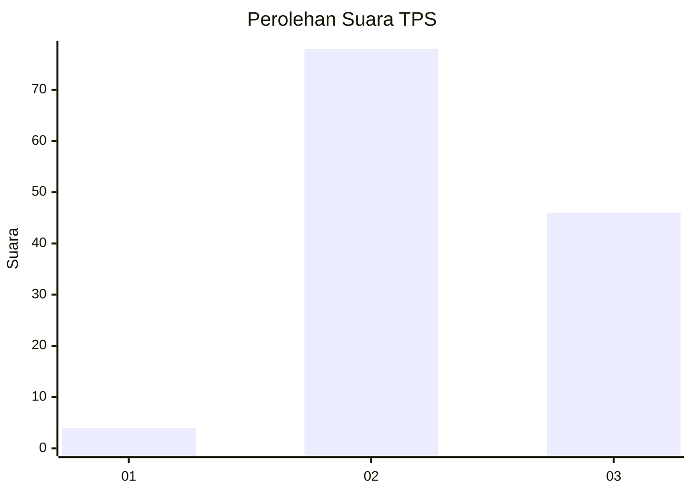
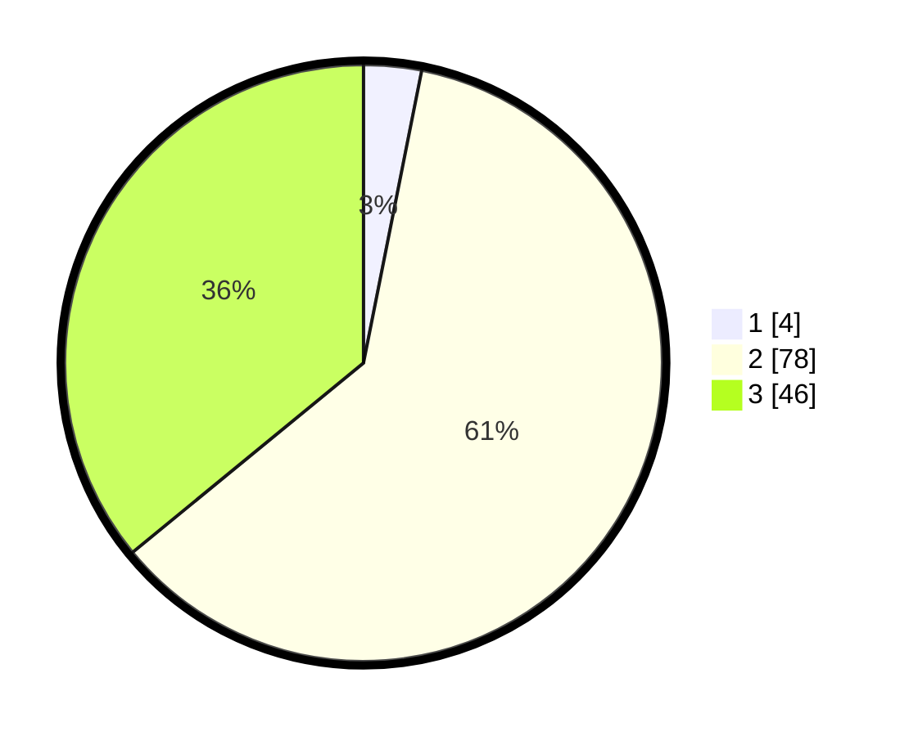

# Hasil

## Grafik

## Tabel

| No. | Nama Paslon    | Suara | Suara (raw) | Persentase |
|:--- |:-------------- | -----:| -----------:| ----------:|
| 1   | ANIES MUHAIMIN | 4     | [4][p-1]    | 3,13       |
| 2   | PRABOWO GIBRAN | 78    | [78][p-2]   | 60,94      |
| 3   | GANJAR MAHFUD  | 46    | [46][p-3]   | 35,94      |

[p-1]: https://github.com/gigit-pemilu/pemilu-2024/blob/main/pilpres/hitung-suara/sub/12-sumatera-utara/sub/04-nias/sub/06-gido/sub/2016-hilisebua/sub/002-tps/sub/paslon-1.txt
[p-2]: https://github.com/gigit-pemilu/pemilu-2024/blob/main/pilpres/hitung-suara/sub/12-sumatera-utara/sub/04-nias/sub/06-gido/sub/2016-hilisebua/sub/002-tps/sub/paslon-2.txt
[p-3]: https://github.com/gigit-pemilu/pemilu-2024/blob/main/pilpres/hitung-suara/sub/12-sumatera-utara/sub/04-nias/sub/06-gido/sub/2016-hilisebua/sub/002-tps/sub/paslon-3.txt

## Foto C Plano

https://sirekap-obj-formc.kpu.go.id/ed44/pemilu/ppwp/12/04/06/20/16/1204062016002-20240214-160102--353dc9a7-946b-4965-be2c-64754c6ec243.jpg

https://sirekap-obj-formc.kpu.go.id/ed44/pemilu/ppwp/12/04/06/20/16/1204062016002-20240214-155739--c136184f-e6ce-400a-8ba1-ca40670b6879.jpg

https://sirekap-obj-formc.kpu.go.id/ed44/pemilu/ppwp/12/04/06/20/16/1204062016002-20240214-155922--c7871606-f50e-465d-9e86-fb17f3e887da.jpg

## Metadata

| Key        | Value               |
| ---------- | ------------------- |
| Time Stamp | 2024-02-15 15:00:29 |

