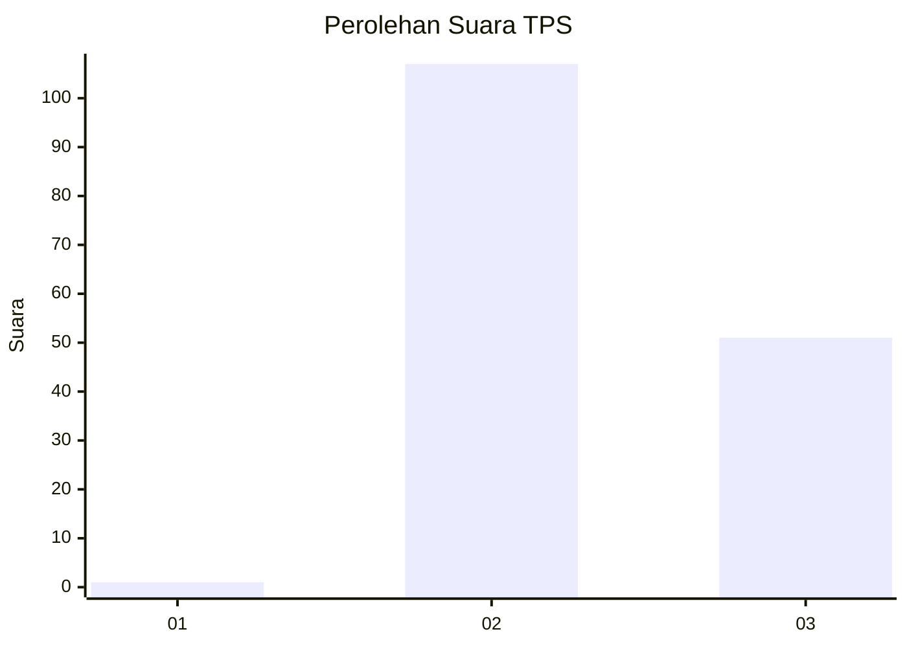
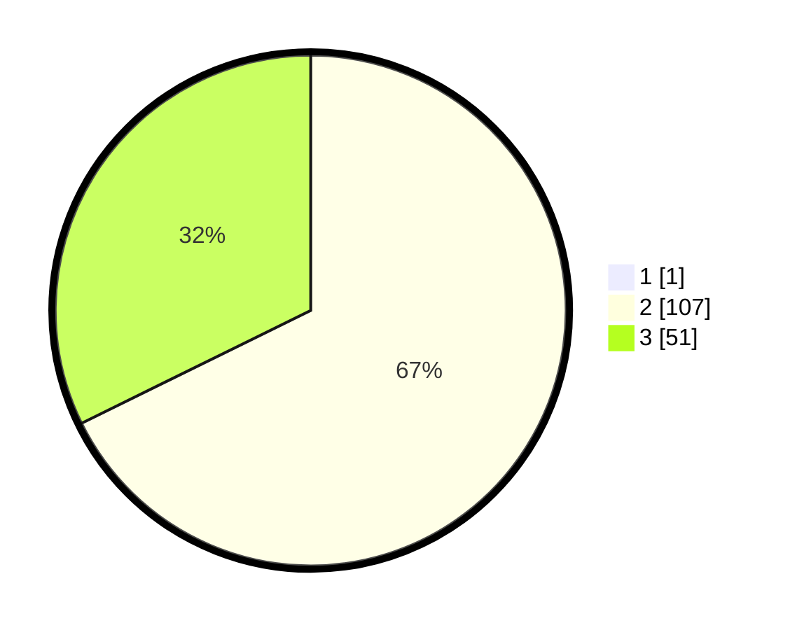

# Hasil

## Grafik

## Tabel

| No. | Nama Paslon    | Suara | Suara (raw) | Persentase |
|:--- |:-------------- | -----:| -----------:| ----------:|
| 1   | ANIES MUHAIMIN | 1     | [1][p-1]    | 0,63       |
| 2   | PRABOWO GIBRAN | 107   | [107][p-2]  | 67,30      |
| 3   | GANJAR MAHFUD  | 51    | [51][p-3]   | 32,08      |

[p-1]: https://github.com/gigit-pemilu/pemilu-2024/blob/main/pilpres/hitung-suara/sub/12-sumatera-utara/sub/04-nias/sub/06-gido/sub/2018-sirete/sub/002-tps/sub/paslon-1.txt
[p-2]: https://github.com/gigit-pemilu/pemilu-2024/blob/main/pilpres/hitung-suara/sub/12-sumatera-utara/sub/04-nias/sub/06-gido/sub/2018-sirete/sub/002-tps/sub/paslon-2.txt
[p-3]: https://github.com/gigit-pemilu/pemilu-2024/blob/main/pilpres/hitung-suara/sub/12-sumatera-utara/sub/04-nias/sub/06-gido/sub/2018-sirete/sub/002-tps/sub/paslon-3.txt

## Foto C Plano

https://sirekap-obj-formc.kpu.go.id/fb9b/pemilu/ppwp/12/04/06/20/18/1204062018002-20240215-001412--ca0bd7a0-f346-40e4-8ab6-939305373fa3.jpg

https://sirekap-obj-formc.kpu.go.id/fb9b/pemilu/ppwp/12/04/06/20/18/1204062018002-20240214-230619--07e43343-a2d4-45e2-8c44-d5d7fa334cf0.jpg

https://sirekap-obj-formc.kpu.go.id/fb9b/pemilu/ppwp/12/04/06/20/18/1204062018002-20240214-230956--e5d0de46-792a-497a-a79a-15bd2c6b7e85.jpg

## Metadata

| Key        | Value               |
| ---------- | ------------------- |
| Time Stamp | 2024-02-16 01:00:27 |

