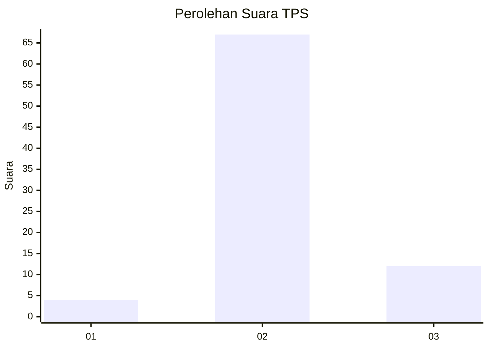
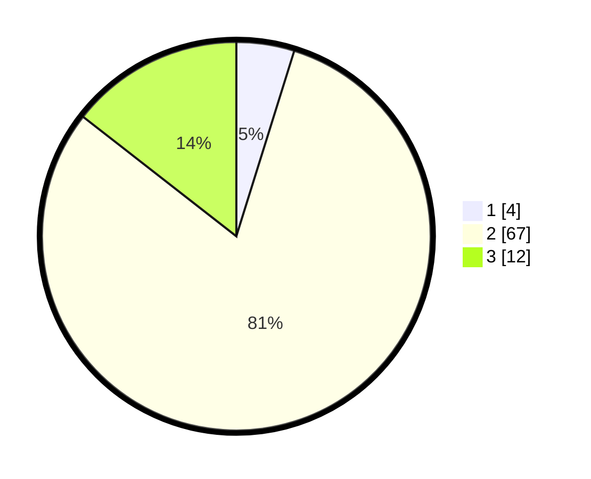

# Hasil

## Grafik

## Tabel

| No. | Nama Paslon    | Suara | Suara (raw) | Persentase |
|:--- |:-------------- | -----:| -----------:| ----------:|
| 1   | ANIES MUHAIMIN | 4     | [4][p-1]    | 4,82       |
| 2   | PRABOWO GIBRAN | 67    | [67][p-2]   | 80,72      |
| 3   | GANJAR MAHFUD  | 12    | [12][p-3]   | 14,46      |

[p-1]: https://github.com/gigit-pemilu/pemilu-2024-12-sumatera-utara/blob/main/pilpres/hitung-suara/sub/12-sumatera-utara/sub/04-nias/sub/06-gido/sub/2024-ladea/sub/003-tps/sub/paslon-1.txt
[p-2]: https://github.com/gigit-pemilu/pemilu-2024-12-sumatera-utara/blob/main/pilpres/hitung-suara/sub/12-sumatera-utara/sub/04-nias/sub/06-gido/sub/2024-ladea/sub/003-tps/sub/paslon-2.txt
[p-3]: https://github.com/gigit-pemilu/pemilu-2024-12-sumatera-utara/blob/main/pilpres/hitung-suara/sub/12-sumatera-utara/sub/04-nias/sub/06-gido/sub/2024-ladea/sub/003-tps/sub/paslon-3.txt

## Foto C Plano

https://sirekap-obj-formc.kpu.go.id/2366/pemilu/ppwp/12/04/06/20/24/1204062024003-20240215-125811--d7aebd1b-d685-42d9-860f-9ef8ae653b88.jpg

https://sirekap-obj-formc.kpu.go.id/2366/pemilu/ppwp/12/04/06/20/24/1204062024003-20240215-125827--e232b1ec-4e40-45b5-839a-d529801b1572.jpg

https://sirekap-obj-formc.kpu.go.id/2366/pemilu/ppwp/12/04/06/20/24/1204062024003-20240215-125843--49e0ecd5-9973-4a33-96d1-ad352c206bcf.jpg

## Metadata

| Key        | Value               |
| ---------- | ------------------- |
| Time Stamp | 2024-02-15 15:00:29 |

