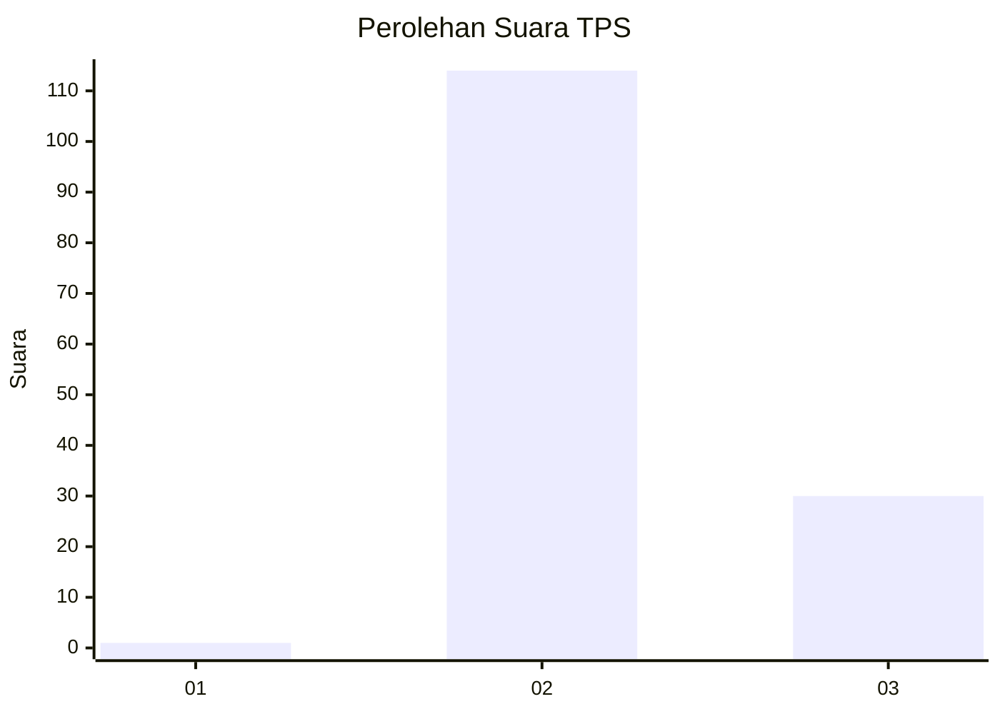
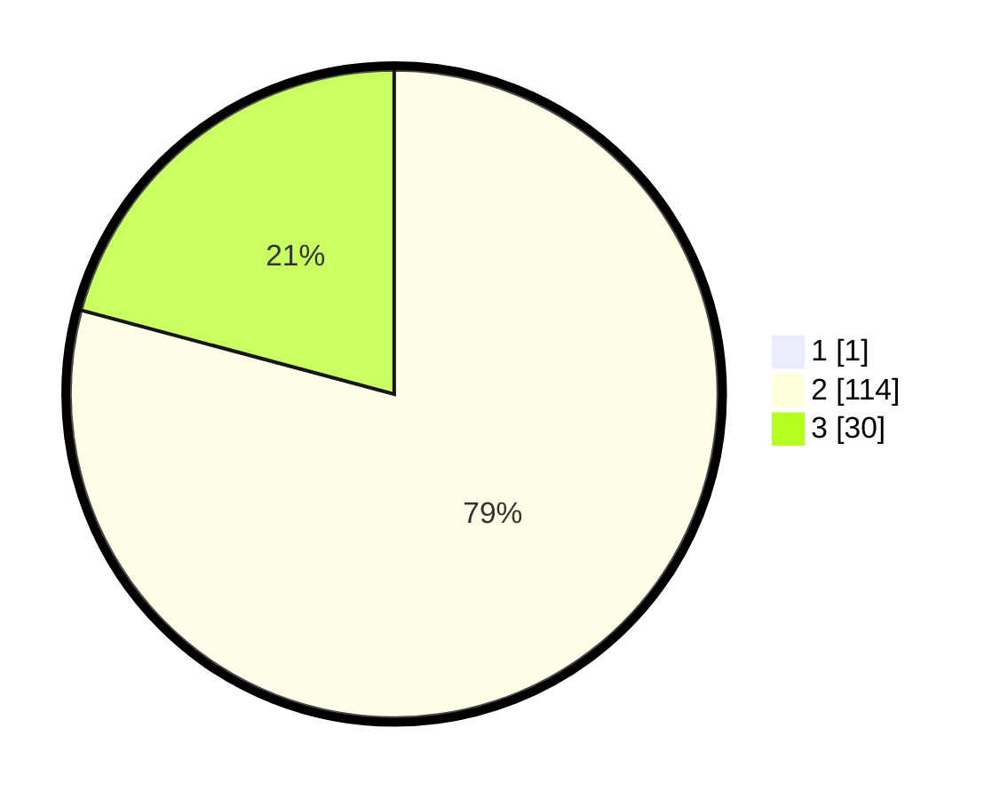

# Hasil

## Grafik

## Tabel

| No. | Nama Paslon    | Suara | Suara (raw) | Persentase |
|:--- |:-------------- | -----:| -----------:| ----------:|
| 1   | ANIES MUHAIMIN | 1     | [1][p-1]    | 0,69       |
| 2   | PRABOWO GIBRAN | 114   | [114][p-2]  | 78,62      |
| 3   | GANJAR MAHFUD  | 30    | [30][p-3]   | 20,69      |

[p-1]: https://github.com/gigit-pemilu/pemilu-2024/blob/main/pilpres/hitung-suara/sub/12-sumatera-utara/sub/04-nias/sub/06-gido/sub/2030-lasara-idanoi/sub/004-tps/sub/paslon-1.txt
[p-2]: https://github.com/gigit-pemilu/pemilu-2024/blob/main/pilpres/hitung-suara/sub/12-sumatera-utara/sub/04-nias/sub/06-gido/sub/2030-lasara-idanoi/sub/004-tps/sub/paslon-2.txt
[p-3]: https://github.com/gigit-pemilu/pemilu-2024/blob/main/pilpres/hitung-suara/sub/12-sumatera-utara/sub/04-nias/sub/06-gido/sub/2030-lasara-idanoi/sub/004-tps/sub/paslon-3.txt

## Foto C Plano

https://sirekap-obj-formc.kpu.go.id/df4b/pemilu/ppwp/12/04/06/20/30/1204062030004-20240215-002427--c5c5e8ae-1387-4ee0-a3ea-455fa2f12304.jpg

https://sirekap-obj-formc.kpu.go.id/df4b/pemilu/ppwp/12/04/06/20/30/1204062030004-20240215-002448--5efe3720-f93f-4aa0-9e2d-27044ab6ebad.jpg

https://sirekap-obj-formc.kpu.go.id/df4b/pemilu/ppwp/12/04/06/20/30/1204062030004-20240215-002506--9129a2a5-8212-4e57-9d7e-df9374717afc.jpg

## Metadata

| Key        | Value               |
| ---------- | ------------------- |
| Time Stamp | 2024-02-15 15:00:29 |

