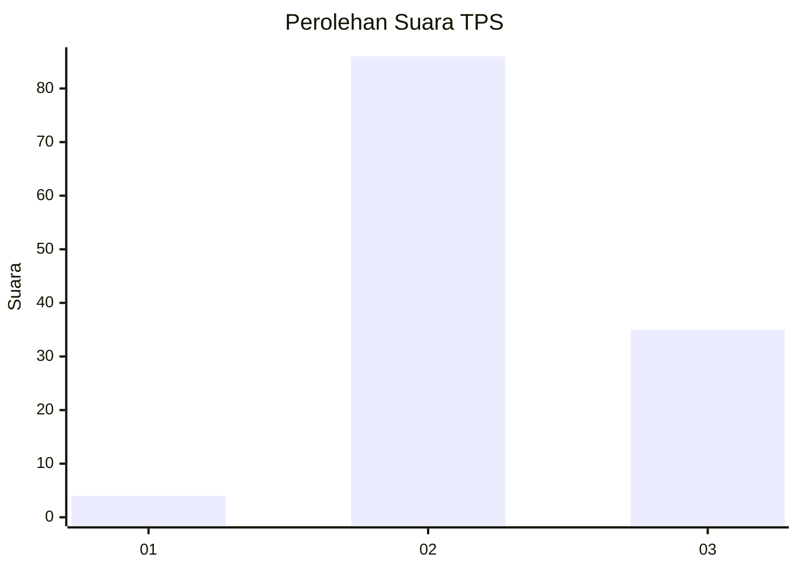
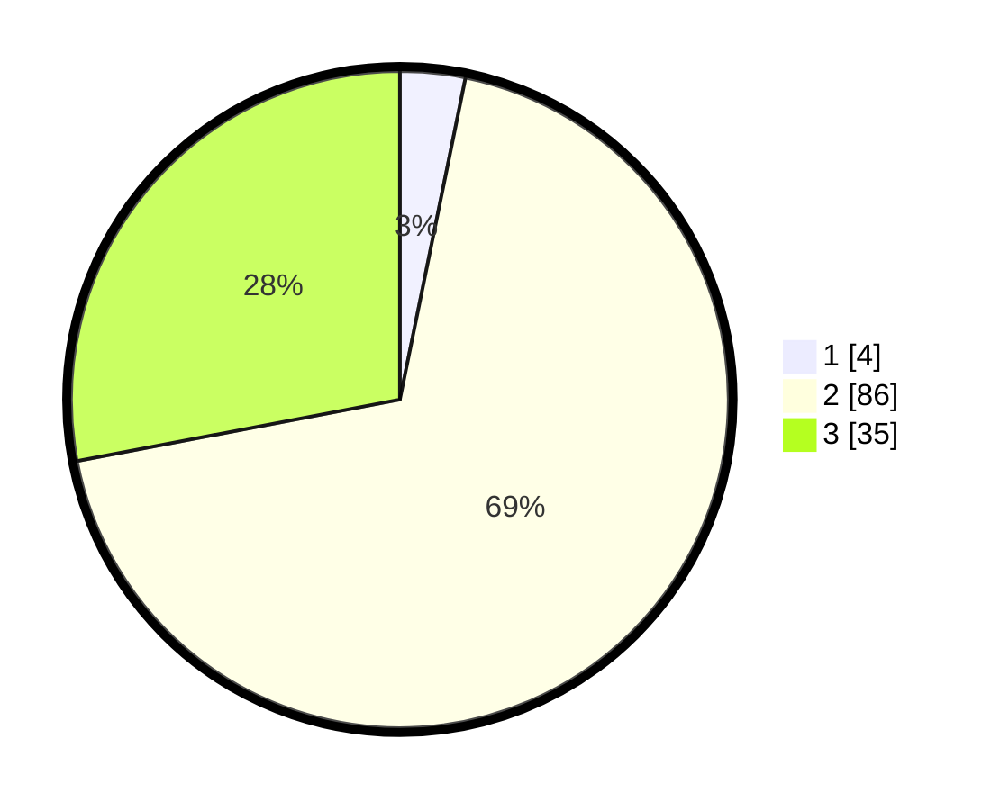

# Hasil

## Grafik

## Tabel

| No. | Nama Paslon    | Suara | Suara (raw) | Persentase |
|:--- |:-------------- | -----:| -----------:| ----------:|
| 1   | ANIES MUHAIMIN | 4     | [4][p-1]    | 3,20       |
| 2   | PRABOWO GIBRAN | 86    | [86][p-2]   | 68,80      |
| 3   | GANJAR MAHFUD  | 35    | [35][p-3]   | 28,00      |

[p-1]: https://github.com/gigit-pemilu/pemilu-2024/blob/main/pilpres/hitung-suara/sub/12-sumatera-utara/sub/04-nias/sub/06-gido/sub/2030-lasara-idanoi/sub/005-tps/sub/paslon-1.txt
[p-2]: https://github.com/gigit-pemilu/pemilu-2024/blob/main/pilpres/hitung-suara/sub/12-sumatera-utara/sub/04-nias/sub/06-gido/sub/2030-lasara-idanoi/sub/005-tps/sub/paslon-2.txt
[p-3]: https://github.com/gigit-pemilu/pemilu-2024/blob/main/pilpres/hitung-suara/sub/12-sumatera-utara/sub/04-nias/sub/06-gido/sub/2030-lasara-idanoi/sub/005-tps/sub/paslon-3.txt

## Foto C Plano

https://sirekap-obj-formc.kpu.go.id/5ddc/pemilu/ppwp/12/04/06/20/30/1204062030005-20240215-091516--954a2b68-06b3-4db9-b35c-b4c16bec859a.jpg

https://sirekap-obj-formc.kpu.go.id/5ddc/pemilu/ppwp/12/04/06/20/30/1204062030005-20240215-091615--412af285-42fd-4ab3-928c-568d084b3f7a.jpg

https://sirekap-obj-formc.kpu.go.id/5ddc/pemilu/ppwp/12/04/06/20/30/1204062030005-20240215-091827--6732f9cf-3be6-43df-bb26-959496ac46a2.jpg

## Metadata

| Key        | Value               |
| ---------- | ------------------- |
| Time Stamp | 2024-02-15 16:00:26 |

