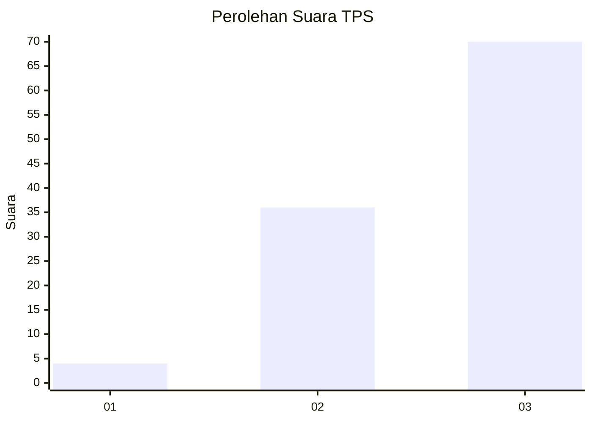
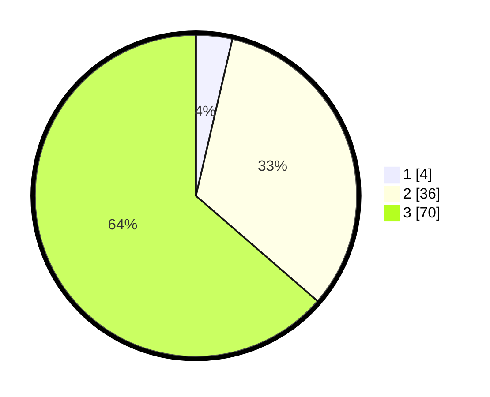

# Hasil

## Grafik

## Tabel

| No. | Nama Paslon    | Suara | Suara (raw) | Persentase |
|:--- |:-------------- | -----:| -----------:| ----------:|
| 1   | ANIES MUHAIMIN | 4     | [4][p-1]    | 3,64       |
| 2   | PRABOWO GIBRAN | 36    | [36][p-2]   | 32,73      |
| 3   | GANJAR MAHFUD  | 70    | [70][p-3]   | 63,64      |

[p-1]: https://github.com/gigit-pemilu/pemilu-2024-12-sumatera-utara/blob/main/pilpres/hitung-suara/sub/12-sumatera-utara/sub/04-nias/sub/06-gido/sub/2051-ladea-orahua/sub/001-tps/sub/paslon-1.txt
[p-2]: https://github.com/gigit-pemilu/pemilu-2024-12-sumatera-utara/blob/main/pilpres/hitung-suara/sub/12-sumatera-utara/sub/04-nias/sub/06-gido/sub/2051-ladea-orahua/sub/001-tps/sub/paslon-2.txt
[p-3]: https://github.com/gigit-pemilu/pemilu-2024-12-sumatera-utara/blob/main/pilpres/hitung-suara/sub/12-sumatera-utara/sub/04-nias/sub/06-gido/sub/2051-ladea-orahua/sub/001-tps/sub/paslon-3.txt

## Foto C Plano

https://sirekap-obj-formc.kpu.go.id/bd55/pemilu/ppwp/12/04/06/20/51/1204062051001-20240214-190407--1e5b3865-5c5a-4fe7-b9ee-55549d460df7.jpg

https://sirekap-obj-formc.kpu.go.id/bd55/pemilu/ppwp/12/04/06/20/51/1204062051001-20240214-190509--51dc093d-0809-4055-9cd8-0f04c14f9859.jpg

https://sirekap-obj-formc.kpu.go.id/bd55/pemilu/ppwp/12/04/06/20/51/1204062051001-20240214-190317--ace84c33-e766-48d7-b42b-2aea4d913685.jpg

## Metadata

| Key        | Value               |
| ---------- | ------------------- |
| Time Stamp | 2024-02-15 15:00:29 |

