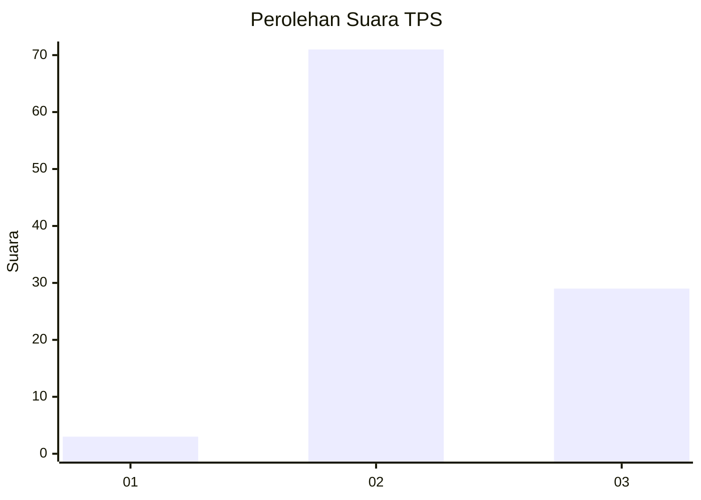
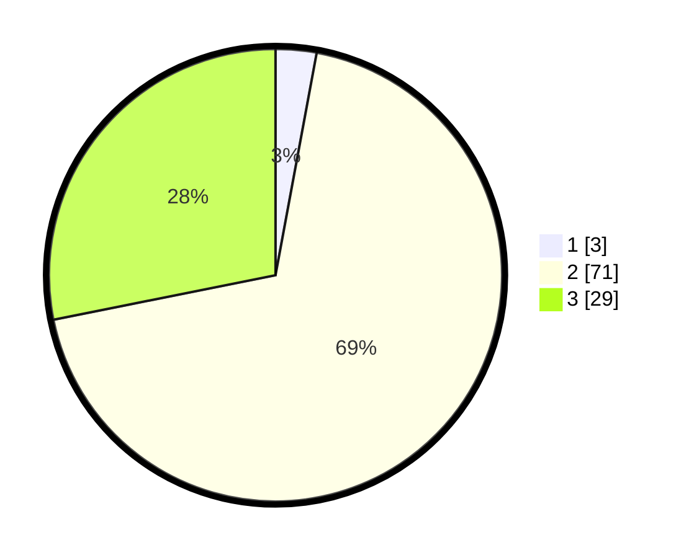

# Hasil

## Grafik

## Tabel

| No. | Nama Paslon    | Suara | Suara (raw) | Persentase |
|:--- |:-------------- | -----:| -----------:| ----------:|
| 1   | ANIES MUHAIMIN | 3     | [3][p-1]    | 2,91       |
| 2   | PRABOWO GIBRAN | 71    | [71][p-2]   | 68,93      |
| 3   | GANJAR MAHFUD  | 29    | [29][p-3]   | 28,16      |

[p-1]: https://github.com/gigit-pemilu/pemilu-2024/blob/main/pilpres/hitung-suara/sub/12-sumatera-utara/sub/04-nias/sub/06-gido/sub/2051-ladea-orahua/sub/002-tps/sub/paslon-1.txt
[p-2]: https://github.com/gigit-pemilu/pemilu-2024/blob/main/pilpres/hitung-suara/sub/12-sumatera-utara/sub/04-nias/sub/06-gido/sub/2051-ladea-orahua/sub/002-tps/sub/paslon-2.txt
[p-3]: https://github.com/gigit-pemilu/pemilu-2024/blob/main/pilpres/hitung-suara/sub/12-sumatera-utara/sub/04-nias/sub/06-gido/sub/2051-ladea-orahua/sub/002-tps/sub/paslon-3.txt

## Foto C Plano

https://sirekap-obj-formc.kpu.go.id/308b/pemilu/ppwp/12/04/06/20/51/1204062051002-20240215-010335--4ff6e8c6-88f3-4777-a7b4-d3d00e97235d.jpg

https://sirekap-obj-formc.kpu.go.id/308b/pemilu/ppwp/12/04/06/20/51/1204062051002-20240215-010511--79fed0fc-3063-4cb0-afec-528a2f5ecd66.jpg

https://sirekap-obj-formc.kpu.go.id/308b/pemilu/ppwp/12/04/06/20/51/1204062051002-20240215-010605--63664604-f9d2-4026-8c08-686f49fc343f.jpg

## Metadata

| Key        | Value               |
| ---------- | ------------------- |
| Time Stamp | 2024-02-15 15:00:29 |

