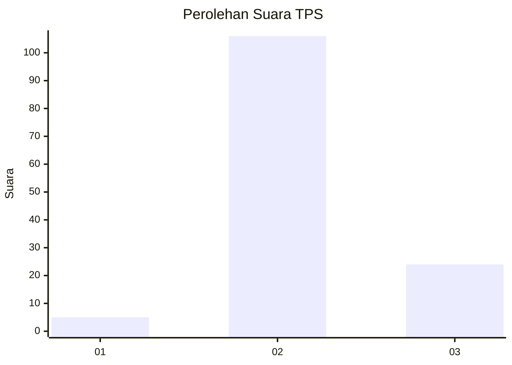

# Hasil

## Grafik

## Tabel

| No. | Nama Paslon    | Suara | Suara (raw) | Persentase |
|:--- |:-------------- | -----:| -----------:| ----------:|
| 1   | ANIES MUHAIMIN | 5     | [5][p-1]    | 3,70       |
| 2   | PRABOWO GIBRAN | 106   | [106][p-2]  | 78,52      |
| 3   | GANJAR MAHFUD  | 24    | [24][p-3]   | 17,78      |

[p-1]: https://github.com/gigit-pemilu/pemilu-2024-12-sumatera-utara/blob/main/pilpres/hitung-suara/sub/12-sumatera-utara/sub/04-nias/sub/06-gido/sub/2053-nifalo'olauru/sub/001-tps/sub/paslon-1.txt
[p-2]: https://github.com/gigit-pemilu/pemilu-2024-12-sumatera-utara/blob/main/pilpres/hitung-suara/sub/12-sumatera-utara/sub/04-nias/sub/06-gido/sub/2053-nifalo'olauru/sub/001-tps/sub/paslon-2.txt
[p-3]: https://github.com/gigit-pemilu/pemilu-2024-12-sumatera-utara/blob/main/pilpres/hitung-suara/sub/12-sumatera-utara/sub/04-nias/sub/06-gido/sub/2053-nifalo'olauru/sub/001-tps/sub/paslon-3.txt

## Foto C Plano

https://sirekap-obj-formc.kpu.go.id/f592/pemilu/ppwp/12/04/06/20/53/1204062053001-20240214-222605--cf3a4dba-1ce1-443a-bfd0-19fe6df44f01.jpg

https://sirekap-obj-formc.kpu.go.id/f592/pemilu/ppwp/12/04/06/20/53/1204062053001-20240214-222829--9888c6ce-3a85-4ffd-b99f-c9fd9d79c5f1.jpg

https://sirekap-obj-formc.kpu.go.id/f592/pemilu/ppwp/12/04/06/20/53/1204062053001-20240214-223026--02e7321a-188b-4d84-9903-28b7a2ac78e1.jpg

## Metadata

| Key        | Value               |
| ---------- | ------------------- |
| Time Stamp | 2024-02-15 15:00:29 |

