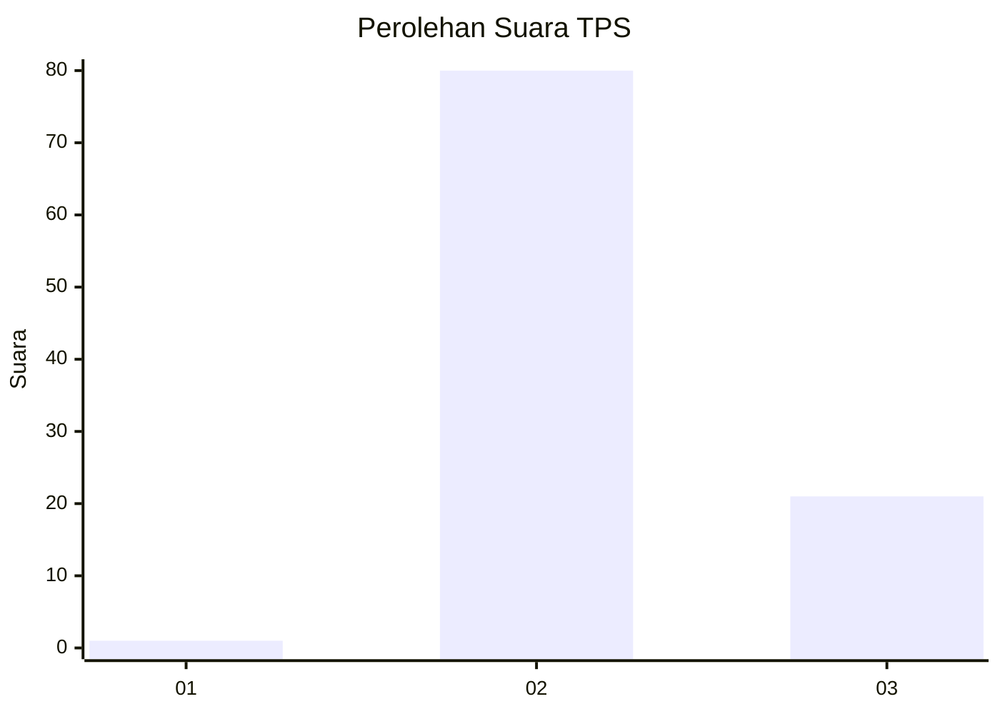
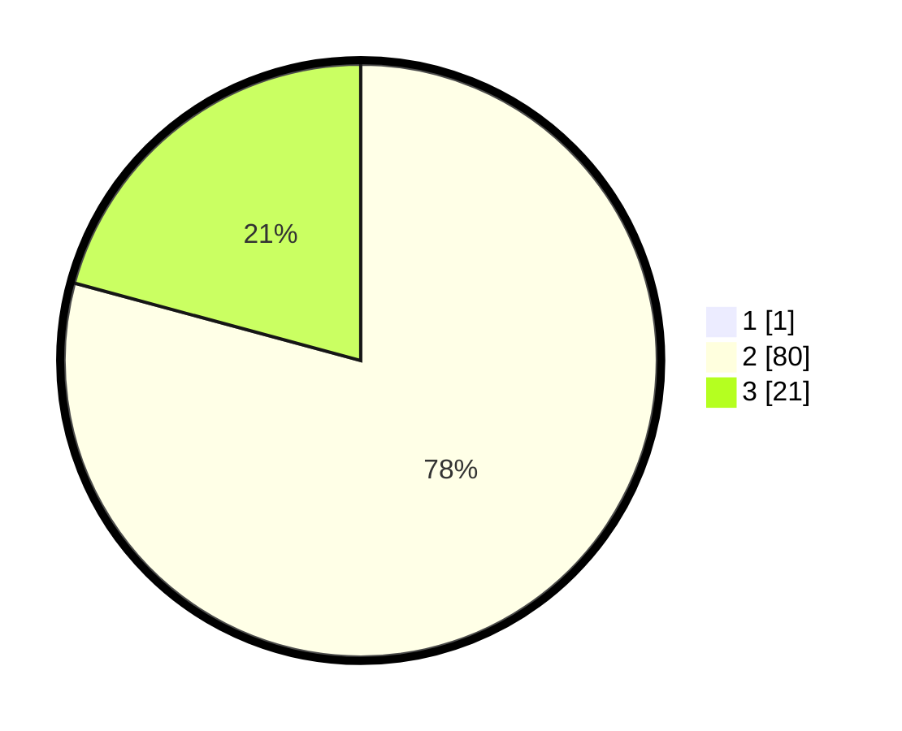

# Hasil

## Grafik

## Tabel

| No. | Nama Paslon    | Suara | Suara (raw) | Persentase |
|:--- |:-------------- | -----:| -----------:| ----------:|
| 1   | ANIES MUHAIMIN | 1     | [1][p-1]    | 0,98       |
| 2   | PRABOWO GIBRAN | 80    | [80][p-2]   | 78,43      |
| 3   | GANJAR MAHFUD  | 21    | [21][p-3]   | 20,59      |

[p-1]: https://github.com/gigit-pemilu/pemilu-2024-12-sumatera-utara/blob/main/pilpres/hitung-suara/sub/12-sumatera-utara/sub/04-nias/sub/06-gido/sub/2053-nifalo'olauru/sub/002-tps/sub/paslon-1.txt
[p-2]: https://github.com/gigit-pemilu/pemilu-2024-12-sumatera-utara/blob/main/pilpres/hitung-suara/sub/12-sumatera-utara/sub/04-nias/sub/06-gido/sub/2053-nifalo'olauru/sub/002-tps/sub/paslon-2.txt
[p-3]: https://github.com/gigit-pemilu/pemilu-2024-12-sumatera-utara/blob/main/pilpres/hitung-suara/sub/12-sumatera-utara/sub/04-nias/sub/06-gido/sub/2053-nifalo'olauru/sub/002-tps/sub/paslon-3.txt

## Foto C Plano

https://sirekap-obj-formc.kpu.go.id/8cd0/pemilu/ppwp/12/04/06/20/53/1204062053002-20240214-232338--a82acc24-a6f1-4325-8484-d3f18ce83730.jpg

https://sirekap-obj-formc.kpu.go.id/8cd0/pemilu/ppwp/12/04/06/20/53/1204062053002-20240214-232031--e82eea30-0bea-4bc0-8f4e-e8f404007bc6.jpg

https://sirekap-obj-formc.kpu.go.id/8cd0/pemilu/ppwp/12/04/06/20/53/1204062053002-20240214-231827--dcf94a16-deb5-4483-bad6-0736f45e46e4.jpg

## Metadata

| Key        | Value               |
| ---------- | ------------------- |
| Time Stamp | 2024-02-15 15:00:29 |

