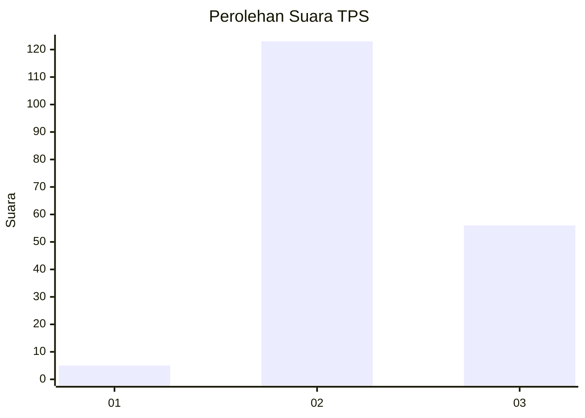

# Hasil

## Grafik

## Tabel

| No. | Nama Paslon    | Suara | Suara (raw) | Persentase |
|:--- |:-------------- | -----:| -----------:| ----------:|
| 1   | ANIES MUHAIMIN | 5     | [5][p-1]    | 2,72       |
| 2   | PRABOWO GIBRAN | 123   | [123][p-2]  | 66,85      |
| 3   | GANJAR MAHFUD  | 56    | [56][p-3]   | 30,43      |

[p-1]: https://github.com/gigit-pemilu/pemilu-2024/blob/main/pilpres/hitung-suara/sub/12-sumatera-utara/sub/04-nias/sub/06-gido/sub/2054-hilizoi/sub/003-tps/sub/paslon-1.txt
[p-2]: https://github.com/gigit-pemilu/pemilu-2024/blob/main/pilpres/hitung-suara/sub/12-sumatera-utara/sub/04-nias/sub/06-gido/sub/2054-hilizoi/sub/003-tps/sub/paslon-2.txt
[p-3]: https://github.com/gigit-pemilu/pemilu-2024/blob/main/pilpres/hitung-suara/sub/12-sumatera-utara/sub/04-nias/sub/06-gido/sub/2054-hilizoi/sub/003-tps/sub/paslon-3.txt

## Foto C Plano

https://sirekap-obj-formc.kpu.go.id/4a6b/pemilu/ppwp/12/04/06/20/54/1204062054003-20240215-053829--946c16b8-2940-465e-9c3d-bea1d37d0f25.jpg

https://sirekap-obj-formc.kpu.go.id/4a6b/pemilu/ppwp/12/04/06/20/54/1204062054003-20240215-054022--1f802747-2f37-45ac-974f-fee0cba6dc15.jpg

https://sirekap-obj-formc.kpu.go.id/4a6b/pemilu/ppwp/12/04/06/20/54/1204062054003-20240215-054141--c627f4b4-17cd-4c15-8c93-3ae9fe92ae46.jpg

## Metadata

| Key        | Value               |
| ---------- | ------------------- |
| Time Stamp | 2024-02-15 15:00:29 |

