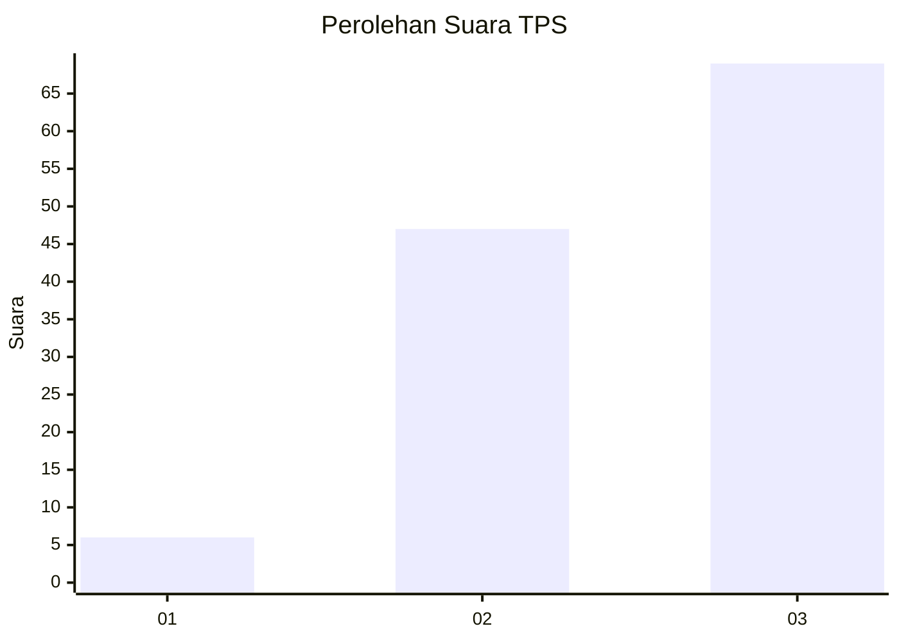
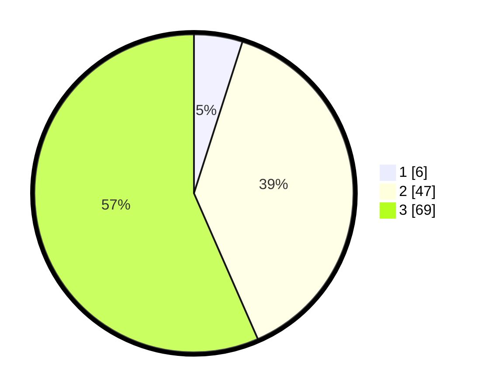

# Hasil

## Grafik

## Tabel

| No. | Nama Paslon    | Suara | Suara (raw) | Persentase |
|:--- |:-------------- | -----:| -----------:| ----------:|
| 1   | ANIES MUHAIMIN | 6     | [6][p-1]    | 4,92       |
| 2   | PRABOWO GIBRAN | 47    | [47][p-2]   | 38,52      |
| 3   | GANJAR MAHFUD  | 69    | [69][p-3]   | 56,56      |

[p-1]: https://github.com/gigit-pemilu/pemilu-2024/blob/main/pilpres/hitung-suara/sub/12-sumatera-utara/sub/04-nias/sub/06-gido/sub/2055-somi-botogo'o/sub/002-tps/sub/paslon-1.txt
[p-2]: https://github.com/gigit-pemilu/pemilu-2024/blob/main/pilpres/hitung-suara/sub/12-sumatera-utara/sub/04-nias/sub/06-gido/sub/2055-somi-botogo'o/sub/002-tps/sub/paslon-2.txt
[p-3]: https://github.com/gigit-pemilu/pemilu-2024/blob/main/pilpres/hitung-suara/sub/12-sumatera-utara/sub/04-nias/sub/06-gido/sub/2055-somi-botogo'o/sub/002-tps/sub/paslon-3.txt

## Foto C Plano

https://sirekap-obj-formc.kpu.go.id/9b5d/pemilu/ppwp/12/04/06/20/55/1204062055002-20240215-071719--e57a8220-067d-449b-bf84-d3b862a459d2.jpg

https://sirekap-obj-formc.kpu.go.id/9b5d/pemilu/ppwp/12/04/06/20/55/1204062055002-20240215-071949--a205f8d7-9403-41bb-bf3f-f26bcf9a481a.jpg

https://sirekap-obj-formc.kpu.go.id/9b5d/pemilu/ppwp/12/04/06/20/55/1204062055002-20240215-072231--d4b9b878-c9ef-4181-83d8-86022aebb7ae.jpg

## Metadata

| Key        | Value               |
| ---------- | ------------------- |
| Time Stamp | 2024-02-15 16:00:26 |

