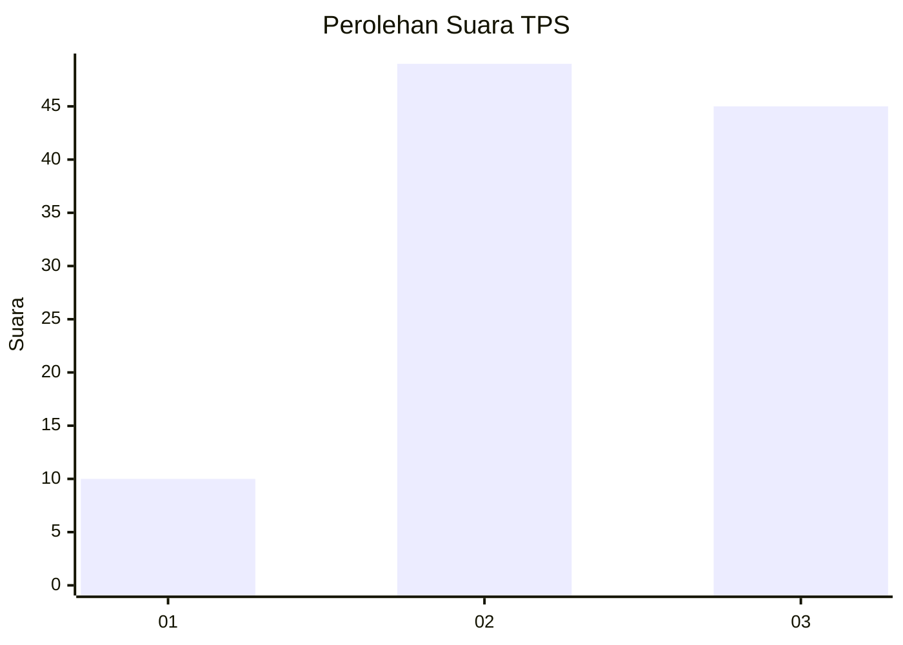
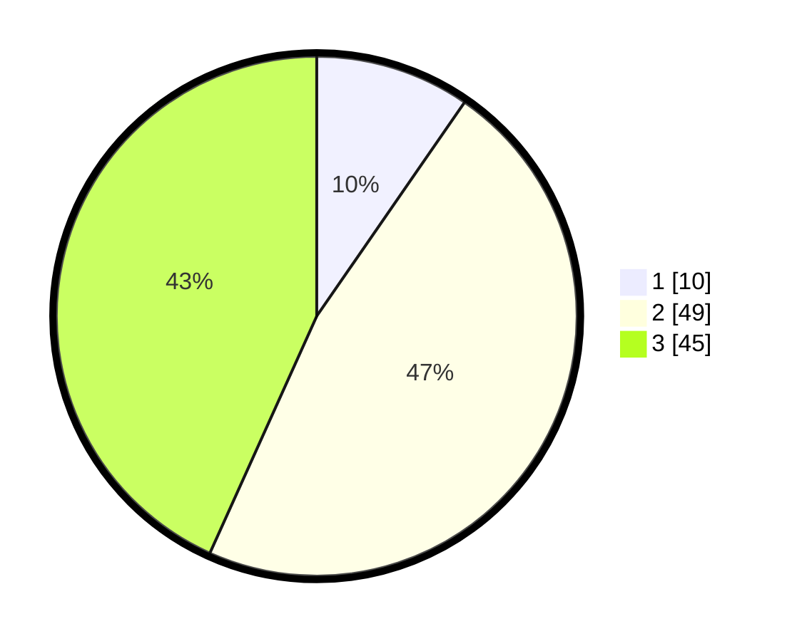

# Hasil

## Grafik

## Tabel

| No. | Nama Paslon    | Suara | Suara (raw) | Persentase |
|:--- |:-------------- | -----:| -----------:| ----------:|
| 1   | ANIES MUHAIMIN | 10    | [10][p-1]   | 9,62       |
| 2   | PRABOWO GIBRAN | 49    | [49][p-2]   | 47,12      |
| 3   | GANJAR MAHFUD  | 45    | [45][p-3]   | 43,27      |

[p-1]: https://github.com/gigit-pemilu/pemilu-2024/blob/main/pilpres/hitung-suara/sub/12-sumatera-utara/sub/04-nias/sub/06-gido/sub/2055-somi-botogo'o/sub/004-tps/sub/paslon-1.txt
[p-2]: https://github.com/gigit-pemilu/pemilu-2024/blob/main/pilpres/hitung-suara/sub/12-sumatera-utara/sub/04-nias/sub/06-gido/sub/2055-somi-botogo'o/sub/004-tps/sub/paslon-2.txt
[p-3]: https://github.com/gigit-pemilu/pemilu-2024/blob/main/pilpres/hitung-suara/sub/12-sumatera-utara/sub/04-nias/sub/06-gido/sub/2055-somi-botogo'o/sub/004-tps/sub/paslon-3.txt

## Foto C Plano

https://sirekap-obj-formc.kpu.go.id/8a28/pemilu/ppwp/12/04/06/20/55/1204062055004-20240215-105619--39fa0980-ec5e-4d0f-a2df-d9c107ee77d6.jpg

https://sirekap-obj-formc.kpu.go.id/8a28/pemilu/ppwp/12/04/06/20/55/1204062055004-20240215-105216--692895d4-7479-466b-8a6c-2f5dc93b6a44.jpg

https://sirekap-obj-formc.kpu.go.id/8a28/pemilu/ppwp/12/04/06/20/55/1204062055004-20240215-105334--4ea087b0-908c-45fd-aa8f-8ee5b02ca89f.jpg

## Metadata

| Key        | Value               |
| ---------- | ------------------- |
| Time Stamp | 2024-02-15 17:30:25 |

