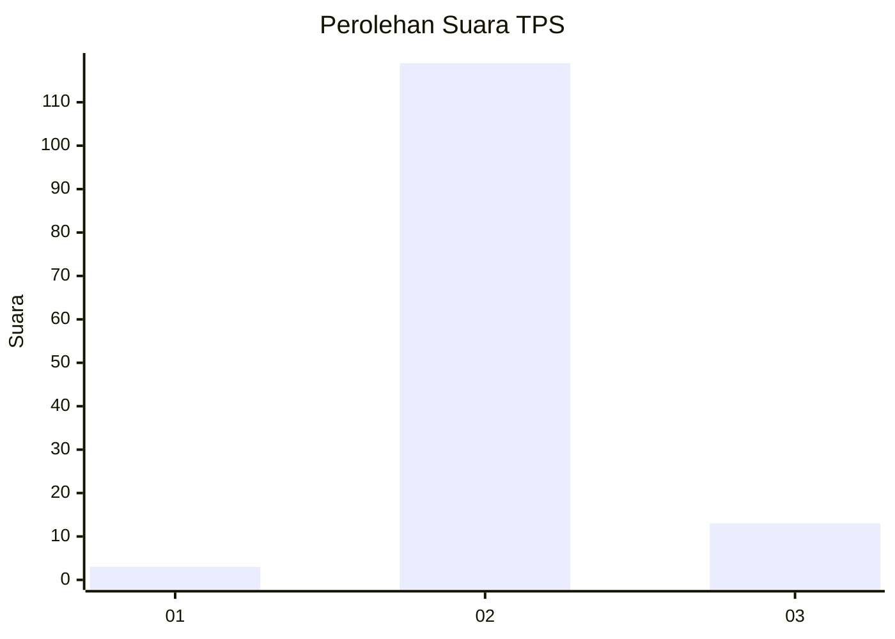
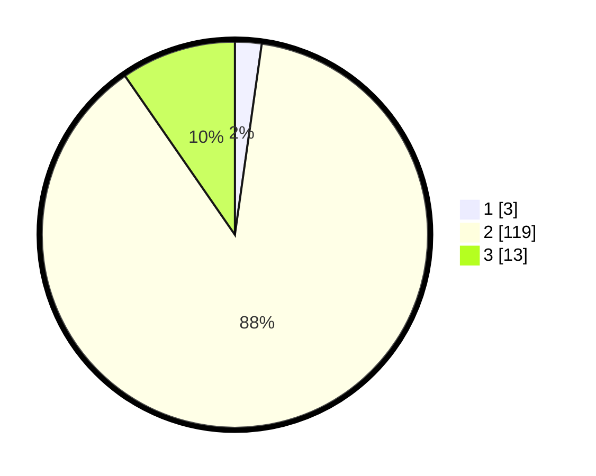

# Hasil

## Grafik

## Tabel

| No. | Nama Paslon    | Suara | Suara (raw) | Persentase |
|:--- |:-------------- | -----:| -----------:| ----------:|
| 1   | ANIES MUHAIMIN | 3     | [3][p-1]    | 2,22       |
| 2   | PRABOWO GIBRAN | 119   | [119][p-2]  | 88,15      |
| 3   | GANJAR MAHFUD  | 13    | [13][p-3]   | 9,63       |

[p-1]: https://github.com/gigit-pemilu/pemilu-2024/blob/main/pilpres/hitung-suara/sub/12-sumatera-utara/sub/04-nias/sub/06-gido/sub/2056-olindrawa-sisarahili/sub/003-tps/sub/paslon-1.txt
[p-2]: https://github.com/gigit-pemilu/pemilu-2024/blob/main/pilpres/hitung-suara/sub/12-sumatera-utara/sub/04-nias/sub/06-gido/sub/2056-olindrawa-sisarahili/sub/003-tps/sub/paslon-2.txt
[p-3]: https://github.com/gigit-pemilu/pemilu-2024/blob/main/pilpres/hitung-suara/sub/12-sumatera-utara/sub/04-nias/sub/06-gido/sub/2056-olindrawa-sisarahili/sub/003-tps/sub/paslon-3.txt

## Foto C Plano

https://sirekap-obj-formc.kpu.go.id/a340/pemilu/ppwp/12/04/06/20/56/1204062056003-20240215-053213--84b556f3-6dfd-4687-b74f-846d63c27246.jpg

https://sirekap-obj-formc.kpu.go.id/a340/pemilu/ppwp/12/04/06/20/56/1204062056003-20240215-051027--5777c303-f038-4c66-be40-ff18e687709e.jpg

https://sirekap-obj-formc.kpu.go.id/a340/pemilu/ppwp/12/04/06/20/56/1204062056003-20240215-053340--9f3f1976-5ae8-4528-bd8f-0cfb28392d11.jpg

## Metadata

| Key        | Value               |
| ---------- | ------------------- |
| Time Stamp | 2024-02-16 01:00:27 |

