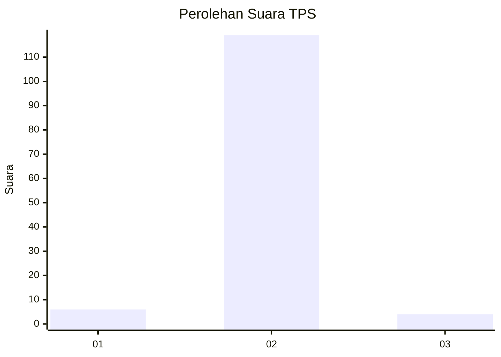
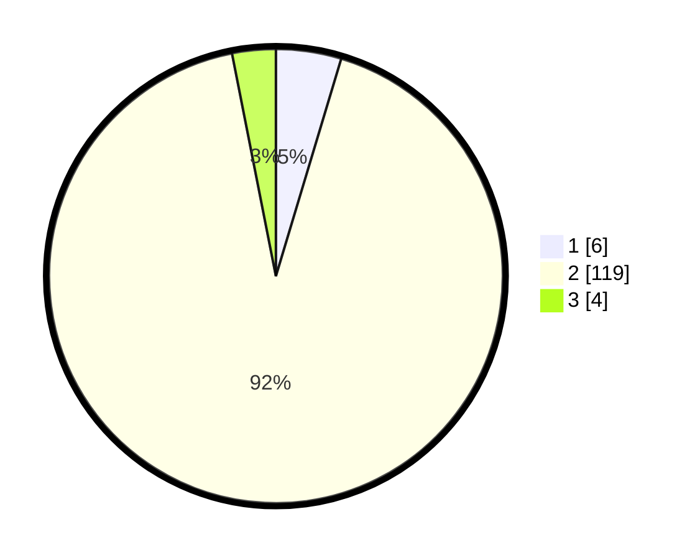

# Hasil

## Grafik

## Tabel

| No. | Nama Paslon    | Suara | Suara (raw) | Persentase |
|:--- |:-------------- | -----:| -----------:| ----------:|
| 1   | ANIES MUHAIMIN | 6     | [6][p-1]    | 4,65       |
| 2   | PRABOWO GIBRAN | 119   | [119][p-2]  | 92,25      |
| 3   | GANJAR MAHFUD  | 4     | [4][p-3]    | 3,10       |

[p-1]: https://github.com/gigit-pemilu/pemilu-2024/blob/main/pilpres/hitung-suara/sub/12-sumatera-utara/sub/04-nias/sub/10-idanogawo/sub/2006-tetegeona'ai/sub/001-tps/sub/paslon-1.txt
[p-2]: https://github.com/gigit-pemilu/pemilu-2024/blob/main/pilpres/hitung-suara/sub/12-sumatera-utara/sub/04-nias/sub/10-idanogawo/sub/2006-tetegeona'ai/sub/001-tps/sub/paslon-2.txt
[p-3]: https://github.com/gigit-pemilu/pemilu-2024/blob/main/pilpres/hitung-suara/sub/12-sumatera-utara/sub/04-nias/sub/10-idanogawo/sub/2006-tetegeona'ai/sub/001-tps/sub/paslon-3.txt

## Foto C Plano

https://sirekap-obj-formc.kpu.go.id/8978/pemilu/ppwp/12/04/10/20/06/1204102006001-20240220-133058--2aa789af-fdc9-4f52-90d5-bf27072c586c.jpg

https://sirekap-obj-formc.kpu.go.id/8978/pemilu/ppwp/12/04/10/20/06/1204102006001-20240220-133255--64e506c4-2ded-4af9-970e-0085c7714a24.jpg

https://sirekap-obj-formc.kpu.go.id/8978/pemilu/ppwp/12/04/10/20/06/1204102006001-20240220-133518--6f51c5a0-046a-48d8-9617-2e7922956cb3.jpg

## Metadata

| Key        | Value               |
| ---------- | ------------------- |
| Time Stamp | 2024-02-26 16:00:00 |

