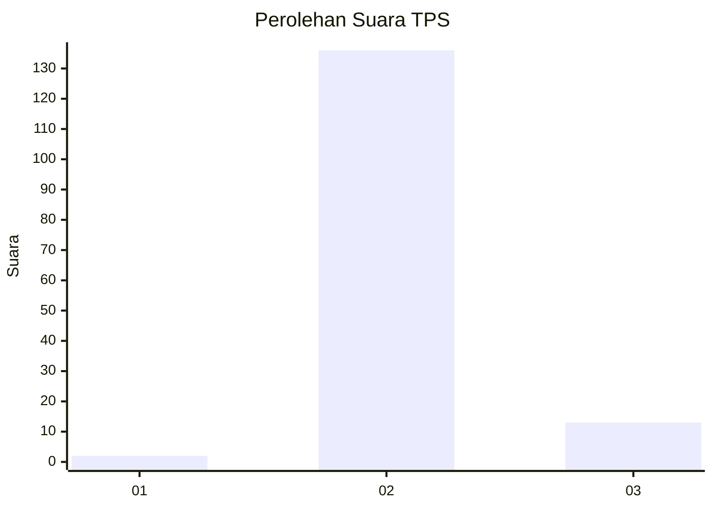
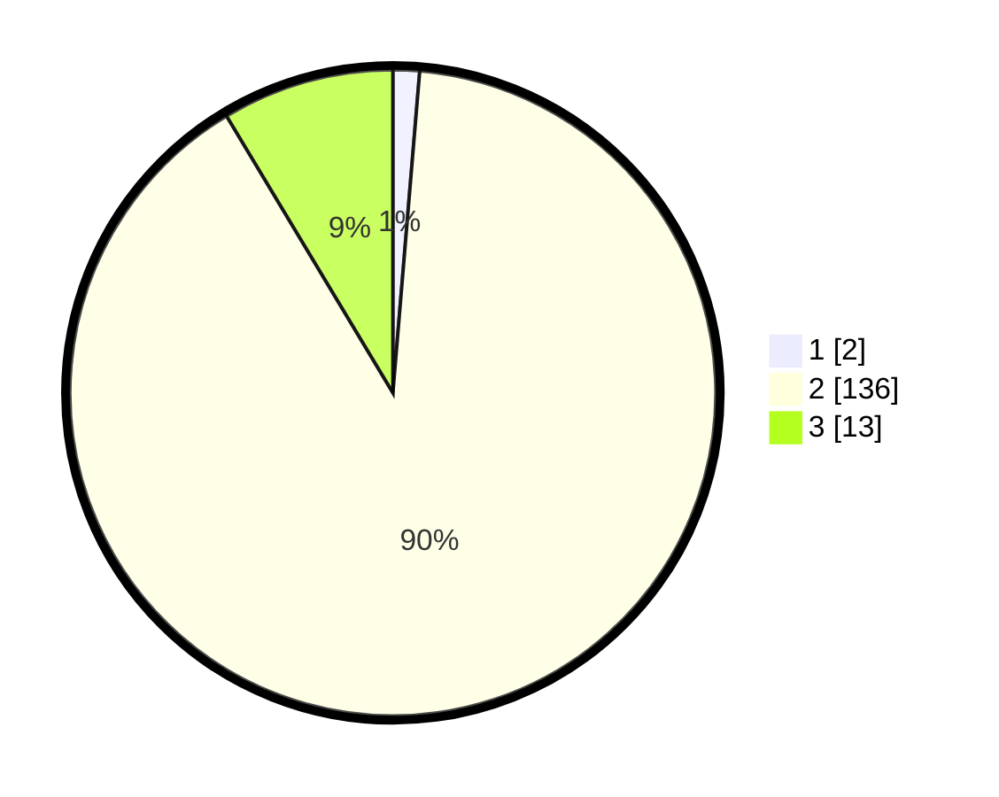

# Hasil

## Grafik

## Tabel

| No. | Nama Paslon    | Suara | Suara (raw) | Persentase |
|:--- |:-------------- | -----:| -----------:| ----------:|
| 1   | ANIES MUHAIMIN | 2     | [2][p-1]    | 1,32       |
| 2   | PRABOWO GIBRAN | 136   | [136][p-2]  | 90,07      |
| 3   | GANJAR MAHFUD  | 13    | [13][p-3]   | 8,61       |

[p-1]: https://github.com/gigit-pemilu/pemilu-2024-12-sumatera-utara/blob/main/pilpres/hitung-suara/sub/12-sumatera-utara/sub/04-nias/sub/10-idanogawo/sub/2006-tetegeona'ai/sub/002-tps/sub/paslon-1.txt
[p-2]: https://github.com/gigit-pemilu/pemilu-2024-12-sumatera-utara/blob/main/pilpres/hitung-suara/sub/12-sumatera-utara/sub/04-nias/sub/10-idanogawo/sub/2006-tetegeona'ai/sub/002-tps/sub/paslon-2.txt
[p-3]: https://github.com/gigit-pemilu/pemilu-2024-12-sumatera-utara/blob/main/pilpres/hitung-suara/sub/12-sumatera-utara/sub/04-nias/sub/10-idanogawo/sub/2006-tetegeona'ai/sub/002-tps/sub/paslon-3.txt

## Foto C Plano

https://sirekap-obj-formc.kpu.go.id/403a/pemilu/ppwp/12/04/10/20/06/1204102006002-20240220-151756--aaf8052a-270b-49b4-9a13-099557b52b59.jpg

https://sirekap-obj-formc.kpu.go.id/403a/pemilu/ppwp/12/04/10/20/06/1204102006002-20240220-152156--7561315d-1cd5-4a1b-8629-326026c1997d.jpg

https://sirekap-obj-formc.kpu.go.id/403a/pemilu/ppwp/12/04/10/20/06/1204102006002-20240220-152318--29b03f14-f8f4-4c20-9ab7-f7a1efe4d2c6.jpg

## Metadata

| Key        | Value               |
| ---------- | ------------------- |
| Time Stamp | 2024-02-25 11:00:00 |

