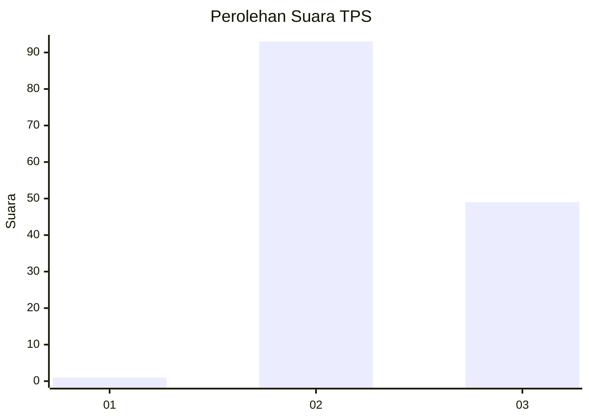
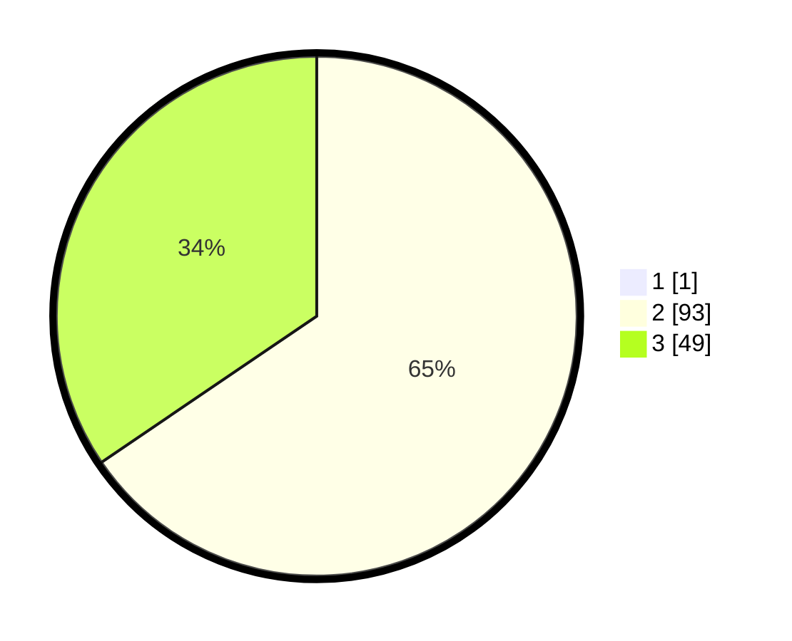

# Hasil

## Grafik

## Tabel

| No. | Nama Paslon    | Suara | Suara (raw) | Persentase |
|:--- |:-------------- | -----:| -----------:| ----------:|
| 1   | ANIES MUHAIMIN | 1     | [1][p-1]    | 0,70       |
| 2   | PRABOWO GIBRAN | 93    | [93][p-2]   | 65,03      |
| 3   | GANJAR MAHFUD  | 49    | [49][p-3]   | 34,27      |

[p-1]: https://github.com/gigit-pemilu/pemilu-2024-12-sumatera-utara/blob/main/pilpres/hitung-suara/sub/12-sumatera-utara/sub/04-nias/sub/10-idanogawo/sub/2007-laowo-hilimbaruzo/sub/005-tps/sub/paslon-1.txt
[p-2]: https://github.com/gigit-pemilu/pemilu-2024-12-sumatera-utara/blob/main/pilpres/hitung-suara/sub/12-sumatera-utara/sub/04-nias/sub/10-idanogawo/sub/2007-laowo-hilimbaruzo/sub/005-tps/sub/paslon-2.txt
[p-3]: https://github.com/gigit-pemilu/pemilu-2024-12-sumatera-utara/blob/main/pilpres/hitung-suara/sub/12-sumatera-utara/sub/04-nias/sub/10-idanogawo/sub/2007-laowo-hilimbaruzo/sub/005-tps/sub/paslon-3.txt

## Foto C Plano

https://sirekap-obj-formc.kpu.go.id/06fa/pemilu/ppwp/12/04/10/20/07/1204102007005-20240215-093332--fccf59ef-d271-49b6-ab38-851a3ba0c5f2.jpg

https://sirekap-obj-formc.kpu.go.id/06fa/pemilu/ppwp/12/04/10/20/07/1204102007005-20240215-093448--47339dc2-a027-410e-a374-0b0061909350.jpg

https://sirekap-obj-formc.kpu.go.id/06fa/pemilu/ppwp/12/04/10/20/07/1204102007005-20240215-093532--7e92c936-2653-4552-ac4a-519ab2d29467.jpg

## Metadata

| Key        | Value               |
| ---------- | ------------------- |
| Time Stamp | 2024-02-15 20:00:44 |

