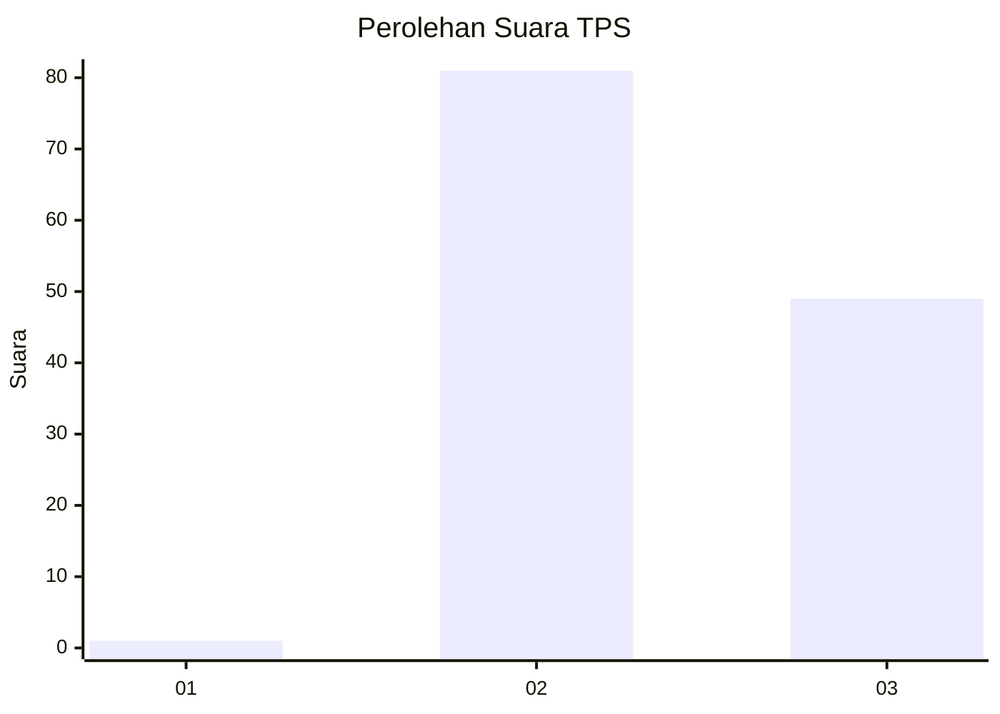
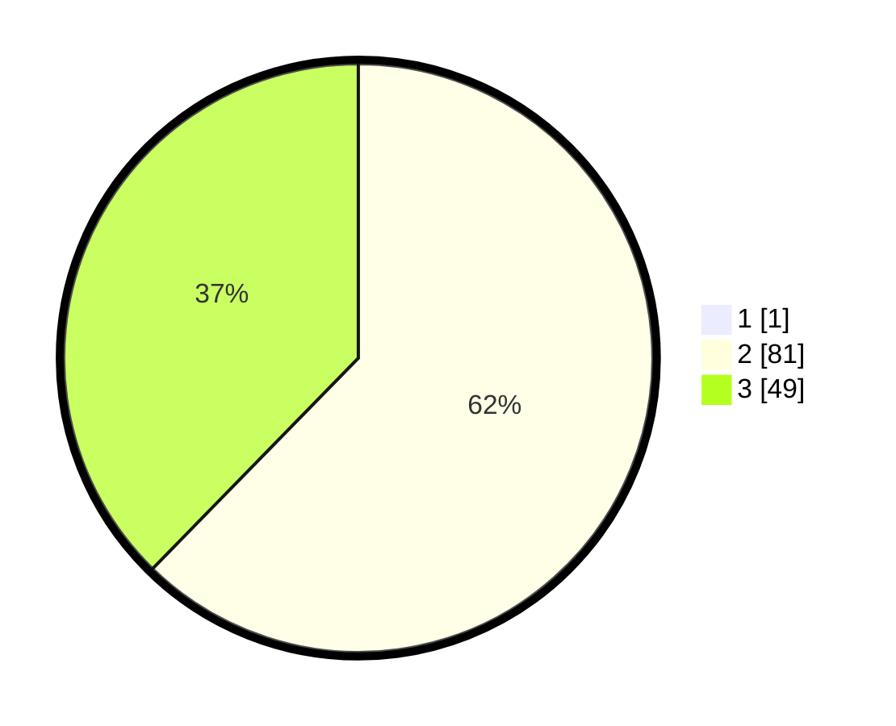

# Hasil

## Grafik

## Tabel

| No. | Nama Paslon    | Suara | Suara (raw) | Persentase |
|:--- |:-------------- | -----:| -----------:| ----------:|
| 1   | ANIES MUHAIMIN | 1     | [1][p-1]    | 0,76       |
| 2   | PRABOWO GIBRAN | 81    | [81][p-2]   | 61,83      |
| 3   | GANJAR MAHFUD  | 49    | [49][p-3]   | 37,40      |

[p-1]: https://github.com/gigit-pemilu/pemilu-2024/blob/main/pilpres/hitung-suara/sub/12-sumatera-utara/sub/04-nias/sub/10-idanogawo/sub/2014-sisobahili-iraonohura/sub/003-tps/sub/paslon-1.txt
[p-2]: https://github.com/gigit-pemilu/pemilu-2024/blob/main/pilpres/hitung-suara/sub/12-sumatera-utara/sub/04-nias/sub/10-idanogawo/sub/2014-sisobahili-iraonohura/sub/003-tps/sub/paslon-2.txt
[p-3]: https://github.com/gigit-pemilu/pemilu-2024/blob/main/pilpres/hitung-suara/sub/12-sumatera-utara/sub/04-nias/sub/10-idanogawo/sub/2014-sisobahili-iraonohura/sub/003-tps/sub/paslon-3.txt

## Foto C Plano

https://sirekap-obj-formc.kpu.go.id/4785/pemilu/ppwp/12/04/10/20/14/1204102014003-20240216-140652--3ffa31c1-4a21-46c7-b55e-39c13713b093.jpg

https://sirekap-obj-formc.kpu.go.id/4785/pemilu/ppwp/12/04/10/20/14/1204102014003-20240216-141146--ef2ab147-ba9f-4941-a72f-353da2d2ae6d.jpg

https://sirekap-obj-formc.kpu.go.id/4785/pemilu/ppwp/12/04/10/20/14/1204102014003-20240216-150340--59e5316f-1fda-47a5-be3e-2b397886bcd7.jpg

## Metadata

| Key        | Value               |
| ---------- | ------------------- |
| Time Stamp | 2024-02-19 06:16:00 |

## DATA PEMILIH TETAP

Jumlah pemilih dalam DPT: **1686**.
 * L: **862**.
 * P: **824**.

## DATA PENGGUNA HAK PILIH

Jumlah pengguna hak pilih dalam DPT: **921**.
 * L: **53**.
 * P: **868**.

Jumlah pengguna hak pilih dalam DPTb: **1600**.
 * L: **800**.
 * P: **800**.

Jumlah pengguna hak pilih dalam DPK: **816**.
 * L: **808**.
 * P: **8**.

Jumlah pengguna hak pilih: **3337**.
 * L: **1661**.
 * P: **1676**.

## JUMLAH SUARA SAH DAN TIDAK SAH

JUMLAH SELURUH SUARA SAH: **131**.

JUMLAH SUARA TIDAK SAH: **0**.

JUMLAH SELURUH SUARA SAH DAN SUARA TIDAK SAH: **131**.

