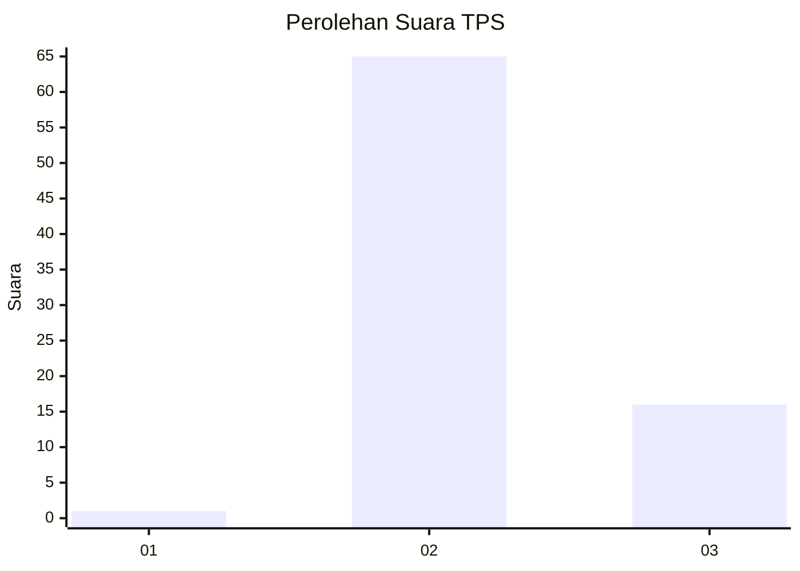
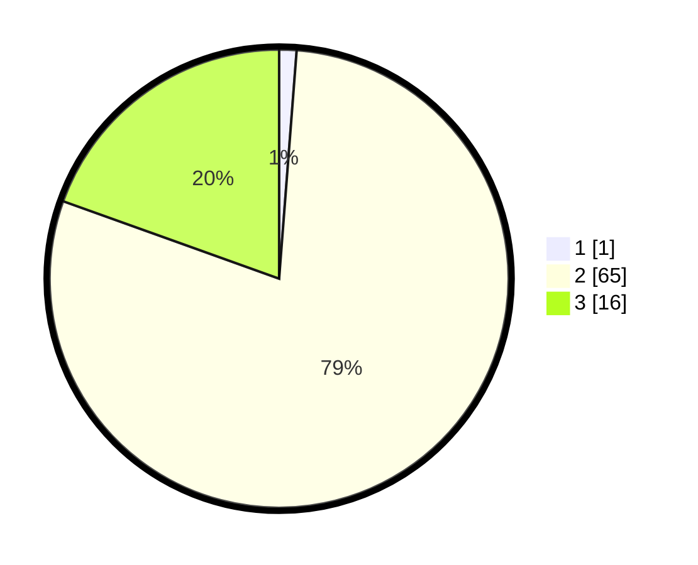

# Hasil

## Grafik

## Tabel

| No. | Nama Paslon    | Suara | Suara (raw) | Persentase |
|:--- |:-------------- | -----:| -----------:| ----------:|
| 1   | ANIES MUHAIMIN | 1     | [1][p-1]    | 1,22       |
| 2   | PRABOWO GIBRAN | 65    | [65][p-2]   | 79,27      |
| 3   | GANJAR MAHFUD  | 16    | [16][p-3]   | 19,51      |

[p-1]: https://github.com/gigit-pemilu/pemilu-2024/blob/main/pilpres/hitung-suara/sub/12-sumatera-utara/sub/04-nias/sub/10-idanogawo/sub/2016-oladano/sub/002-tps/sub/paslon-1.txt
[p-2]: https://github.com/gigit-pemilu/pemilu-2024/blob/main/pilpres/hitung-suara/sub/12-sumatera-utara/sub/04-nias/sub/10-idanogawo/sub/2016-oladano/sub/002-tps/sub/paslon-2.txt
[p-3]: https://github.com/gigit-pemilu/pemilu-2024/blob/main/pilpres/hitung-suara/sub/12-sumatera-utara/sub/04-nias/sub/10-idanogawo/sub/2016-oladano/sub/002-tps/sub/paslon-3.txt

## Foto C Plano

https://sirekap-obj-formc.kpu.go.id/995e/pemilu/ppwp/12/04/10/20/16/1204102016002-20240215-074855--1107aa4a-3729-41f7-b838-25a35a0c734f.jpg

https://sirekap-obj-formc.kpu.go.id/995e/pemilu/ppwp/12/04/10/20/16/1204102016002-20240215-074838--8f13aed2-d734-45d4-adb5-c73aeff2244a.jpg

https://sirekap-obj-formc.kpu.go.id/995e/pemilu/ppwp/12/04/10/20/16/1204102016002-20240215-074816--75c1c39b-305f-40a0-b498-c0cc72b48f92.jpg

## Metadata

| Key        | Value               |
| ---------- | ------------------- |
| Time Stamp | 2024-02-15 15:00:29 |

