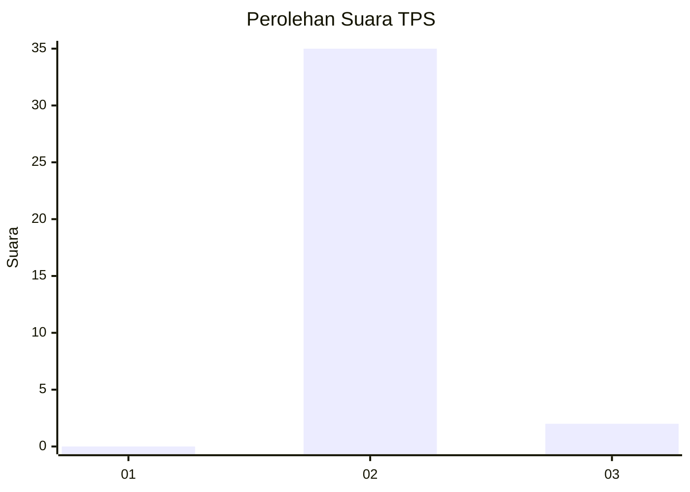
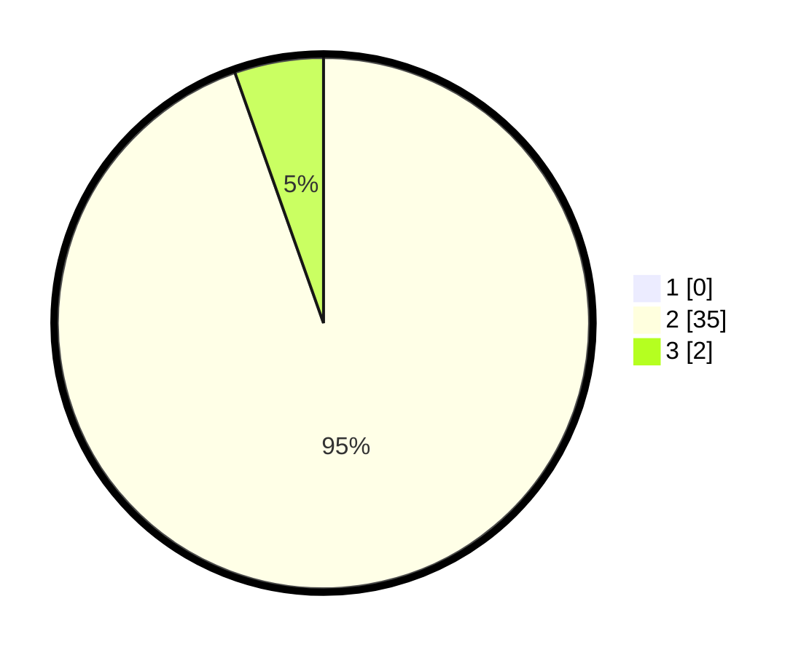

# Hasil

## Grafik

## Tabel

| No. | Nama Paslon    | Suara | Suara (raw) | Persentase |
|:--- |:-------------- | -----:| -----------:| ----------:|
| 1   | ANIES MUHAIMIN | 0     | [0][p-1]    | 0,00       |
| 2   | PRABOWO GIBRAN | 35    | [35][p-2]   | 94,59      |
| 3   | GANJAR MAHFUD  | 2     | [2][p-3]    | 5,41       |

[p-1]: https://github.com/gigit-pemilu/pemilu-2024-12-sumatera-utara/blob/main/pilpres/hitung-suara/sub/12-sumatera-utara/sub/04-nias/sub/10-idanogawo/sub/2022-tetehosi/sub/005-tps/sub/paslon-1.txt
[p-2]: https://github.com/gigit-pemilu/pemilu-2024-12-sumatera-utara/blob/main/pilpres/hitung-suara/sub/12-sumatera-utara/sub/04-nias/sub/10-idanogawo/sub/2022-tetehosi/sub/005-tps/sub/paslon-2.txt
[p-3]: https://github.com/gigit-pemilu/pemilu-2024-12-sumatera-utara/blob/main/pilpres/hitung-suara/sub/12-sumatera-utara/sub/04-nias/sub/10-idanogawo/sub/2022-tetehosi/sub/005-tps/sub/paslon-3.txt

## Foto C Plano

https://sirekap-obj-formc.kpu.go.id/965a/pemilu/ppwp/12/04/10/20/22/1204102022005-20240214-221211--5e3096f5-ac45-4dd8-b5f9-50dd580e9e2e.jpg

https://sirekap-obj-formc.kpu.go.id/965a/pemilu/ppwp/12/04/10/20/22/1204102022005-20240214-221300--fb0e9e30-da43-4efa-aab1-abd4cb1cf67b.jpg

https://sirekap-obj-formc.kpu.go.id/965a/pemilu/ppwp/12/04/10/20/22/1204102022005-20240214-221356--05449cb7-4762-46a1-89a2-7889e0b21ea0.jpg

## Metadata

| Key        | Value               |
| ---------- | ------------------- |
| Time Stamp | 2024-02-15 15:00:29 |

