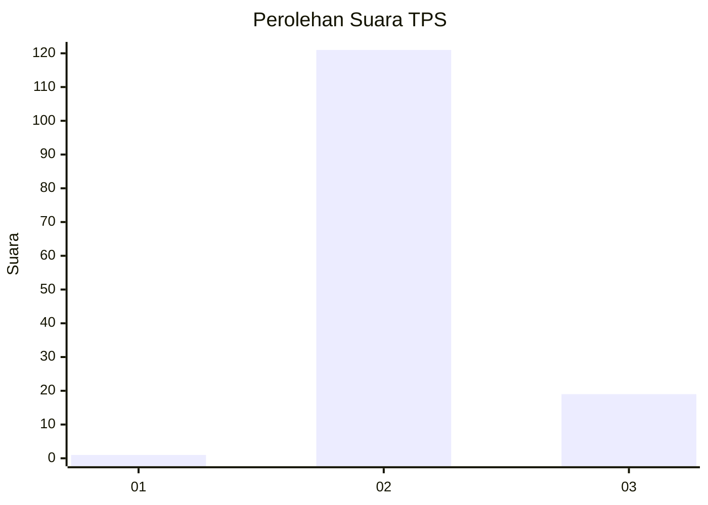
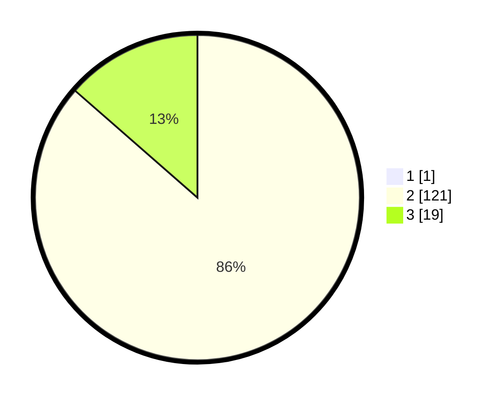

# Hasil

## Grafik

## Tabel

| No. | Nama Paslon    | Suara | Suara (raw) | Persentase |
|:--- |:-------------- | -----:| -----------:| ----------:|
| 1   | ANIES MUHAIMIN | 1     | [1][p-1]    | 0,71       |
| 2   | PRABOWO GIBRAN | 121   | [121][p-2]  | 85,82      |
| 3   | GANJAR MAHFUD  | 19    | [19][p-3]   | 13,48      |

[p-1]: https://github.com/gigit-pemilu/pemilu-2024-12-sumatera-utara/blob/main/pilpres/hitung-suara/sub/12-sumatera-utara/sub/04-nias/sub/10-idanogawo/sub/2023-saiwahili-hiliadulo/sub/002-tps/sub/paslon-1.txt
[p-2]: https://github.com/gigit-pemilu/pemilu-2024-12-sumatera-utara/blob/main/pilpres/hitung-suara/sub/12-sumatera-utara/sub/04-nias/sub/10-idanogawo/sub/2023-saiwahili-hiliadulo/sub/002-tps/sub/paslon-2.txt
[p-3]: https://github.com/gigit-pemilu/pemilu-2024-12-sumatera-utara/blob/main/pilpres/hitung-suara/sub/12-sumatera-utara/sub/04-nias/sub/10-idanogawo/sub/2023-saiwahili-hiliadulo/sub/002-tps/sub/paslon-3.txt

## Foto C Plano

https://sirekap-obj-formc.kpu.go.id/44fe/pemilu/ppwp/12/04/10/20/23/1204102023002-20240215-041113--e45d32a0-0cfd-40d6-a154-cd635a0ba04d.jpg

https://sirekap-obj-formc.kpu.go.id/44fe/pemilu/ppwp/12/04/10/20/23/1204102023002-20240215-041746--90b41ed7-dd23-4c94-a49d-455475db0c58.jpg

https://sirekap-obj-formc.kpu.go.id/44fe/pemilu/ppwp/12/04/10/20/23/1204102023002-20240215-042050--af595aa1-faa3-4ce0-b487-1e216353eb61.jpg

## Metadata

| Key        | Value               |
| ---------- | ------------------- |
| Time Stamp | 2024-02-15 21:01:18 |

