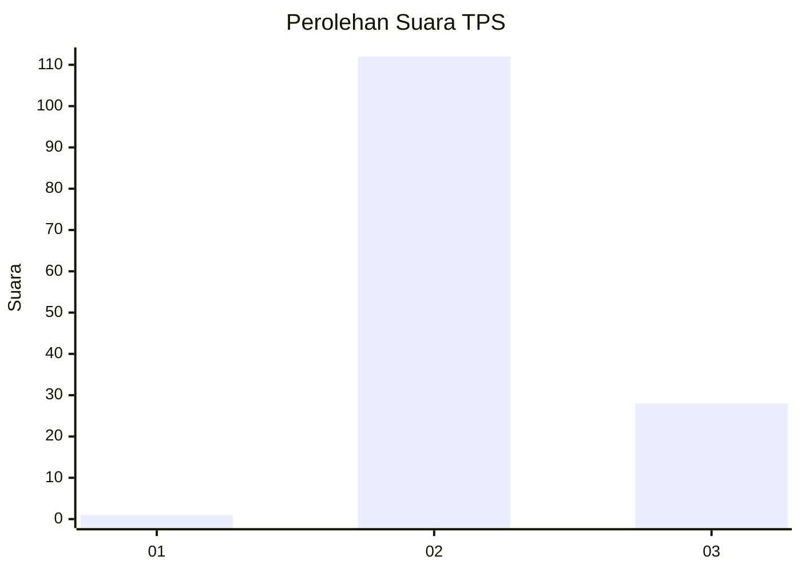
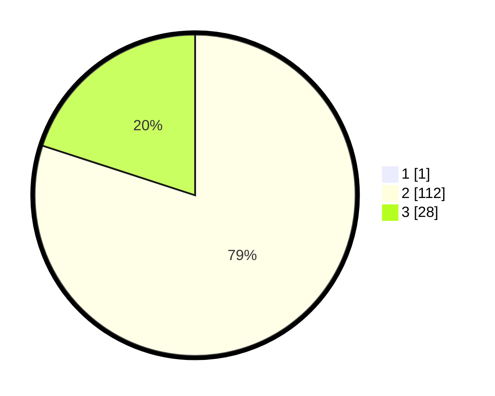

# Hasil

## Grafik

## Tabel

| No. | Nama Paslon    | Suara | Suara (raw) | Persentase |
|:--- |:-------------- | -----:| -----------:| ----------:|
| 1   | ANIES MUHAIMIN | 1     | [1][p-1]    | 0,71       |
| 2   | PRABOWO GIBRAN | 112   | [112][p-2]  | 79,43      |
| 3   | GANJAR MAHFUD  | 28    | [28][p-3]   | 19,86      |

[p-1]: https://github.com/gigit-pemilu/pemilu-2024/blob/main/pilpres/hitung-suara/sub/12-sumatera-utara/sub/04-nias/sub/10-idanogawo/sub/2028-sandruta/sub/003-tps/sub/paslon-1.txt
[p-2]: https://github.com/gigit-pemilu/pemilu-2024/blob/main/pilpres/hitung-suara/sub/12-sumatera-utara/sub/04-nias/sub/10-idanogawo/sub/2028-sandruta/sub/003-tps/sub/paslon-2.txt
[p-3]: https://github.com/gigit-pemilu/pemilu-2024/blob/main/pilpres/hitung-suara/sub/12-sumatera-utara/sub/04-nias/sub/10-idanogawo/sub/2028-sandruta/sub/003-tps/sub/paslon-3.txt

## Foto C Plano

https://sirekap-obj-formc.kpu.go.id/5048/pemilu/ppwp/12/04/10/20/28/1204102028003-20240214-234539--a30a8e7c-33d5-4604-8274-3fec7f4c18a2.jpg

https://sirekap-obj-formc.kpu.go.id/5048/pemilu/ppwp/12/04/10/20/28/1204102028003-20240214-235319--a8ba49a2-0d3c-497a-b359-6d3a6131542d.jpg

https://sirekap-obj-formc.kpu.go.id/5048/pemilu/ppwp/12/04/10/20/28/1204102028003-20240214-235830--1b6cf61f-2f3e-49e3-9957-66211ff36ed5.jpg

## Metadata

| Key        | Value               |
| ---------- | ------------------- |
| Time Stamp | 2024-02-15 19:30:26 |

