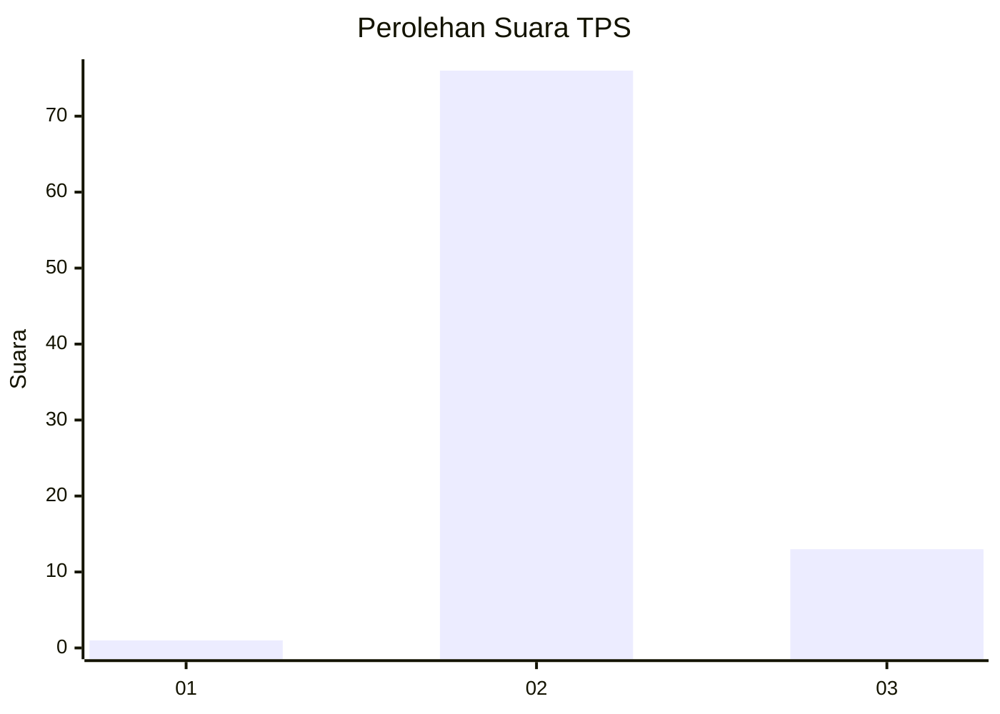
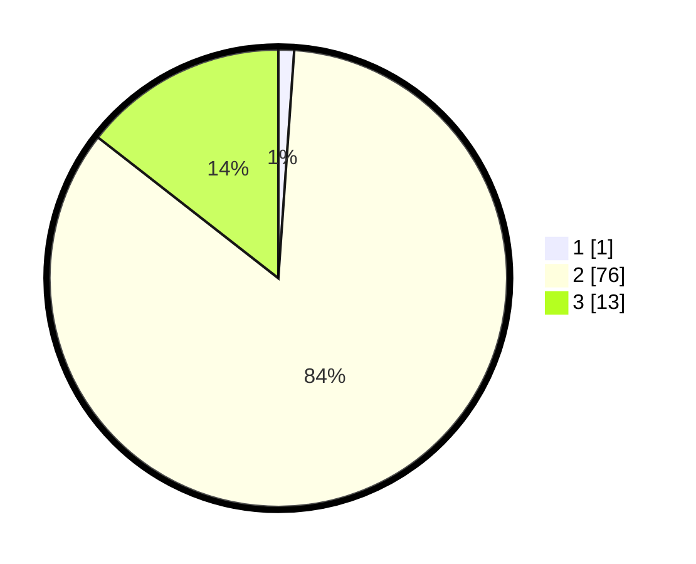

# Hasil

## Grafik

## Tabel

| No. | Nama Paslon    | Suara | Suara (raw) | Persentase |
|:--- |:-------------- | -----:| -----------:| ----------:|
| 1   | ANIES MUHAIMIN | 1     | [1][p-1]    | 1,11       |
| 2   | PRABOWO GIBRAN | 76    | [76][p-2]   | 84,44      |
| 3   | GANJAR MAHFUD  | 13    | [13][p-3]   | 14,44      |

[p-1]: https://github.com/gigit-pemilu/pemilu-2024-12-sumatera-utara/blob/main/pilpres/hitung-suara/sub/12-sumatera-utara/sub/04-nias/sub/10-idanogawo/sub/2031-baruzo/sub/003-tps/sub/paslon-1.txt
[p-2]: https://github.com/gigit-pemilu/pemilu-2024-12-sumatera-utara/blob/main/pilpres/hitung-suara/sub/12-sumatera-utara/sub/04-nias/sub/10-idanogawo/sub/2031-baruzo/sub/003-tps/sub/paslon-2.txt
[p-3]: https://github.com/gigit-pemilu/pemilu-2024-12-sumatera-utara/blob/main/pilpres/hitung-suara/sub/12-sumatera-utara/sub/04-nias/sub/10-idanogawo/sub/2031-baruzo/sub/003-tps/sub/paslon-3.txt

## Foto C Plano

https://sirekap-obj-formc.kpu.go.id/5d88/pemilu/ppwp/12/04/10/20/31/1204102031003-20240215-025147--7042e78f-2584-4e67-9b56-f6d82b827fce.jpg

https://sirekap-obj-formc.kpu.go.id/5d88/pemilu/ppwp/12/04/10/20/31/1204102031003-20240215-030621--ff82f75b-e3db-48e8-acb3-5b991ba7f09b.jpg

https://sirekap-obj-formc.kpu.go.id/5d88/pemilu/ppwp/12/04/10/20/31/1204102031003-20240215-030726--5b4f3fca-b2c2-4806-a730-be2e06fa97f5.jpg

## Metadata

| Key        | Value               |
| ---------- | ------------------- |
| Time Stamp | 2024-02-16 00:30:27 |

