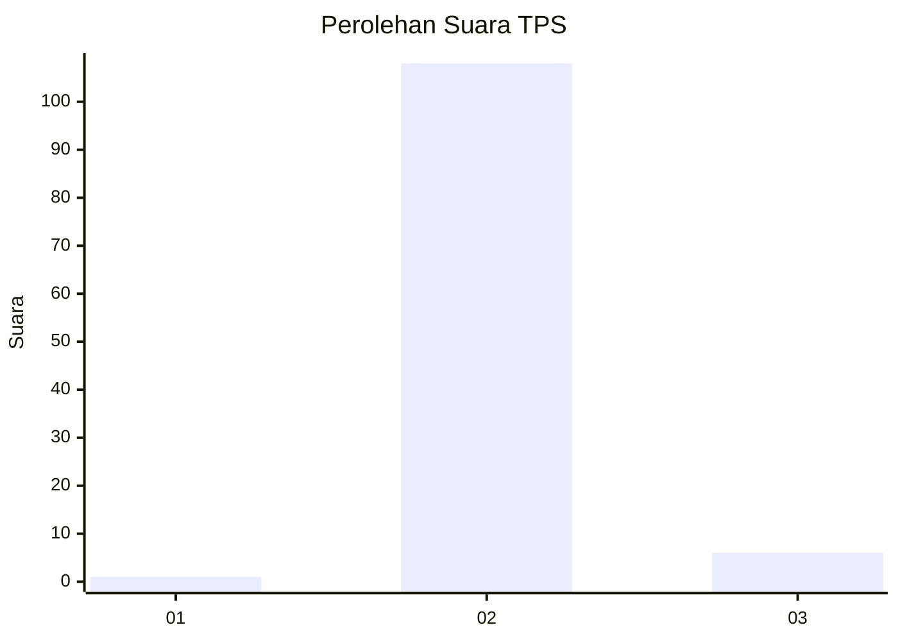
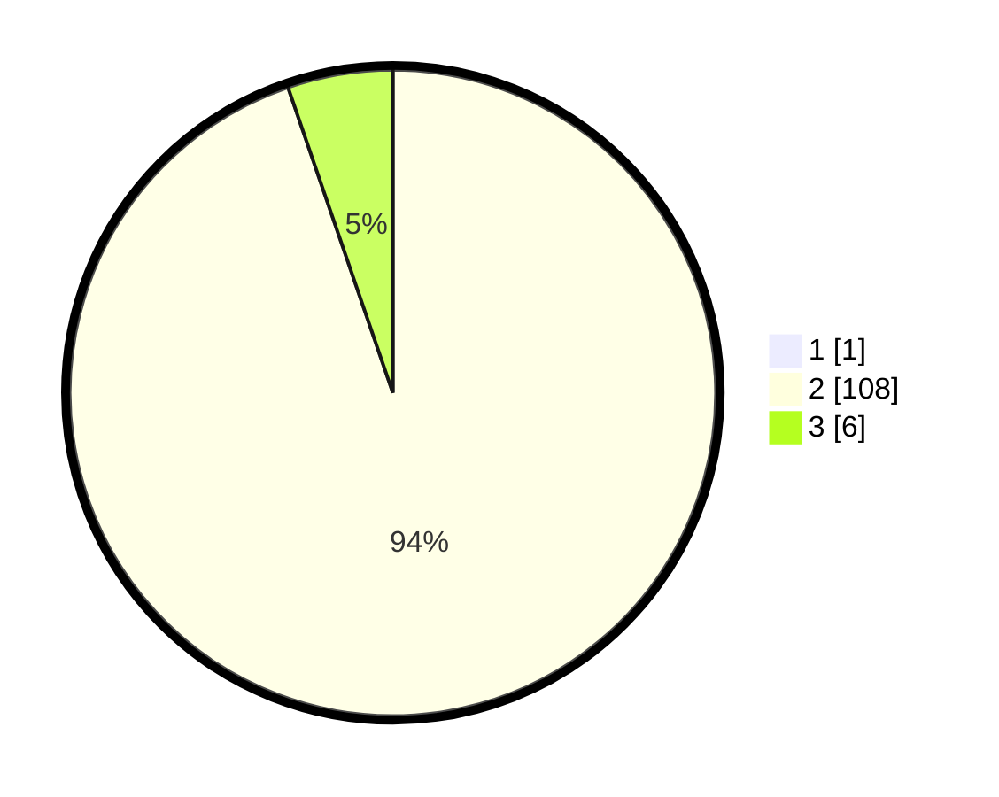

# Hasil

## Grafik

## Tabel

| No. | Nama Paslon    | Suara | Suara (raw) | Persentase |
|:--- |:-------------- | -----:| -----------:| ----------:|
| 1   | ANIES MUHAIMIN | 1     | [1][p-1]    | 0,87       |
| 2   | PRABOWO GIBRAN | 108   | [108][p-2]  | 93,91      |
| 3   | GANJAR MAHFUD  | 6     | [6][p-3]    | 5,22       |

[p-1]: https://github.com/gigit-pemilu/pemilu-2024-12-sumatera-utara/blob/main/pilpres/hitung-suara/sub/12-sumatera-utara/sub/04-nias/sub/10-idanogawo/sub/2033-tiga-serangkai-maliwa'a/sub/001-tps/sub/paslon-1.txt
[p-2]: https://github.com/gigit-pemilu/pemilu-2024-12-sumatera-utara/blob/main/pilpres/hitung-suara/sub/12-sumatera-utara/sub/04-nias/sub/10-idanogawo/sub/2033-tiga-serangkai-maliwa'a/sub/001-tps/sub/paslon-2.txt
[p-3]: https://github.com/gigit-pemilu/pemilu-2024-12-sumatera-utara/blob/main/pilpres/hitung-suara/sub/12-sumatera-utara/sub/04-nias/sub/10-idanogawo/sub/2033-tiga-serangkai-maliwa'a/sub/001-tps/sub/paslon-3.txt

## Foto C Plano

https://sirekap-obj-formc.kpu.go.id/001d/pemilu/ppwp/12/04/10/20/33/1204102033001-20240215-150125--60493c17-2a0c-424f-adc2-a5d2639fe902.jpg

https://sirekap-obj-formc.kpu.go.id/001d/pemilu/ppwp/12/04/10/20/33/1204102033001-20240215-150254--d9efd0f2-e7ca-4755-ab26-ecd52117e820.jpg

https://sirekap-obj-formc.kpu.go.id/001d/pemilu/ppwp/12/04/10/20/33/1204102033001-20240215-152419--68689cf4-da5d-4f28-b9b3-17aa1f2ff95d.jpg

## Metadata

| Key        | Value               |
| ---------- | ------------------- |
| Time Stamp | 2024-02-16 01:00:27 |

