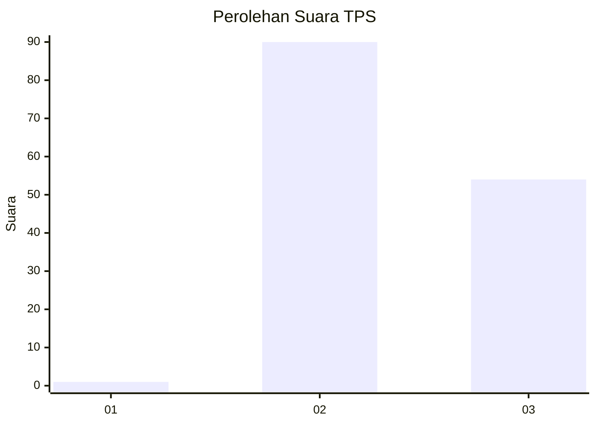
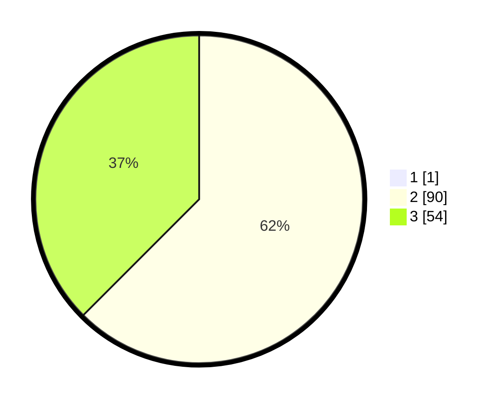

# Hasil

## Grafik

## Tabel

| No. | Nama Paslon    | Suara | Suara (raw) | Persentase |
|:--- |:-------------- | -----:| -----------:| ----------:|
| 1   | ANIES MUHAIMIN | 1     | [1][p-1]    | 0,69       |
| 2   | PRABOWO GIBRAN | 90    | [90][p-2]   | 62,07      |
| 3   | GANJAR MAHFUD  | 54    | [54][p-3]   | 37,24      |

[p-1]: https://github.com/gigit-pemilu/pemilu-2024/blob/main/pilpres/hitung-suara/sub/12-sumatera-utara/sub/04-nias/sub/10-idanogawo/sub/2034-hiligogowaya-maliwa'a/sub/002-tps/sub/paslon-1.txt
[p-2]: https://github.com/gigit-pemilu/pemilu-2024/blob/main/pilpres/hitung-suara/sub/12-sumatera-utara/sub/04-nias/sub/10-idanogawo/sub/2034-hiligogowaya-maliwa'a/sub/002-tps/sub/paslon-2.txt
[p-3]: https://github.com/gigit-pemilu/pemilu-2024/blob/main/pilpres/hitung-suara/sub/12-sumatera-utara/sub/04-nias/sub/10-idanogawo/sub/2034-hiligogowaya-maliwa'a/sub/002-tps/sub/paslon-3.txt

## Foto C Plano

https://sirekap-obj-formc.kpu.go.id/efe1/pemilu/ppwp/12/04/10/20/34/1204102034002-20240215-082311--22f0001b-1b0e-4e94-b24a-22bb7256ddd6.jpg

https://sirekap-obj-formc.kpu.go.id/efe1/pemilu/ppwp/12/04/10/20/34/1204102034002-20240215-085704--491f40d3-a085-4a51-a17f-684013100c4d.jpg

https://sirekap-obj-formc.kpu.go.id/efe1/pemilu/ppwp/12/04/10/20/34/1204102034002-20240215-085844--fdc6b19d-d395-4944-af9f-3db8d455fdc5.jpg

## Metadata

| Key        | Value               |
| ---------- | ------------------- |
| Time Stamp | 2024-02-16 01:00:27 |

