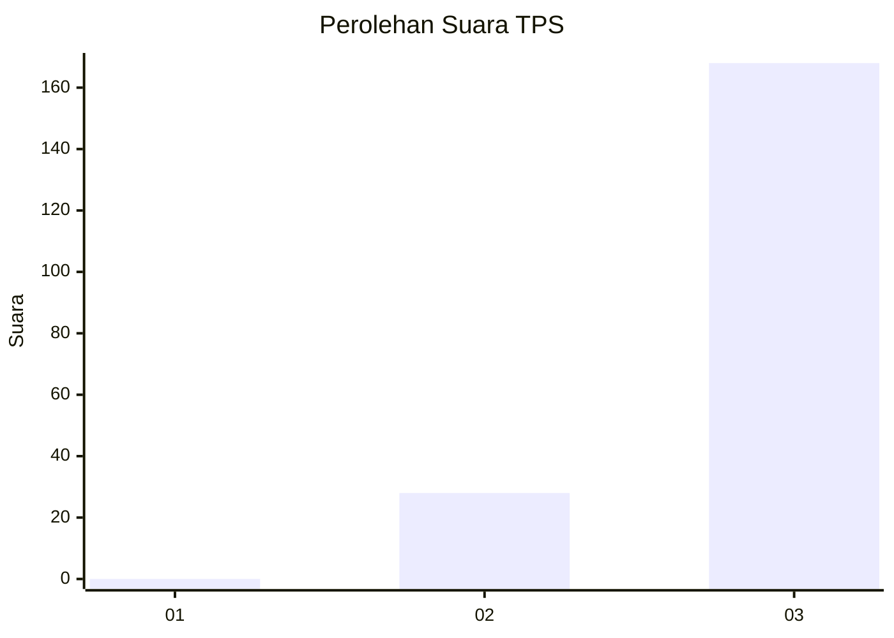
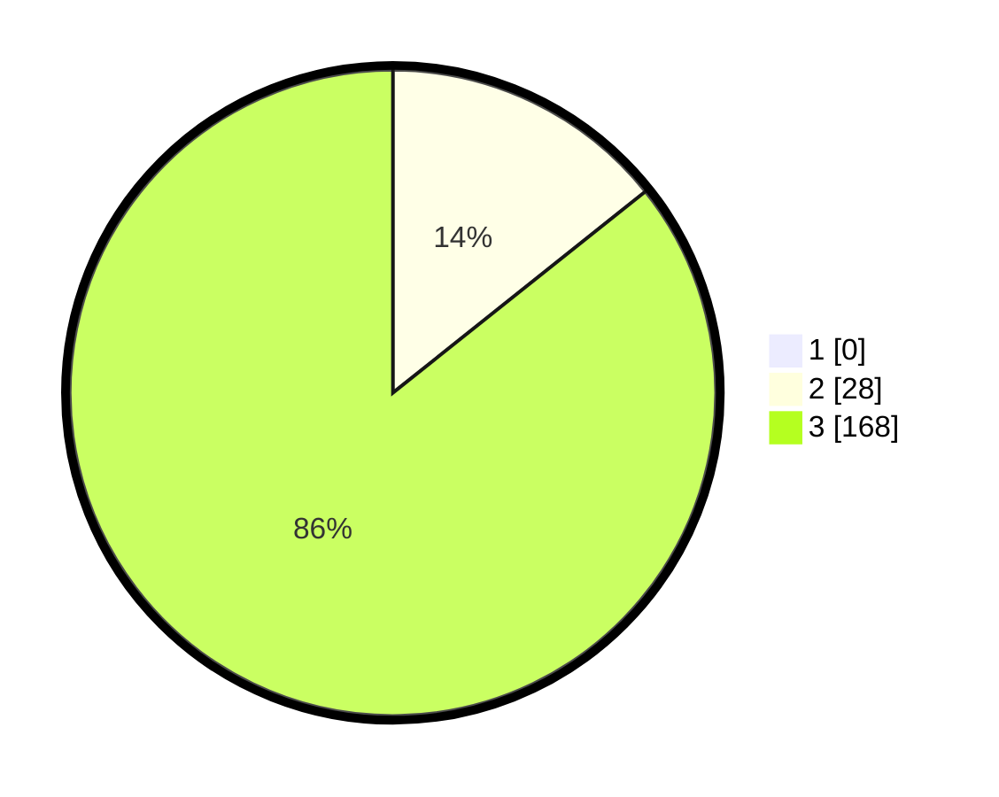

# Hasil

## Grafik

## Tabel

| No. | Nama Paslon    | Suara | Suara (raw) | Persentase |
|:--- |:-------------- | -----:| -----------:| ----------:|
| 1   | ANIES MUHAIMIN | 0     | [0][p-1]    | 0,00       |
| 2   | PRABOWO GIBRAN | 28    | [28][p-2]   | 14,29      |
| 3   | GANJAR MAHFUD  | 168   | [168][p-3]  | 85,71      |

[p-1]: https://github.com/gigit-pemilu/pemilu-2024-12-sumatera-utara/blob/main/pilpres/hitung-suara/sub/12-sumatera-utara/sub/04-nias/sub/10-idanogawo/sub/2036-hilimoasio-dua/sub/002-tps/sub/paslon-1.txt
[p-2]: https://github.com/gigit-pemilu/pemilu-2024-12-sumatera-utara/blob/main/pilpres/hitung-suara/sub/12-sumatera-utara/sub/04-nias/sub/10-idanogawo/sub/2036-hilimoasio-dua/sub/002-tps/sub/paslon-2.txt
[p-3]: https://github.com/gigit-pemilu/pemilu-2024-12-sumatera-utara/blob/main/pilpres/hitung-suara/sub/12-sumatera-utara/sub/04-nias/sub/10-idanogawo/sub/2036-hilimoasio-dua/sub/002-tps/sub/paslon-3.txt

## Foto C Plano

https://sirekap-obj-formc.kpu.go.id/d9a1/pemilu/ppwp/12/04/10/20/36/1204102036002-20240215-104825--892a65f1-e11c-4db1-a1a6-3cfc768ee611.jpg

https://sirekap-obj-formc.kpu.go.id/d9a1/pemilu/ppwp/12/04/10/20/36/1204102036002-20240215-105050--a1b9b087-fcde-447c-9278-0a3154f966d3.jpg

https://sirekap-obj-formc.kpu.go.id/d9a1/pemilu/ppwp/12/04/10/20/36/1204102036002-20240215-105227--ababc7e6-19b7-4ed7-9a52-781e83123368.jpg

## Metadata

| Key        | Value               |
| ---------- | ------------------- |
| Time Stamp | 2024-02-15 15:00:29 |

