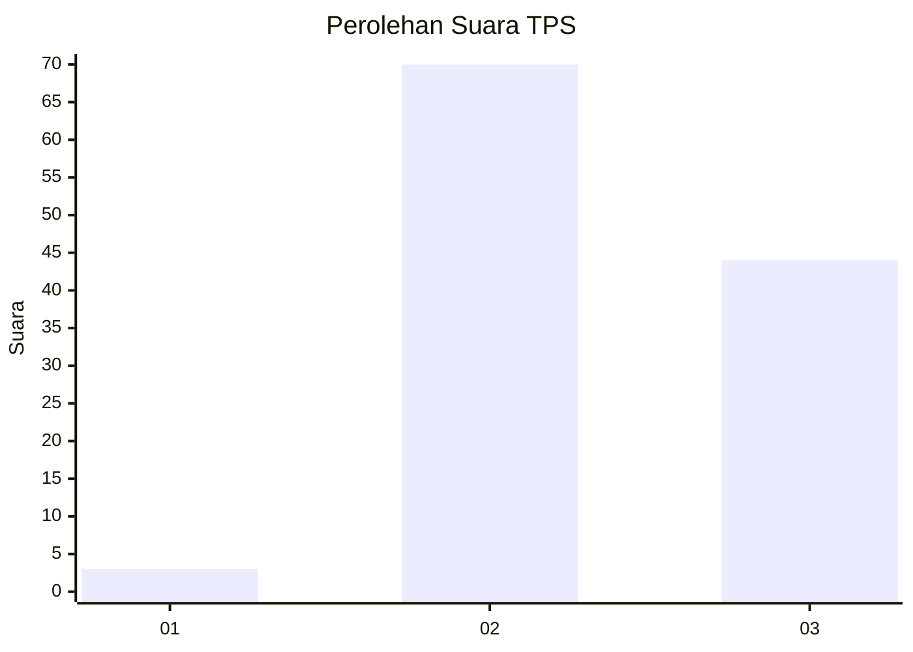
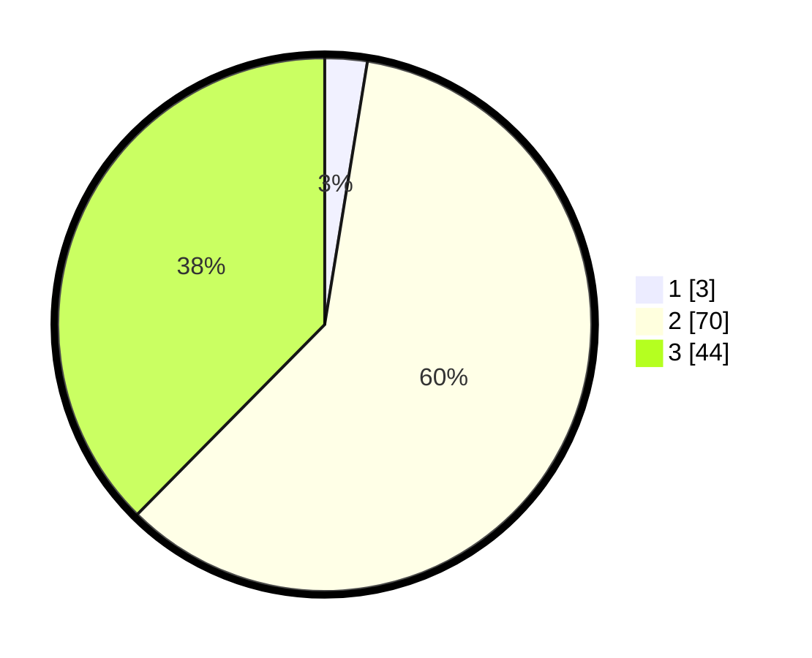

# Hasil

## Grafik

## Tabel

| No. | Nama Paslon    | Suara | Suara (raw) | Persentase |
|:--- |:-------------- | -----:| -----------:| ----------:|
| 1   | ANIES MUHAIMIN | 3     | [3][p-1]    | 2,56       |
| 2   | PRABOWO GIBRAN | 70    | [70][p-2]   | 59,83      |
| 3   | GANJAR MAHFUD  | 44    | [44][p-3]   | 37,61      |

[p-1]: https://github.com/gigit-pemilu/pemilu-2024-12-sumatera-utara/blob/main/pilpres/hitung-suara/sub/12-sumatera-utara/sub/04-nias/sub/10-idanogawo/sub/2037-biouti-timur/sub/001-tps/sub/paslon-1.txt
[p-2]: https://github.com/gigit-pemilu/pemilu-2024-12-sumatera-utara/blob/main/pilpres/hitung-suara/sub/12-sumatera-utara/sub/04-nias/sub/10-idanogawo/sub/2037-biouti-timur/sub/001-tps/sub/paslon-2.txt
[p-3]: https://github.com/gigit-pemilu/pemilu-2024-12-sumatera-utara/blob/main/pilpres/hitung-suara/sub/12-sumatera-utara/sub/04-nias/sub/10-idanogawo/sub/2037-biouti-timur/sub/001-tps/sub/paslon-3.txt

## Foto C Plano

https://sirekap-obj-formc.kpu.go.id/97d8/pemilu/ppwp/12/04/10/20/37/1204102037001-20240214-222452--45a4a0b7-d5b2-4eea-b8e9-ea63e5dd656f.jpg

https://sirekap-obj-formc.kpu.go.id/97d8/pemilu/ppwp/12/04/10/20/37/1204102037001-20240215-001406--e194aae8-67d4-4d06-97e4-1b0a3f530645.jpg

https://sirekap-obj-formc.kpu.go.id/97d8/pemilu/ppwp/12/04/10/20/37/1204102037001-20240214-220137--1136d06c-2689-428f-9d65-4ecfbfda8ef3.jpg

## Metadata

| Key        | Value               |
| ---------- | ------------------- |
| Time Stamp | 2024-02-25 12:00:00 |

