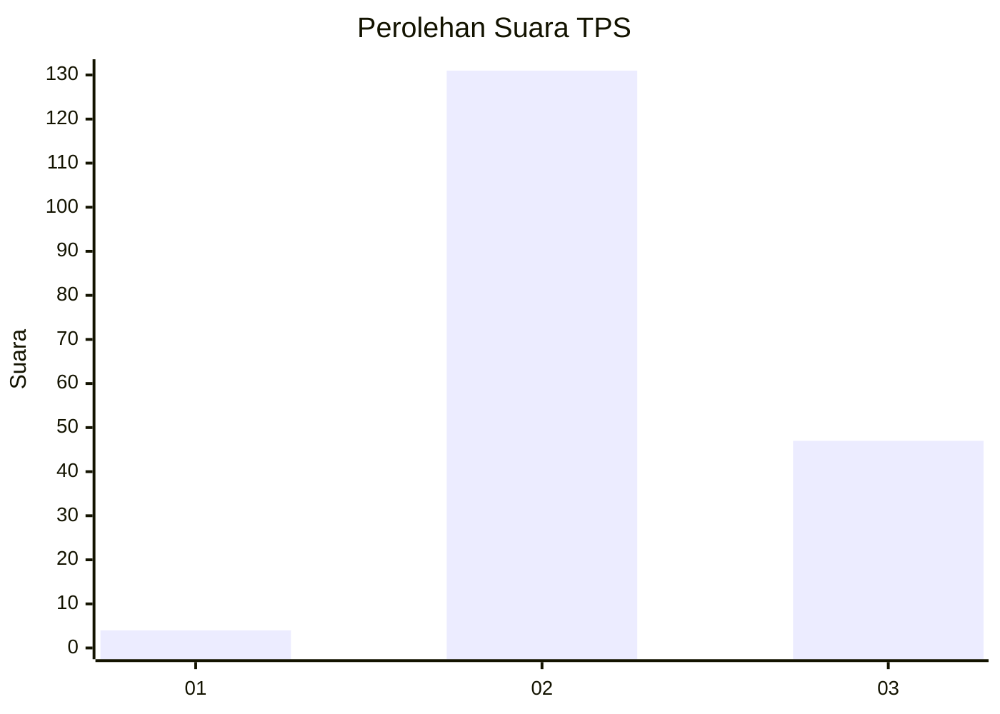
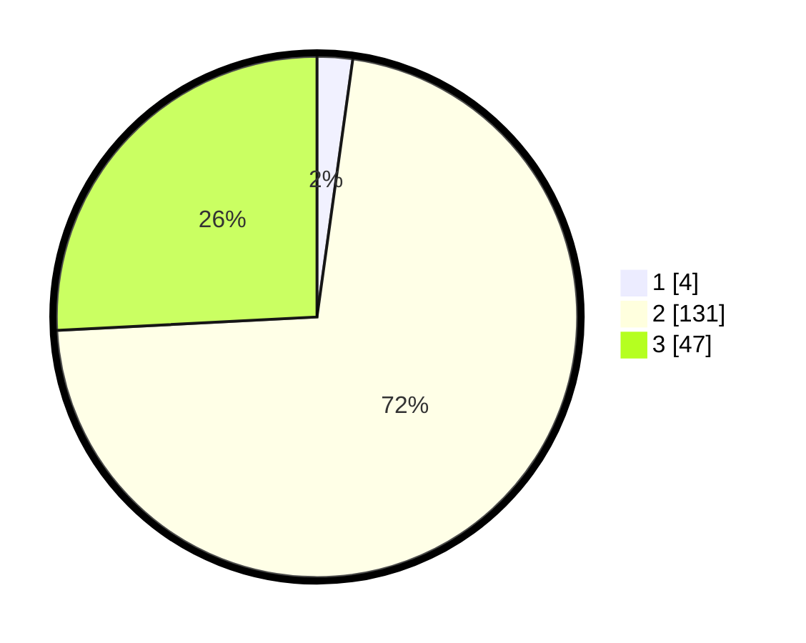

# Hasil

## Grafik

## Tabel

| No. | Nama Paslon    | Suara | Suara (raw) | Persentase |
|:--- |:-------------- | -----:| -----------:| ----------:|
| 1   | ANIES MUHAIMIN | 4     | [4][p-1]    | 2,20       |
| 2   | PRABOWO GIBRAN | 131   | [131][p-2]  | 71,98      |
| 3   | GANJAR MAHFUD  | 47    | [47][p-3]   | 25,82      |

[p-1]: https://github.com/gigit-pemilu/pemilu-2024-12-sumatera-utara/blob/main/pilpres/hitung-suara/sub/12-sumatera-utara/sub/04-nias/sub/11-bawolato/sub/2002-sisarahili-bawolato/sub/001-tps/sub/paslon-1.txt
[p-2]: https://github.com/gigit-pemilu/pemilu-2024-12-sumatera-utara/blob/main/pilpres/hitung-suara/sub/12-sumatera-utara/sub/04-nias/sub/11-bawolato/sub/2002-sisarahili-bawolato/sub/001-tps/sub/paslon-2.txt
[p-3]: https://github.com/gigit-pemilu/pemilu-2024-12-sumatera-utara/blob/main/pilpres/hitung-suara/sub/12-sumatera-utara/sub/04-nias/sub/11-bawolato/sub/2002-sisarahili-bawolato/sub/001-tps/sub/paslon-3.txt

## Foto C Plano

https://sirekap-obj-formc.kpu.go.id/798e/pemilu/ppwp/12/04/11/20/02/1204112002001-20240215-103719--03930dba-1742-48ac-a491-426662ceced4.jpg

https://sirekap-obj-formc.kpu.go.id/798e/pemilu/ppwp/12/04/11/20/02/1204112002001-20240215-103846--5b46c24b-c24f-4bc7-a18a-f631b6cd4547.jpg

https://sirekap-obj-formc.kpu.go.id/798e/pemilu/ppwp/12/04/11/20/02/1204112002001-20240215-104004--72f34db6-dcdf-459a-96c1-736ca74d24d5.jpg

## Metadata

| Key        | Value               |
| ---------- | ------------------- |
| Time Stamp | 2024-02-25 13:00:00 |

