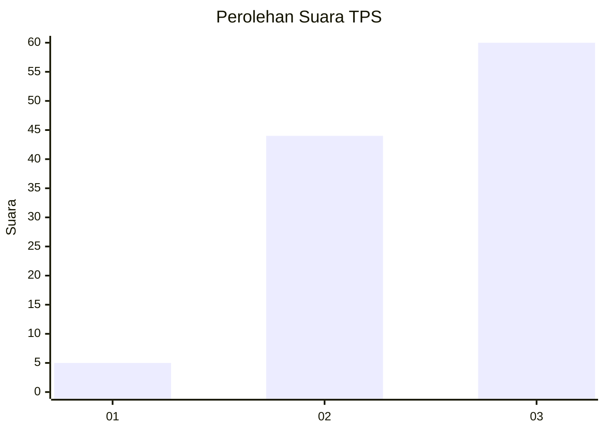
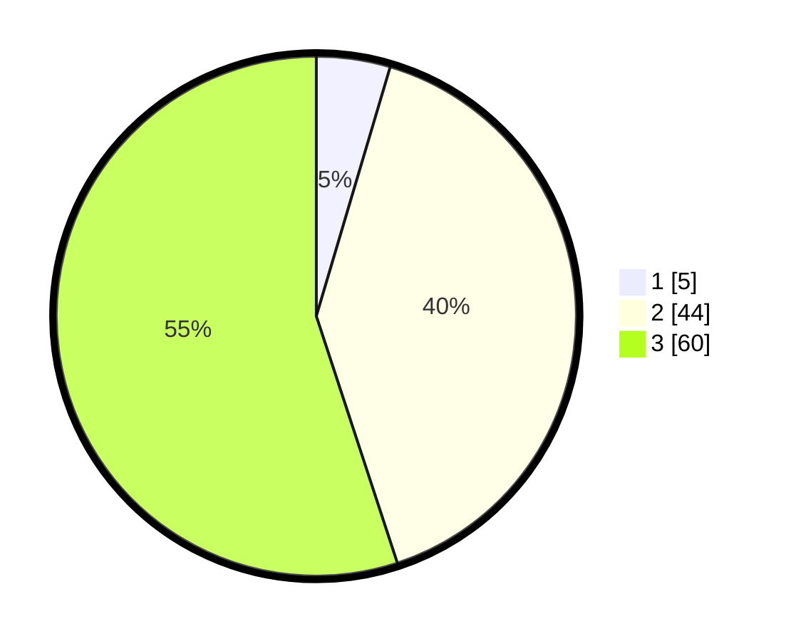

# Hasil

## Grafik

## Tabel

| No. | Nama Paslon    | Suara | Suara (raw) | Persentase |
|:--- |:-------------- | -----:| -----------:| ----------:|
| 1   | ANIES MUHAIMIN | 5     | [5][p-1]    | 4,59       |
| 2   | PRABOWO GIBRAN | 44    | [44][p-2]   | 40,37      |
| 3   | GANJAR MAHFUD  | 60    | [60][p-3]   | 55,05      |

[p-1]: https://github.com/gigit-pemilu/pemilu-2024-12-sumatera-utara/blob/main/pilpres/hitung-suara/sub/12-sumatera-utara/sub/04-nias/sub/11-bawolato/sub/2005-hilihoru/sub/001-tps/sub/paslon-1.txt
[p-2]: https://github.com/gigit-pemilu/pemilu-2024-12-sumatera-utara/blob/main/pilpres/hitung-suara/sub/12-sumatera-utara/sub/04-nias/sub/11-bawolato/sub/2005-hilihoru/sub/001-tps/sub/paslon-2.txt
[p-3]: https://github.com/gigit-pemilu/pemilu-2024-12-sumatera-utara/blob/main/pilpres/hitung-suara/sub/12-sumatera-utara/sub/04-nias/sub/11-bawolato/sub/2005-hilihoru/sub/001-tps/sub/paslon-3.txt

## Foto C Plano

https://sirekap-obj-formc.kpu.go.id/3130/pemilu/ppwp/12/04/11/20/05/1204112005001-20240214-231243--46c605f6-f67c-426c-b664-30bd1fb61245.jpg

https://sirekap-obj-formc.kpu.go.id/3130/pemilu/ppwp/12/04/11/20/05/1204112005001-20240214-231851--a75d1a97-5d9c-4e5b-a168-e76c4cbccba1.jpg

https://sirekap-obj-formc.kpu.go.id/3130/pemilu/ppwp/12/04/11/20/05/1204112005001-20240214-231930--7b26f0c3-3452-46ea-a60e-38ea94962d23.jpg

## Metadata

| Key        | Value               |
| ---------- | ------------------- |
| Time Stamp | 2024-02-15 15:00:29 |

