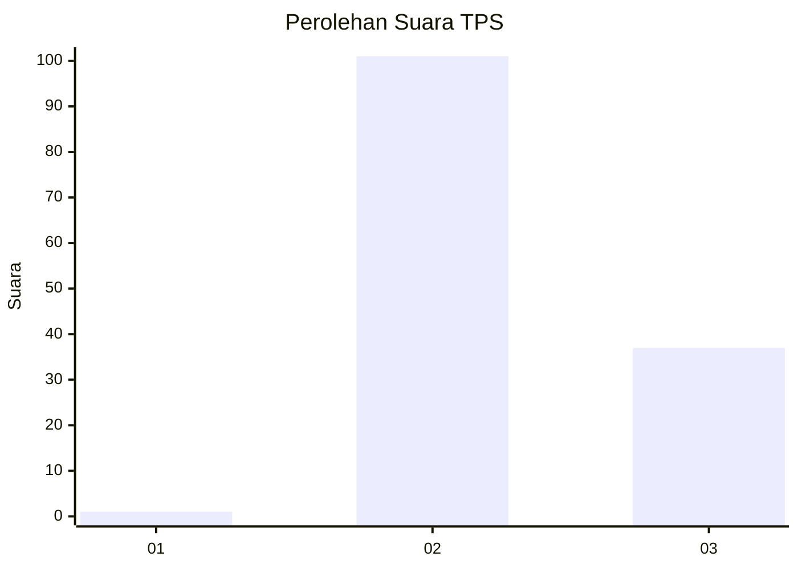
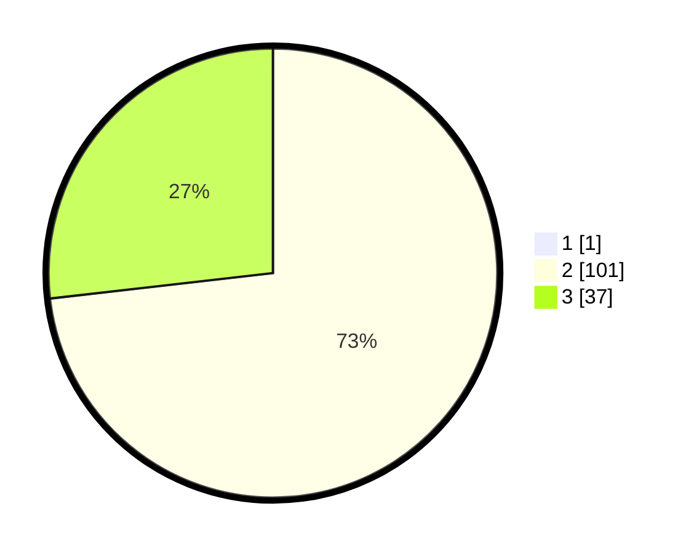

# Hasil

## Grafik

## Tabel

| No. | Nama Paslon    | Suara | Suara (raw) | Persentase |
|:--- |:-------------- | -----:| -----------:| ----------:|
| 1   | ANIES MUHAIMIN | 1     | [1][p-1]    | 0,72       |
| 2   | PRABOWO GIBRAN | 101   | [101][p-2]  | 72,66      |
| 3   | GANJAR MAHFUD  | 37    | [37][p-3]   | 26,62      |

[p-1]: https://github.com/gigit-pemilu/pemilu-2024-12-sumatera-utara/blob/main/pilpres/hitung-suara/sub/12-sumatera-utara/sub/04-nias/sub/11-bawolato/sub/2007-hilifaosi/sub/004-tps/sub/paslon-1.txt
[p-2]: https://github.com/gigit-pemilu/pemilu-2024-12-sumatera-utara/blob/main/pilpres/hitung-suara/sub/12-sumatera-utara/sub/04-nias/sub/11-bawolato/sub/2007-hilifaosi/sub/004-tps/sub/paslon-2.txt
[p-3]: https://github.com/gigit-pemilu/pemilu-2024-12-sumatera-utara/blob/main/pilpres/hitung-suara/sub/12-sumatera-utara/sub/04-nias/sub/11-bawolato/sub/2007-hilifaosi/sub/004-tps/sub/paslon-3.txt

## Foto C Plano

https://sirekap-obj-formc.kpu.go.id/e4c1/pemilu/ppwp/12/04/11/20/07/1204112007004-20240215-153744--a425ac56-f000-40b9-ab0c-cf23a3c25f6f.jpg

https://sirekap-obj-formc.kpu.go.id/e4c1/pemilu/ppwp/12/04/11/20/07/1204112007004-20240215-153805--10549eec-1eb1-407c-8950-2019c1be9860.jpg

https://sirekap-obj-formc.kpu.go.id/e4c1/pemilu/ppwp/12/04/11/20/07/1204112007004-20240215-153821--6d6f08d8-ee6a-47f1-b560-84681236fcdc.jpg

## Metadata

| Key        | Value               |
| ---------- | ------------------- |
| Time Stamp | 2024-02-24 22:31:28 |

