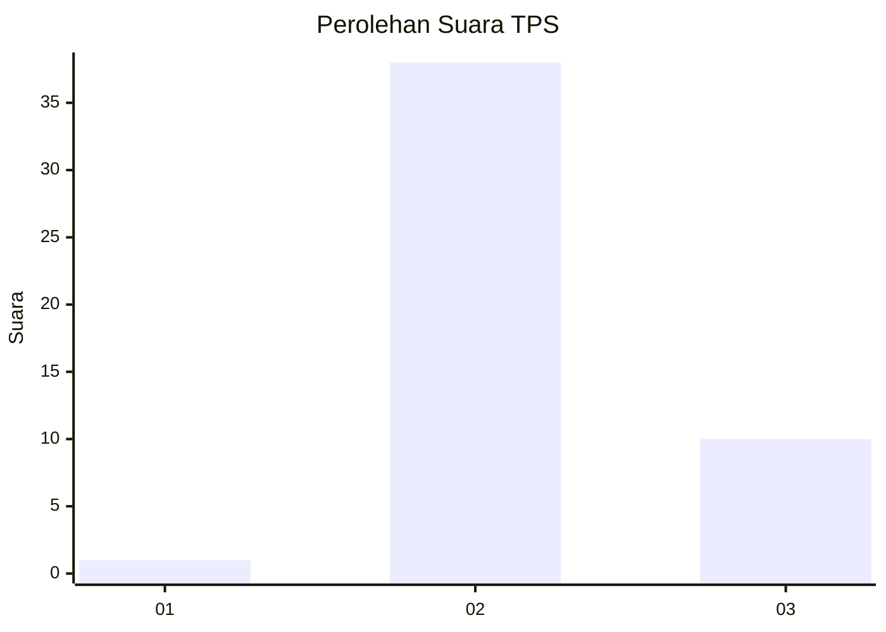

# Hasil

## Grafik

## Tabel

| No. | Nama Paslon    | Suara | Suara (raw) | Persentase |
|:--- |:-------------- | -----:| -----------:| ----------:|
| 1   | ANIES MUHAIMIN | 1     | [1][p-1]    | 2,04       |
| 2   | PRABOWO GIBRAN | 38    | [38][p-2]   | 77,55      |
| 3   | GANJAR MAHFUD  | 10    | [10][p-3]   | 20,41      |

[p-1]: https://github.com/gigit-pemilu/pemilu-2024/blob/main/pilpres/hitung-suara/sub/12-sumatera-utara/sub/04-nias/sub/11-bawolato/sub/2007-hilifaosi/sub/005-tps/sub/paslon-1.txt
[p-2]: https://github.com/gigit-pemilu/pemilu-2024/blob/main/pilpres/hitung-suara/sub/12-sumatera-utara/sub/04-nias/sub/11-bawolato/sub/2007-hilifaosi/sub/005-tps/sub/paslon-2.txt
[p-3]: https://github.com/gigit-pemilu/pemilu-2024/blob/main/pilpres/hitung-suara/sub/12-sumatera-utara/sub/04-nias/sub/11-bawolato/sub/2007-hilifaosi/sub/005-tps/sub/paslon-3.txt

## Foto C Plano

https://sirekap-obj-formc.kpu.go.id/1018/pemilu/ppwp/12/04/11/20/07/1204112007005-20240214-224540--99636330-3c1e-42e0-a40f-22024fff15bb.jpg

https://sirekap-obj-formc.kpu.go.id/1018/pemilu/ppwp/12/04/11/20/07/1204112007005-20240214-224613--760585d3-8a12-484b-a0cf-1b4cb43cbad1.jpg

## Metadata

| Key        | Value               |
| ---------- | ------------------- |
| Time Stamp | 2024-02-15 09:00:24 |

