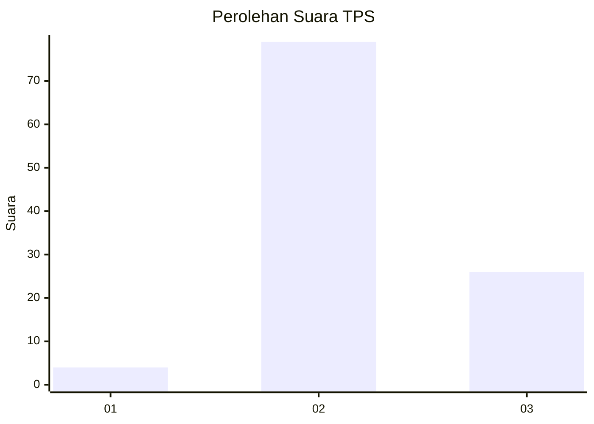
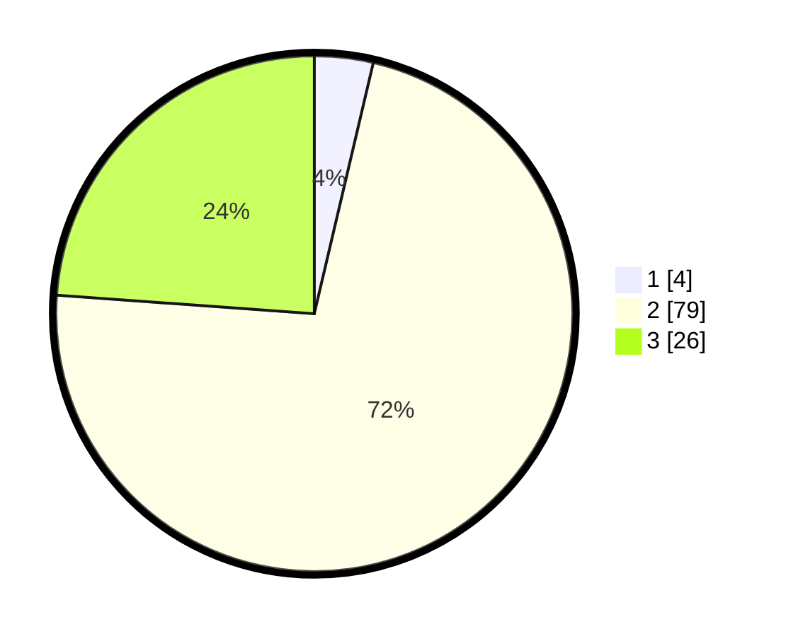

# Hasil

## Grafik

## Tabel

| No. | Nama Paslon    | Suara | Suara (raw) | Persentase |
|:--- |:-------------- | -----:| -----------:| ----------:|
| 1   | ANIES MUHAIMIN | 4     | [4][p-1]    | 3,67       |
| 2   | PRABOWO GIBRAN | 79    | [79][p-2]   | 72,48      |
| 3   | GANJAR MAHFUD  | 26    | [26][p-3]   | 23,85      |

[p-1]: https://github.com/gigit-pemilu/pemilu-2024/blob/main/pilpres/hitung-suara/sub/12-sumatera-utara/sub/04-nias/sub/11-bawolato/sub/2009-sitolubanua/sub/004-tps/sub/paslon-1.txt
[p-2]: https://github.com/gigit-pemilu/pemilu-2024/blob/main/pilpres/hitung-suara/sub/12-sumatera-utara/sub/04-nias/sub/11-bawolato/sub/2009-sitolubanua/sub/004-tps/sub/paslon-2.txt
[p-3]: https://github.com/gigit-pemilu/pemilu-2024/blob/main/pilpres/hitung-suara/sub/12-sumatera-utara/sub/04-nias/sub/11-bawolato/sub/2009-sitolubanua/sub/004-tps/sub/paslon-3.txt

## Foto C Plano

https://sirekap-obj-formc.kpu.go.id/7b85/pemilu/ppwp/12/04/11/20/09/1204112009004-20240214-160152--d26d2d78-1ee4-4627-9374-d39d1d5fc171.jpg

https://sirekap-obj-formc.kpu.go.id/7b85/pemilu/ppwp/12/04/11/20/09/1204112009004-20240214-212403--64f27a62-8cc7-4fe5-9ed0-b7b681aac117.jpg

https://sirekap-obj-formc.kpu.go.id/7b85/pemilu/ppwp/12/04/11/20/09/1204112009004-20240214-212458--382a81f5-a139-4004-8709-48cae33fdadb.jpg

## Metadata

| Key        | Value               |
| ---------- | ------------------- |
| Time Stamp | 2024-02-15 00:56:54 |

