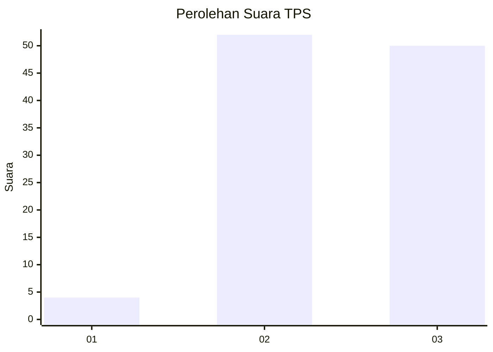
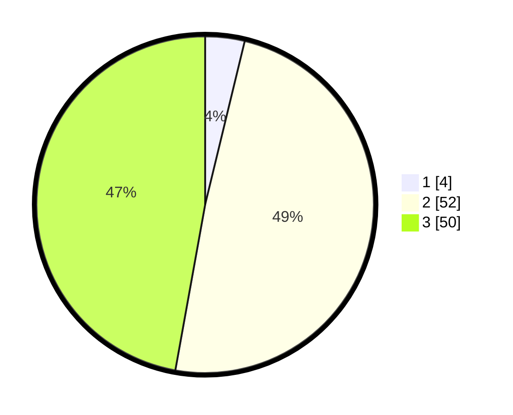

# Hasil

## Grafik

## Tabel

| No. | Nama Paslon    | Suara | Suara (raw) | Persentase |
|:--- |:-------------- | -----:| -----------:| ----------:|
| 1   | ANIES MUHAIMIN | 4     | [4][p-1]    | 3,77       |
| 2   | PRABOWO GIBRAN | 52    | [52][p-2]   | 49,06      |
| 3   | GANJAR MAHFUD  | 50    | [50][p-3]   | 47,17      |

[p-1]: https://github.com/gigit-pemilu/pemilu-2024-12-sumatera-utara/blob/main/pilpres/hitung-suara/sub/12-sumatera-utara/sub/04-nias/sub/11-bawolato/sub/2010-siofaewali/sub/003-tps/sub/paslon-1.txt
[p-2]: https://github.com/gigit-pemilu/pemilu-2024-12-sumatera-utara/blob/main/pilpres/hitung-suara/sub/12-sumatera-utara/sub/04-nias/sub/11-bawolato/sub/2010-siofaewali/sub/003-tps/sub/paslon-2.txt
[p-3]: https://github.com/gigit-pemilu/pemilu-2024-12-sumatera-utara/blob/main/pilpres/hitung-suara/sub/12-sumatera-utara/sub/04-nias/sub/11-bawolato/sub/2010-siofaewali/sub/003-tps/sub/paslon-3.txt

## Foto C Plano

https://sirekap-obj-formc.kpu.go.id/53db/pemilu/ppwp/12/04/11/20/10/1204112010003-20240215-151334--c305c238-bce6-489e-9db8-6c2e4ae0d454.jpg

https://sirekap-obj-formc.kpu.go.id/53db/pemilu/ppwp/12/04/11/20/10/1204112010003-20240215-151427--7195c9c6-6b8d-4f05-b2d7-e5513319669d.jpg

https://sirekap-obj-formc.kpu.go.id/53db/pemilu/ppwp/12/04/11/20/10/1204112010003-20240215-151534--41d5c91e-ceee-4df9-b7eb-7776e32c1ba6.jpg

## Metadata

| Key        | Value               |
| ---------- | ------------------- |
| Time Stamp | 2024-02-24 22:31:28 |

