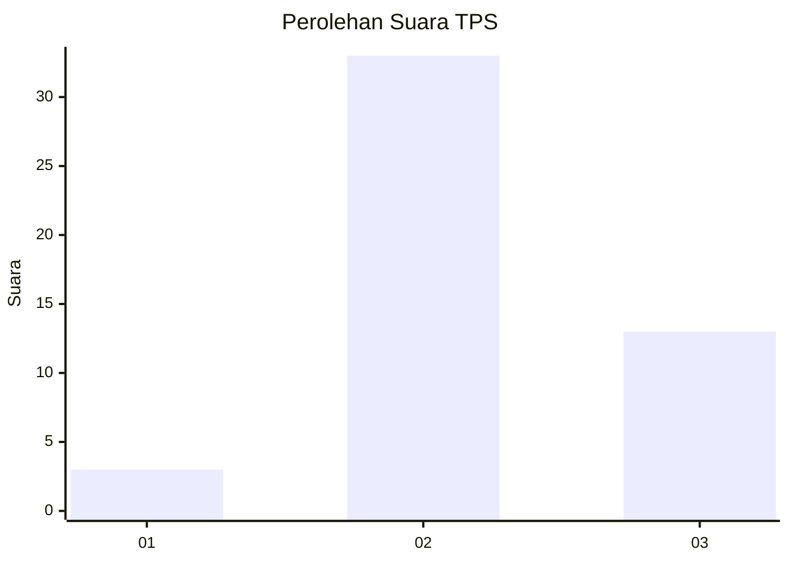
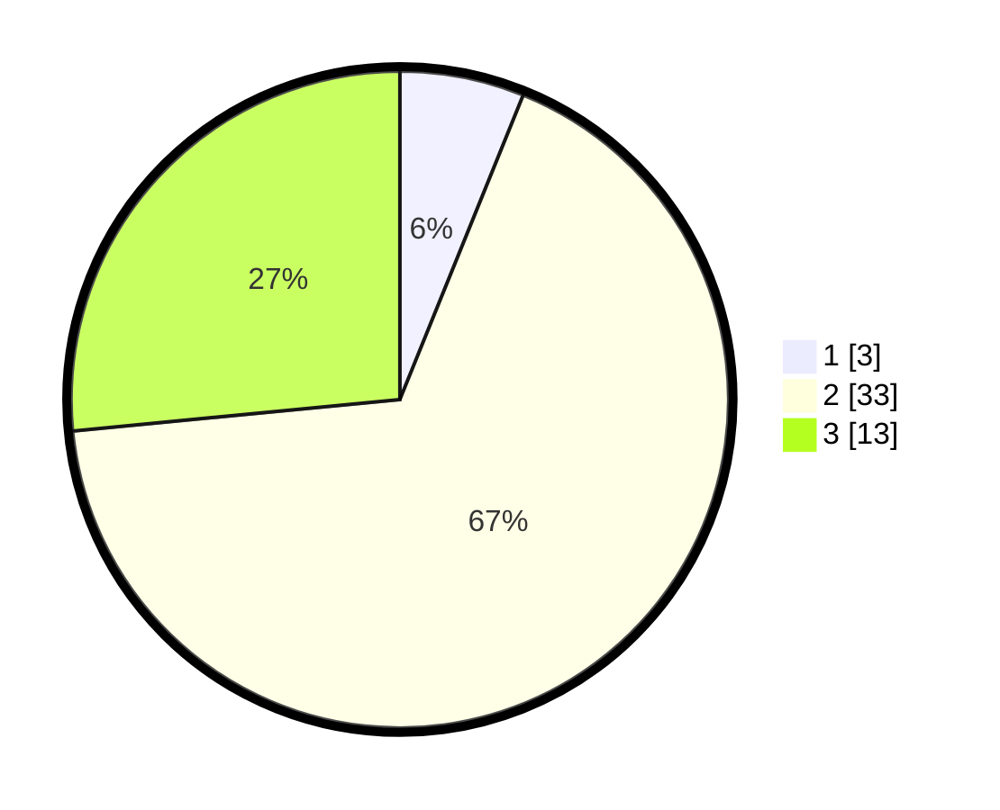

# Hasil

## Grafik

## Tabel

| No. | Nama Paslon    | Suara | Suara (raw) | Persentase |
|:--- |:-------------- | -----:| -----------:| ----------:|
| 1   | ANIES MUHAIMIN | 3     | [3][p-1]    | 6,12       |
| 2   | PRABOWO GIBRAN | 33    | [33][p-2]   | 67,35      |
| 3   | GANJAR MAHFUD  | 13    | [13][p-3]   | 26,53      |

[p-1]: https://github.com/gigit-pemilu/pemilu-2024/blob/main/pilpres/hitung-suara/sub/12-sumatera-utara/sub/04-nias/sub/11-bawolato/sub/2011-sohoya/sub/002-tps/sub/paslon-1.txt
[p-2]: https://github.com/gigit-pemilu/pemilu-2024/blob/main/pilpres/hitung-suara/sub/12-sumatera-utara/sub/04-nias/sub/11-bawolato/sub/2011-sohoya/sub/002-tps/sub/paslon-2.txt
[p-3]: https://github.com/gigit-pemilu/pemilu-2024/blob/main/pilpres/hitung-suara/sub/12-sumatera-utara/sub/04-nias/sub/11-bawolato/sub/2011-sohoya/sub/002-tps/sub/paslon-3.txt

## Foto C Plano

https://sirekap-obj-formc.kpu.go.id/e5dc/pemilu/ppwp/12/04/11/20/11/1204112011002-20240215-203425--7d0c12cd-a16f-4dba-93b5-dee23fe4564e.jpg

https://sirekap-obj-formc.kpu.go.id/e5dc/pemilu/ppwp/12/04/11/20/11/1204112011002-20240215-204155--d5e6c650-f014-45f0-a1c7-ee75948f6643.jpg

https://sirekap-obj-formc.kpu.go.id/e5dc/pemilu/ppwp/12/04/11/20/11/1204112011002-20240215-205113--820b464d-1d20-4d75-b69c-5e61530136fe.jpg

## Metadata

| Key        | Value               |
| ---------- | ------------------- |
| Time Stamp | 2024-02-26 00:00:00 |

