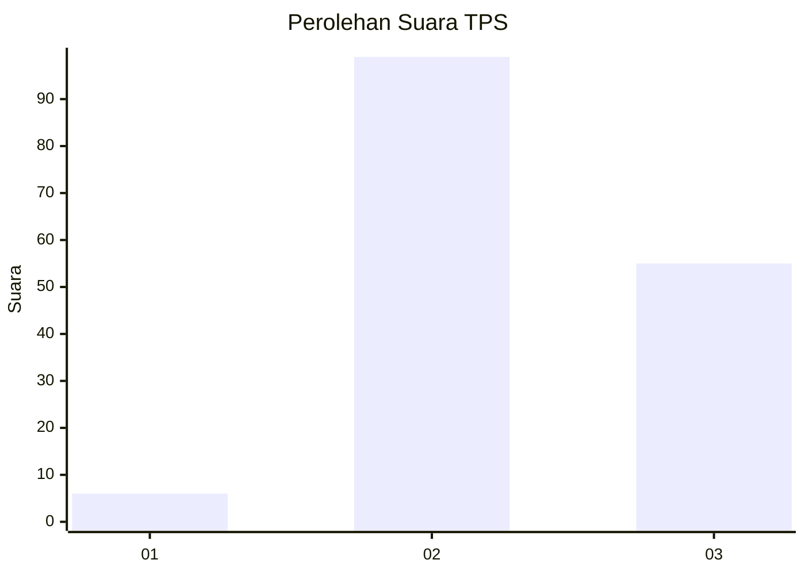
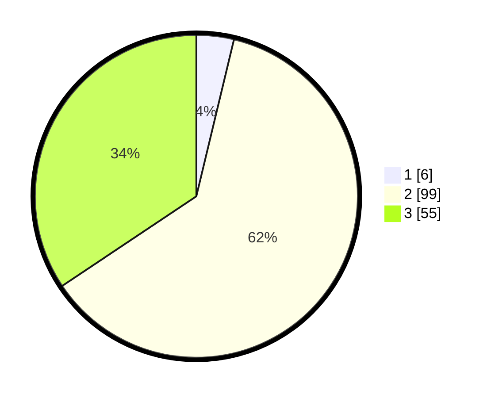

# Hasil

## Grafik

## Tabel

| No. | Nama Paslon    | Suara | Suara (raw) | Persentase |
|:--- |:-------------- | -----:| -----------:| ----------:|
| 1   | ANIES MUHAIMIN | 6     | [6][p-1]    | 3,75       |
| 2   | PRABOWO GIBRAN | 99    | [99][p-2]   | 61,88      |
| 3   | GANJAR MAHFUD  | 55    | [55][p-3]   | 34,38      |

[p-1]: https://github.com/gigit-pemilu/pemilu-2024/blob/main/pilpres/hitung-suara/sub/12-sumatera-utara/sub/04-nias/sub/11-bawolato/sub/2015-siofabanua/sub/001-tps/sub/paslon-1.txt
[p-2]: https://github.com/gigit-pemilu/pemilu-2024/blob/main/pilpres/hitung-suara/sub/12-sumatera-utara/sub/04-nias/sub/11-bawolato/sub/2015-siofabanua/sub/001-tps/sub/paslon-2.txt
[p-3]: https://github.com/gigit-pemilu/pemilu-2024/blob/main/pilpres/hitung-suara/sub/12-sumatera-utara/sub/04-nias/sub/11-bawolato/sub/2015-siofabanua/sub/001-tps/sub/paslon-3.txt

## Foto C Plano

https://sirekap-obj-formc.kpu.go.id/5e28/pemilu/ppwp/12/04/11/20/15/1204112015001-20240215-083757--c88727c4-6c37-4a0e-a4d8-6b8edb56c10e.jpg

https://sirekap-obj-formc.kpu.go.id/5e28/pemilu/ppwp/12/04/11/20/15/1204112015001-20240215-084929--3e618aa5-ffaa-455f-8efc-e30ab4a9c39b.jpg

https://sirekap-obj-formc.kpu.go.id/5e28/pemilu/ppwp/12/04/11/20/15/1204112015001-20240215-075350--156778a5-05c8-4649-ba6d-0c1fdb79c489.jpg

## Metadata

| Key        | Value               |
| ---------- | ------------------- |
| Time Stamp | 2024-02-16 00:30:27 |

