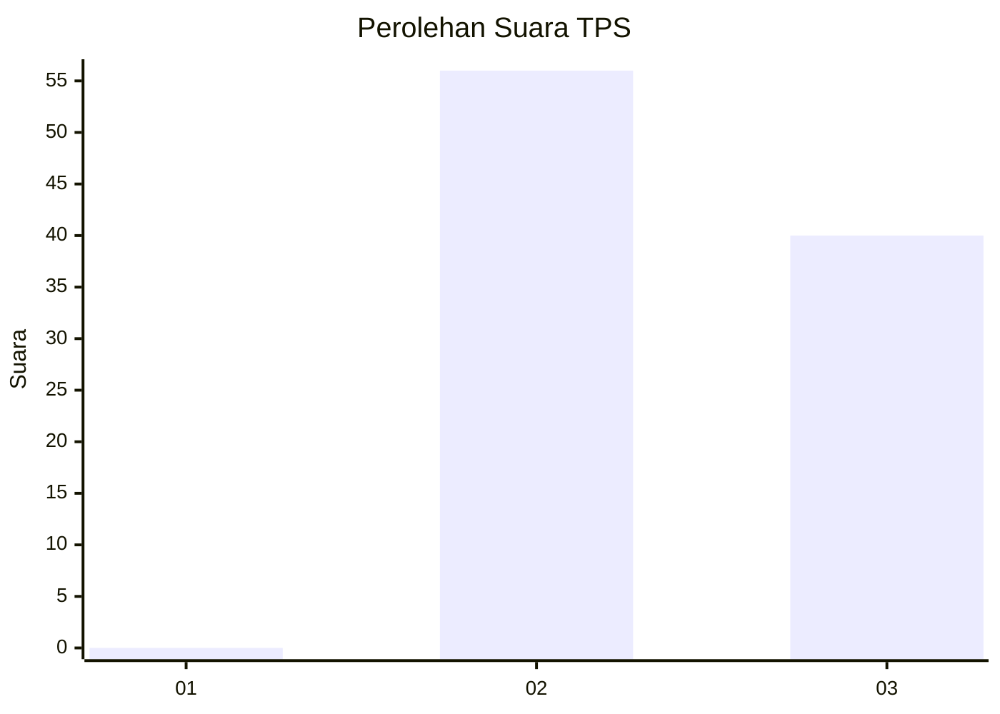
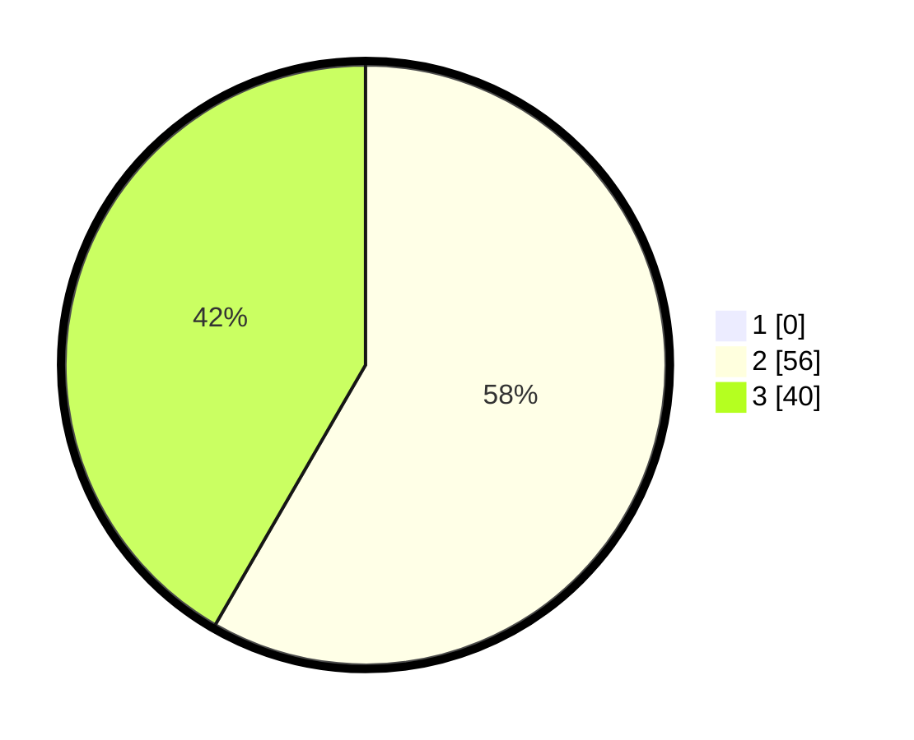

# Hasil

## Grafik

## Tabel

| No. | Nama Paslon    | Suara | Suara (raw) | Persentase |
|:--- |:-------------- | -----:| -----------:| ----------:|
| 1   | ANIES MUHAIMIN | 0     | [0][p-1]    | 0,00       |
| 2   | PRABOWO GIBRAN | 56    | [56][p-2]   | 58,33      |
| 3   | GANJAR MAHFUD  | 40    | [40][p-3]   | 41,67      |

[p-1]: https://github.com/gigit-pemilu/pemilu-2024-12-sumatera-utara/blob/main/pilpres/hitung-suara/sub/12-sumatera-utara/sub/04-nias/sub/11-bawolato/sub/2015-siofabanua/sub/004-tps/sub/paslon-1.txt
[p-2]: https://github.com/gigit-pemilu/pemilu-2024-12-sumatera-utara/blob/main/pilpres/hitung-suara/sub/12-sumatera-utara/sub/04-nias/sub/11-bawolato/sub/2015-siofabanua/sub/004-tps/sub/paslon-2.txt
[p-3]: https://github.com/gigit-pemilu/pemilu-2024-12-sumatera-utara/blob/main/pilpres/hitung-suara/sub/12-sumatera-utara/sub/04-nias/sub/11-bawolato/sub/2015-siofabanua/sub/004-tps/sub/paslon-3.txt

## Foto C Plano

https://sirekap-obj-formc.kpu.go.id/ec83/pemilu/ppwp/12/04/11/20/15/1204112015004-20240215-135032--c7b29249-0669-47c0-a559-b4a5e3e0a8fe.jpg

https://sirekap-obj-formc.kpu.go.id/ec83/pemilu/ppwp/12/04/11/20/15/1204112015004-20240214-235003--ac330e97-297d-48f2-9266-c4c9b81bae32.jpg

https://sirekap-obj-formc.kpu.go.id/ec83/pemilu/ppwp/12/04/11/20/15/1204112015004-20240215-060708--2cf3a8e0-1291-46a1-82e7-0abcc5e79885.jpg

## Metadata

| Key        | Value               |
| ---------- | ------------------- |
| Time Stamp | 2024-02-15 15:30:25 |

