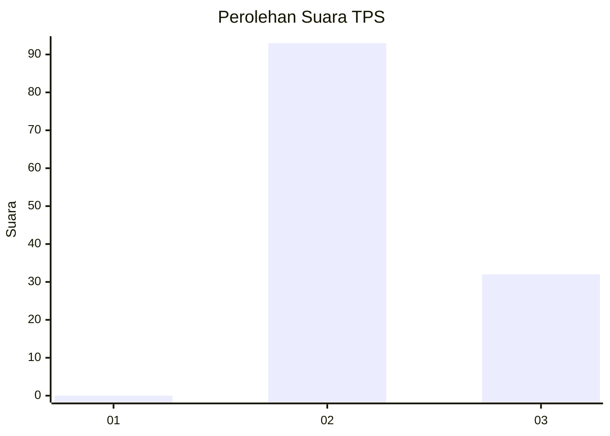
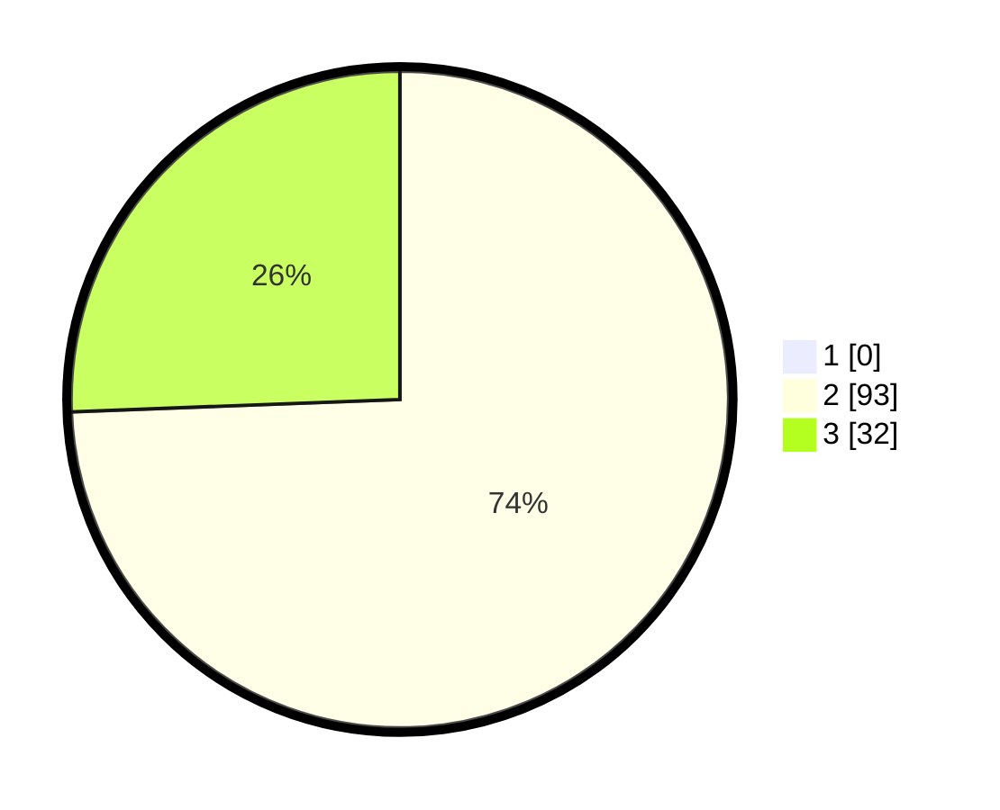

# Hasil

## Grafik

## Tabel

| No. | Nama Paslon    | Suara | Suara (raw) | Persentase |
|:--- |:-------------- | -----:| -----------:| ----------:|
| 1   | ANIES MUHAIMIN | 0     | [0][p-1]    | 0,00       |
| 2   | PRABOWO GIBRAN | 93    | [93][p-2]   | 74,40      |
| 3   | GANJAR MAHFUD  | 32    | [32][p-3]   | 25,60      |

[p-1]: https://github.com/gigit-pemilu/pemilu-2024-12-sumatera-utara/blob/main/pilpres/hitung-suara/sub/12-sumatera-utara/sub/04-nias/sub/11-bawolato/sub/2015-siofabanua/sub/005-tps/sub/paslon-1.txt
[p-2]: https://github.com/gigit-pemilu/pemilu-2024-12-sumatera-utara/blob/main/pilpres/hitung-suara/sub/12-sumatera-utara/sub/04-nias/sub/11-bawolato/sub/2015-siofabanua/sub/005-tps/sub/paslon-2.txt
[p-3]: https://github.com/gigit-pemilu/pemilu-2024-12-sumatera-utara/blob/main/pilpres/hitung-suara/sub/12-sumatera-utara/sub/04-nias/sub/11-bawolato/sub/2015-siofabanua/sub/005-tps/sub/paslon-3.txt

## Foto C Plano

https://sirekap-obj-formc.kpu.go.id/c209/pemilu/ppwp/12/04/11/20/15/1204112015005-20240215-083221--3ddb3d81-576d-4446-a7d2-15c50ddac5c6.jpg

https://sirekap-obj-formc.kpu.go.id/c209/pemilu/ppwp/12/04/11/20/15/1204112015005-20240215-083403--eea07525-f9a7-4875-bded-8061d2a0b817.jpg

https://sirekap-obj-formc.kpu.go.id/c209/pemilu/ppwp/12/04/11/20/15/1204112015005-20240215-083521--12cbca1c-fb7a-4bb2-8e8a-d870df6fe103.jpg

## Metadata

| Key        | Value               |
| ---------- | ------------------- |
| Time Stamp | 2024-02-16 00:30:27 |

