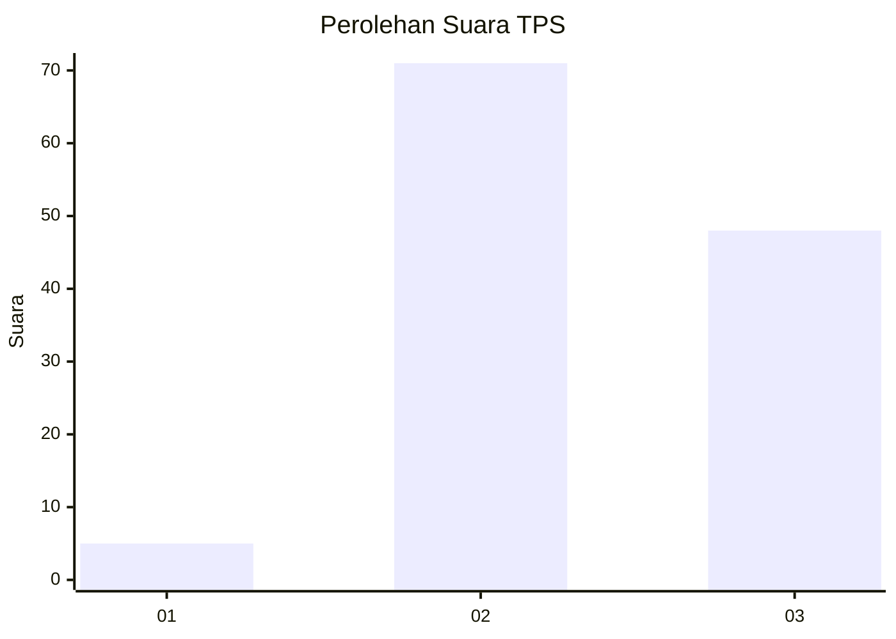
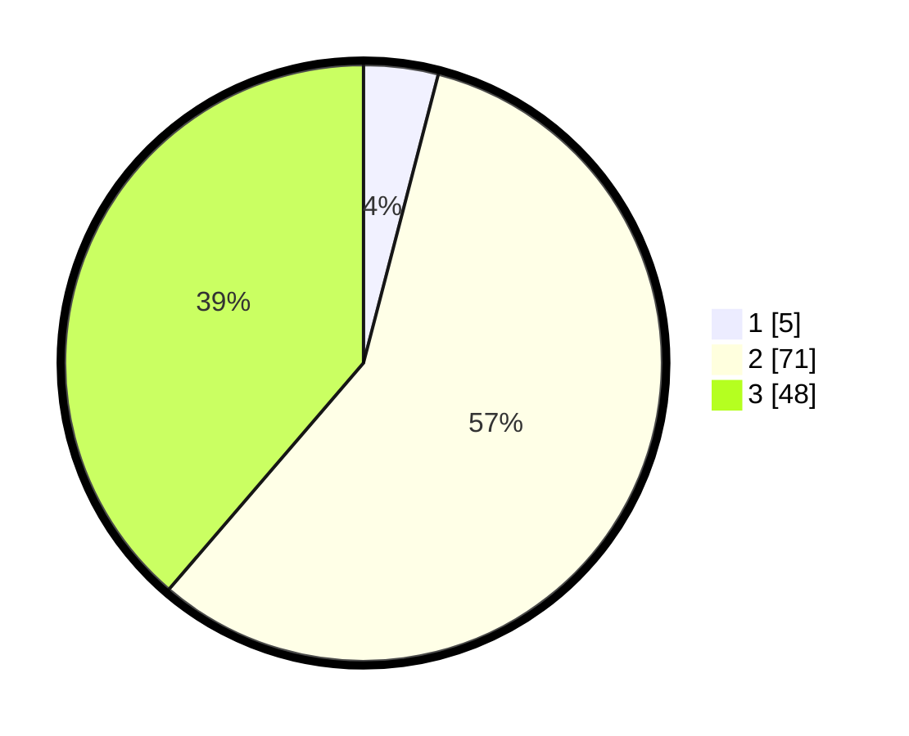

# Hasil

## Grafik

## Tabel

| No. | Nama Paslon    | Suara | Suara (raw) | Persentase |
|:--- |:-------------- | -----:| -----------:| ----------:|
| 1   | ANIES MUHAIMIN | 5     | [5][p-1]    | 4,03       |
| 2   | PRABOWO GIBRAN | 71    | [71][p-2]   | 57,26      |
| 3   | GANJAR MAHFUD  | 48    | [48][p-3]   | 38,71      |

[p-1]: https://github.com/gigit-pemilu/pemilu-2024-12-sumatera-utara/blob/main/pilpres/hitung-suara/sub/12-sumatera-utara/sub/04-nias/sub/11-bawolato/sub/2016-sifaoro'asi-uluhou/sub/003-tps/sub/paslon-1.txt
[p-2]: https://github.com/gigit-pemilu/pemilu-2024-12-sumatera-utara/blob/main/pilpres/hitung-suara/sub/12-sumatera-utara/sub/04-nias/sub/11-bawolato/sub/2016-sifaoro'asi-uluhou/sub/003-tps/sub/paslon-2.txt
[p-3]: https://github.com/gigit-pemilu/pemilu-2024-12-sumatera-utara/blob/main/pilpres/hitung-suara/sub/12-sumatera-utara/sub/04-nias/sub/11-bawolato/sub/2016-sifaoro'asi-uluhou/sub/003-tps/sub/paslon-3.txt

## Foto C Plano

https://sirekap-obj-formc.kpu.go.id/60c2/pemilu/ppwp/12/04/11/20/16/1204112016003-20240215-123833--0581db85-4e60-45e0-bf61-f1d6791ae391.jpg

https://sirekap-obj-formc.kpu.go.id/60c2/pemilu/ppwp/12/04/11/20/16/1204112016003-20240215-015421--3114d2d3-d73c-4880-bd4a-1094211a2e78.jpg

https://sirekap-obj-formc.kpu.go.id/60c2/pemilu/ppwp/12/04/11/20/16/1204112016003-20240215-015304--a3619b83-081e-4264-99e6-b9a1adf571ac.jpg

## Metadata

| Key        | Value               |
| ---------- | ------------------- |
| Time Stamp | 2024-02-16 00:30:27 |

