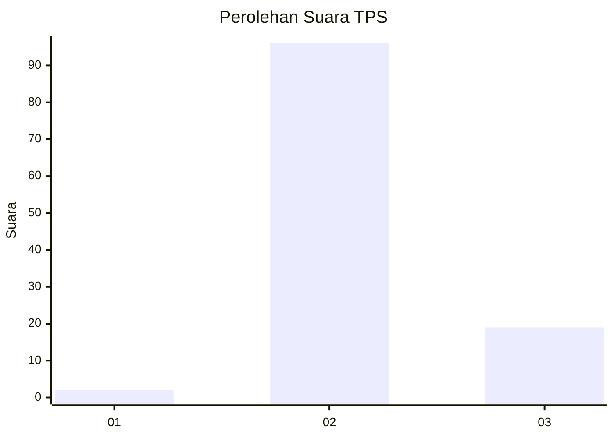
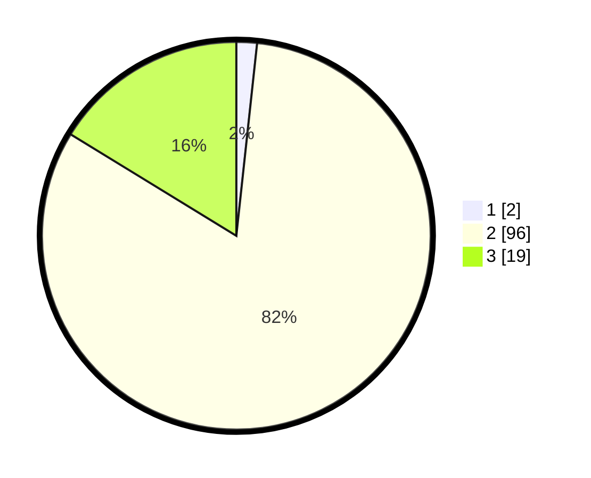

# Hasil

## Grafik

## Tabel

| No. | Nama Paslon    | Suara | Suara (raw) | Persentase |
|:--- |:-------------- | -----:| -----------:| ----------:|
| 1   | ANIES MUHAIMIN | 2     | [2][p-1]    | 1,71       |
| 2   | PRABOWO GIBRAN | 96    | [96][p-2]   | 82,05      |
| 3   | GANJAR MAHFUD  | 19    | [19][p-3]   | 16,24      |

[p-1]: https://github.com/gigit-pemilu/pemilu-2024/blob/main/pilpres/hitung-suara/sub/12-sumatera-utara/sub/04-nias/sub/11-bawolato/sub/2021-lagasimahe/sub/001-tps/sub/paslon-1.txt
[p-2]: https://github.com/gigit-pemilu/pemilu-2024/blob/main/pilpres/hitung-suara/sub/12-sumatera-utara/sub/04-nias/sub/11-bawolato/sub/2021-lagasimahe/sub/001-tps/sub/paslon-2.txt
[p-3]: https://github.com/gigit-pemilu/pemilu-2024/blob/main/pilpres/hitung-suara/sub/12-sumatera-utara/sub/04-nias/sub/11-bawolato/sub/2021-lagasimahe/sub/001-tps/sub/paslon-3.txt

## Foto C Plano

https://sirekap-obj-formc.kpu.go.id/db68/pemilu/ppwp/12/04/11/20/21/1204112021001-20240215-035506--d8e3b820-a8ef-45aa-b6f3-61a2b55b7230.jpg

https://sirekap-obj-formc.kpu.go.id/db68/pemilu/ppwp/12/04/11/20/21/1204112021001-20240215-035614--32a3291a-acd6-4782-aacd-78fc927d929c.jpg

https://sirekap-obj-formc.kpu.go.id/db68/pemilu/ppwp/12/04/11/20/21/1204112021001-20240215-035720--114a0341-7b34-459f-b2ab-b41047636cd6.jpg

## Metadata

| Key        | Value               |
| ---------- | ------------------- |
| Time Stamp | 2024-02-15 15:00:29 |

