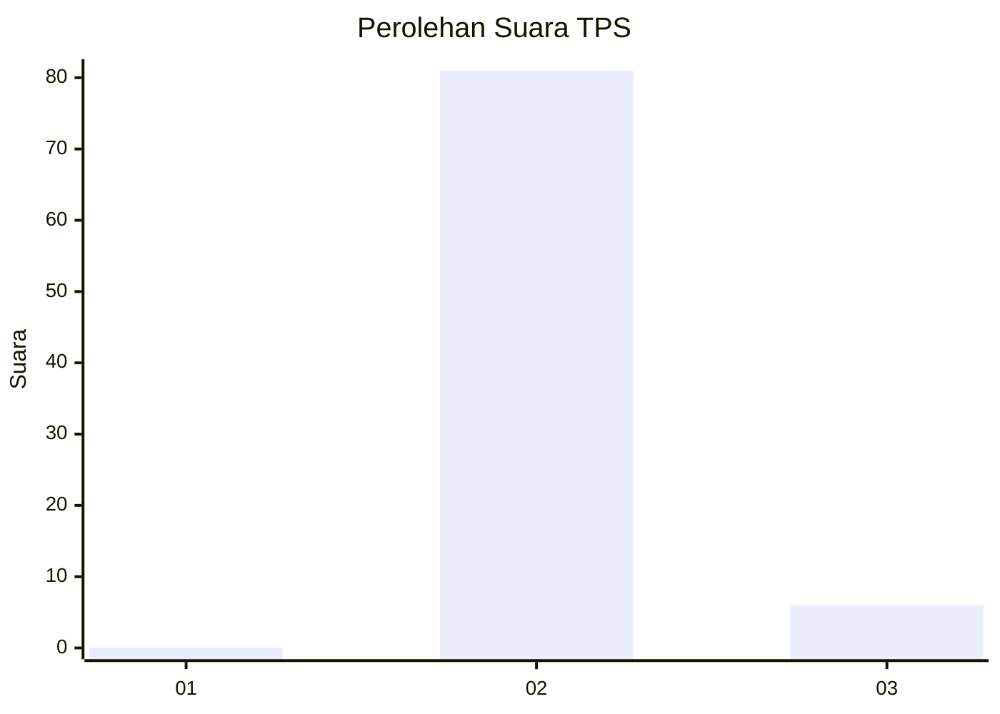
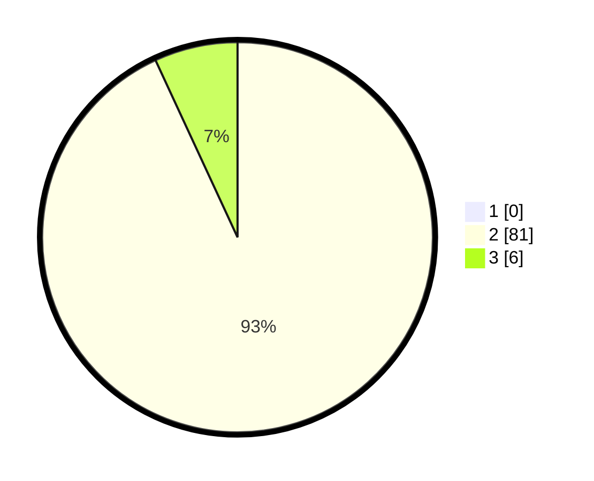

# Hasil

## Grafik

## Tabel

| No. | Nama Paslon    | Suara | Suara (raw) | Persentase |
|:--- |:-------------- | -----:| -----------:| ----------:|
| 1   | ANIES MUHAIMIN | 0     | [0][p-1]    | 0,00       |
| 2   | PRABOWO GIBRAN | 81    | [81][p-2]   | 93,10      |
| 3   | GANJAR MAHFUD  | 6     | [6][p-3]    | 6,90       |

[p-1]: https://github.com/gigit-pemilu/pemilu-2024/blob/main/pilpres/hitung-suara/sub/12-sumatera-utara/sub/04-nias/sub/11-bawolato/sub/2021-lagasimahe/sub/002-tps/sub/paslon-1.txt
[p-2]: https://github.com/gigit-pemilu/pemilu-2024/blob/main/pilpres/hitung-suara/sub/12-sumatera-utara/sub/04-nias/sub/11-bawolato/sub/2021-lagasimahe/sub/002-tps/sub/paslon-2.txt
[p-3]: https://github.com/gigit-pemilu/pemilu-2024/blob/main/pilpres/hitung-suara/sub/12-sumatera-utara/sub/04-nias/sub/11-bawolato/sub/2021-lagasimahe/sub/002-tps/sub/paslon-3.txt

## Foto C Plano

https://sirekap-obj-formc.kpu.go.id/7af2/pemilu/ppwp/12/04/11/20/21/1204112021002-20240215-043502--00300458-7a2f-4e9e-9234-4154c3dd35c6.jpg

https://sirekap-obj-formc.kpu.go.id/7af2/pemilu/ppwp/12/04/11/20/21/1204112021002-20240215-043733--4305290b-a385-4e4c-88cd-57f873d1d729.jpg

https://sirekap-obj-formc.kpu.go.id/7af2/pemilu/ppwp/12/04/11/20/21/1204112021002-20240215-043916--01e4bf88-df3f-4f01-abcc-539066f4e673.jpg

## Metadata

| Key        | Value               |
| ---------- | ------------------- |
| Time Stamp | 2024-02-16 00:30:27 |

