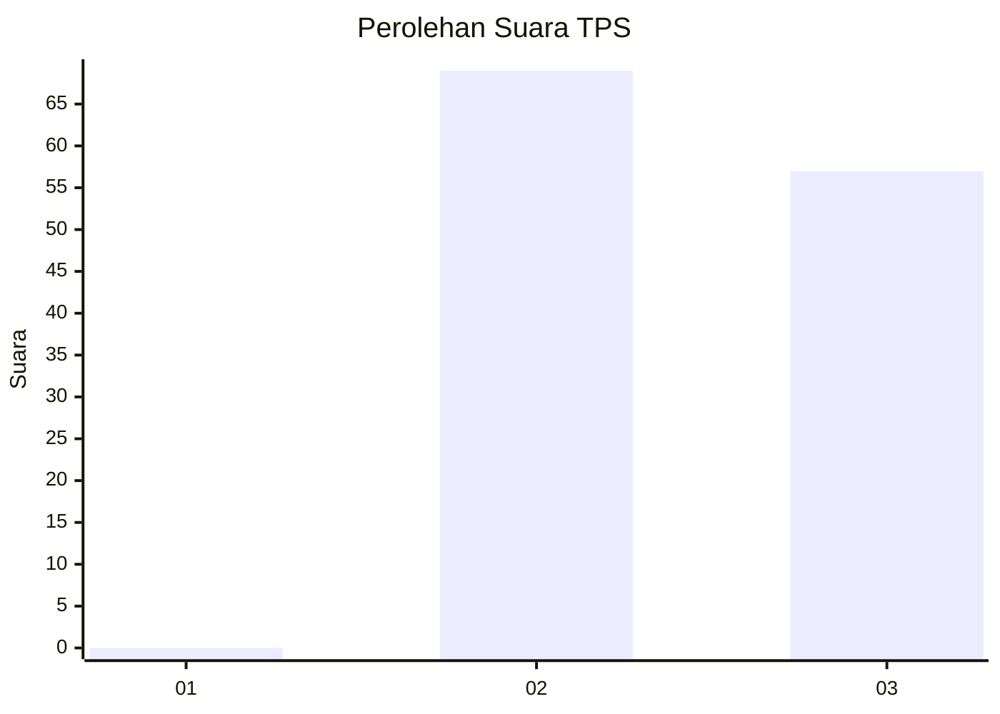
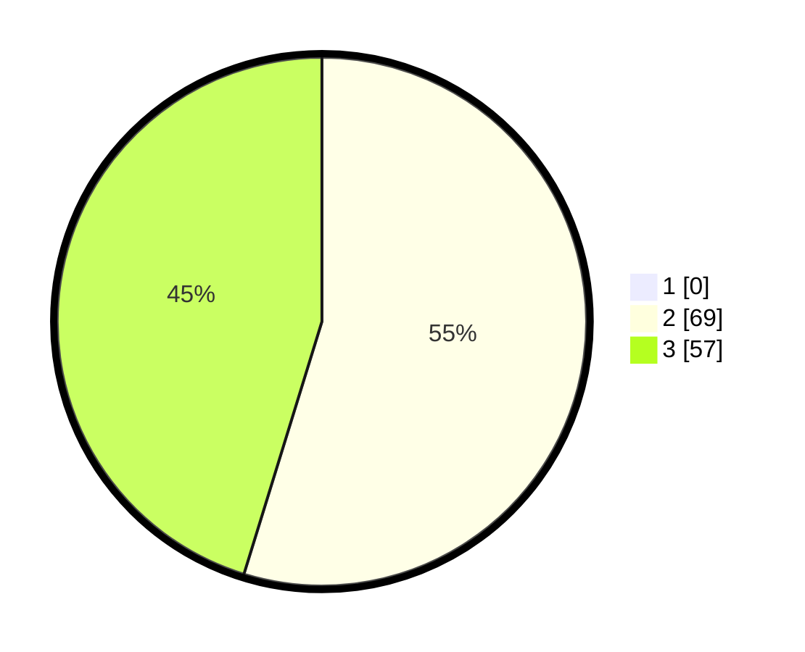

# Hasil

## Grafik

## Tabel

| No. | Nama Paslon    | Suara | Suara (raw) | Persentase |
|:--- |:-------------- | -----:| -----------:| ----------:|
| 1   | ANIES MUHAIMIN | 0     | [0][p-1]    | 0,00       |
| 2   | PRABOWO GIBRAN | 69    | [69][p-2]   | 54,76      |
| 3   | GANJAR MAHFUD  | 57    | [57][p-3]   | 45,24      |

[p-1]: https://github.com/gigit-pemilu/pemilu-2024-12-sumatera-utara/blob/main/pilpres/hitung-suara/sub/12-sumatera-utara/sub/04-nias/sub/20-hiliserangkai/sub/2002-lolofaoso-lalai/sub/001-tps/sub/paslon-1.txt
[p-2]: https://github.com/gigit-pemilu/pemilu-2024-12-sumatera-utara/blob/main/pilpres/hitung-suara/sub/12-sumatera-utara/sub/04-nias/sub/20-hiliserangkai/sub/2002-lolofaoso-lalai/sub/001-tps/sub/paslon-2.txt
[p-3]: https://github.com/gigit-pemilu/pemilu-2024-12-sumatera-utara/blob/main/pilpres/hitung-suara/sub/12-sumatera-utara/sub/04-nias/sub/20-hiliserangkai/sub/2002-lolofaoso-lalai/sub/001-tps/sub/paslon-3.txt

## Foto C Plano

https://sirekap-obj-formc.kpu.go.id/d51a/pemilu/ppwp/12/04/20/20/02/1204202002001-20240220-120818--ebd94d8c-2999-4f13-972d-700a6e5a11ba.jpg

https://sirekap-obj-formc.kpu.go.id/d51a/pemilu/ppwp/12/04/20/20/02/1204202002001-20240220-120933--2c9c49e6-4442-4d0f-bb14-4c499455a275.jpg

https://sirekap-obj-formc.kpu.go.id/d51a/pemilu/ppwp/12/04/20/20/02/1204202002001-20240220-121053--bea9f5f1-52b5-4fad-be7c-f89255daa715.jpg

## Metadata

| Key        | Value               |
| ---------- | ------------------- |
| Time Stamp | 2024-02-24 23:00:00 |

