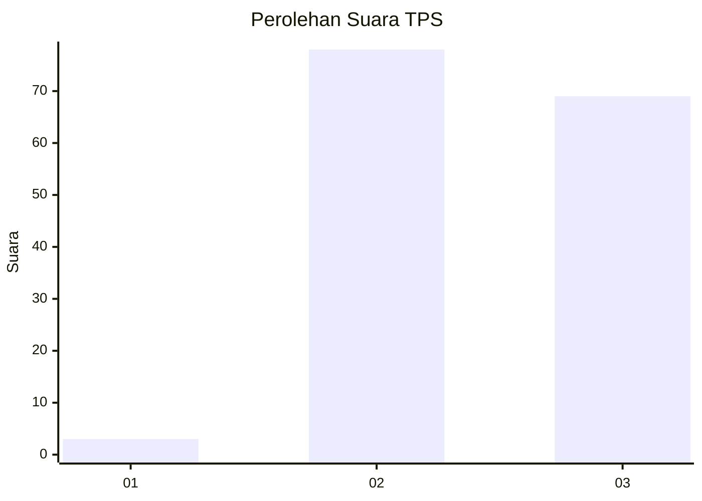
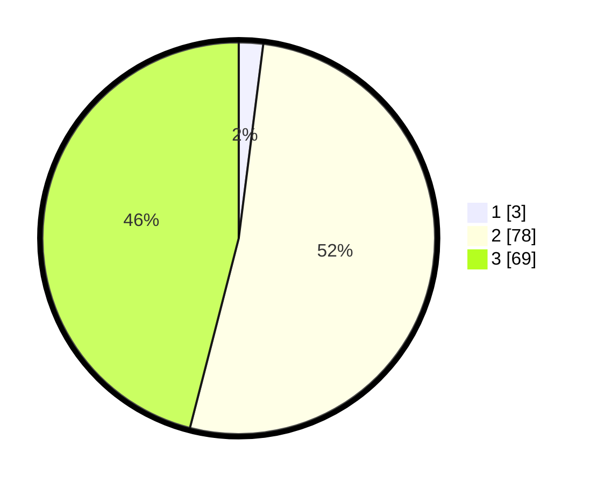

# Hasil

## Grafik

## Tabel

| No. | Nama Paslon    | Suara | Suara (raw) | Persentase |
|:--- |:-------------- | -----:| -----------:| ----------:|
| 1   | ANIES MUHAIMIN | 3     | [3][p-1]    | 2,00       |
| 2   | PRABOWO GIBRAN | 78    | [78][p-2]   | 52,00      |
| 3   | GANJAR MAHFUD  | 69    | [69][p-3]   | 46,00      |

[p-1]: https://github.com/gigit-pemilu/pemilu-2024-12-sumatera-utara/blob/main/pilpres/hitung-suara/sub/12-sumatera-utara/sub/04-nias/sub/20-hiliserangkai/sub/2002-lolofaoso-lalai/sub/003-tps/sub/paslon-1.txt
[p-2]: https://github.com/gigit-pemilu/pemilu-2024-12-sumatera-utara/blob/main/pilpres/hitung-suara/sub/12-sumatera-utara/sub/04-nias/sub/20-hiliserangkai/sub/2002-lolofaoso-lalai/sub/003-tps/sub/paslon-2.txt
[p-3]: https://github.com/gigit-pemilu/pemilu-2024-12-sumatera-utara/blob/main/pilpres/hitung-suara/sub/12-sumatera-utara/sub/04-nias/sub/20-hiliserangkai/sub/2002-lolofaoso-lalai/sub/003-tps/sub/paslon-3.txt

## Foto C Plano

https://sirekap-obj-formc.kpu.go.id/e8bb/pemilu/ppwp/12/04/20/20/02/1204202002003-20240220-121518--f3ad924b-40a0-40a8-95cc-f844b83b620c.jpg

https://sirekap-obj-formc.kpu.go.id/e8bb/pemilu/ppwp/12/04/20/20/02/1204202002003-20240220-121613--db42c632-d288-4122-bd35-0ccdde23fb9b.jpg

https://sirekap-obj-formc.kpu.go.id/e8bb/pemilu/ppwp/12/04/20/20/02/1204202002003-20240220-121708--0da4b15f-f130-41b7-ac93-ac9b5626f4b2.jpg

## Metadata

| Key        | Value               |
| ---------- | ------------------- |
| Time Stamp | 2024-02-24 22:31:28 |

