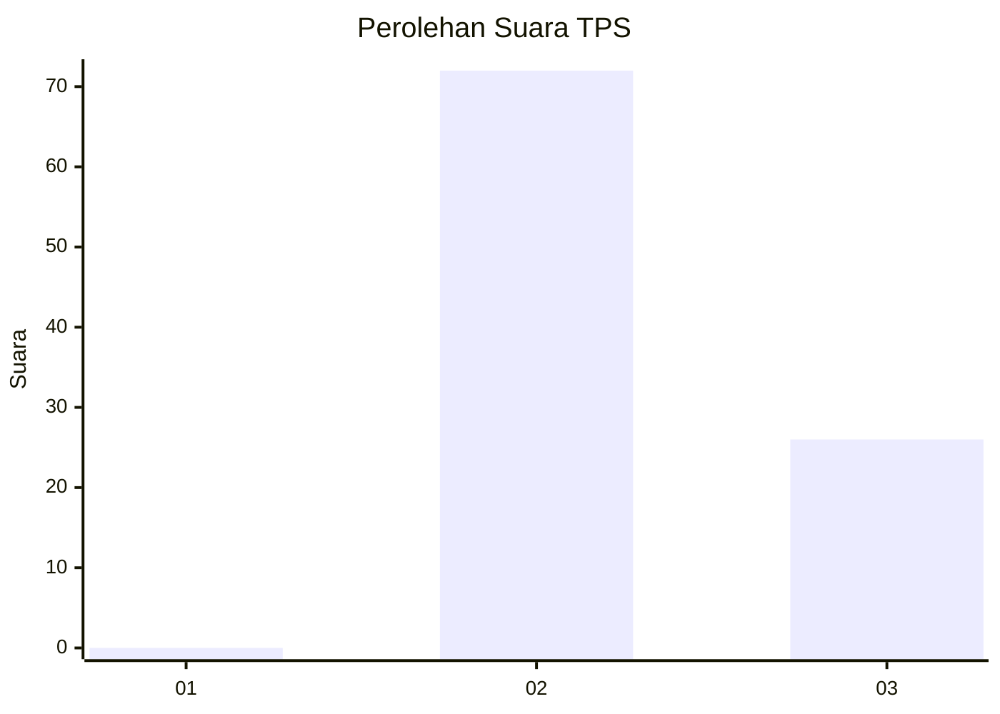
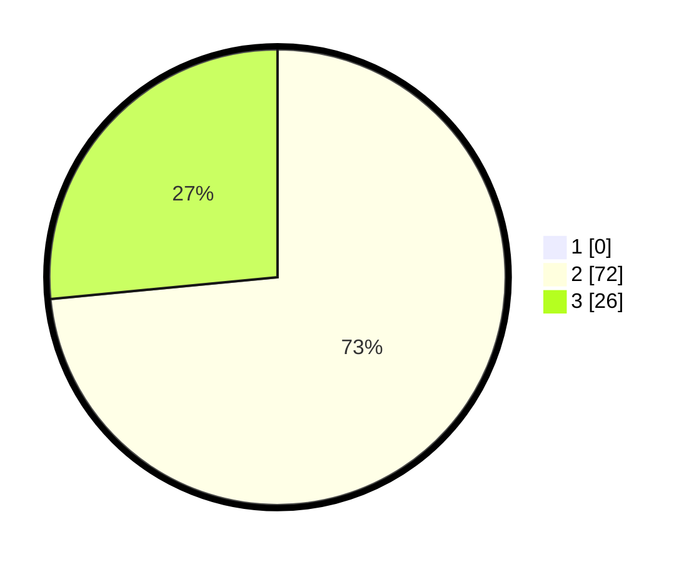

# Hasil

## Grafik

## Tabel

| No. | Nama Paslon    | Suara | Suara (raw) | Persentase |
|:--- |:-------------- | -----:| -----------:| ----------:|
| 1   | ANIES MUHAIMIN | 0     | [0][p-1]    | 0,00       |
| 2   | PRABOWO GIBRAN | 72    | [72][p-2]   | 73,47      |
| 3   | GANJAR MAHFUD  | 26    | [26][p-3]   | 26,53      |

[p-1]: https://github.com/gigit-pemilu/pemilu-2024-12-sumatera-utara/blob/main/pilpres/hitung-suara/sub/12-sumatera-utara/sub/04-nias/sub/20-hiliserangkai/sub/2008-fadoro-lalai/sub/001-tps/sub/paslon-1.txt
[p-2]: https://github.com/gigit-pemilu/pemilu-2024-12-sumatera-utara/blob/main/pilpres/hitung-suara/sub/12-sumatera-utara/sub/04-nias/sub/20-hiliserangkai/sub/2008-fadoro-lalai/sub/001-tps/sub/paslon-2.txt
[p-3]: https://github.com/gigit-pemilu/pemilu-2024-12-sumatera-utara/blob/main/pilpres/hitung-suara/sub/12-sumatera-utara/sub/04-nias/sub/20-hiliserangkai/sub/2008-fadoro-lalai/sub/001-tps/sub/paslon-3.txt

## Foto C Plano

https://sirekap-obj-formc.kpu.go.id/6138/pemilu/ppwp/12/04/20/20/08/1204202008001-20240214-224056--6e147b5b-bc2f-4e60-8b5f-5345a7a6ace0.jpg

https://sirekap-obj-formc.kpu.go.id/6138/pemilu/ppwp/12/04/20/20/08/1204202008001-20240214-224535--4971093e-5504-4768-b0d4-554add8f5f3e.jpg

## Metadata

| Key        | Value               |
| ---------- | ------------------- |
| Time Stamp | 2024-02-25 21:00:00 |

