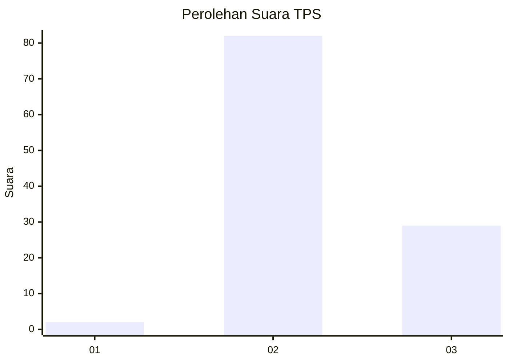
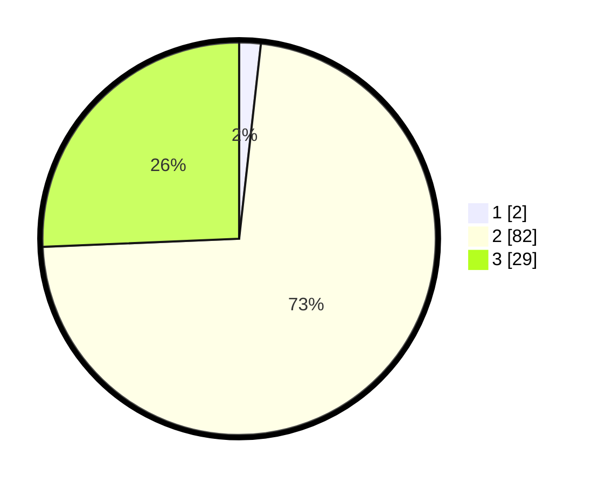

# Hasil

## Grafik

## Tabel

| No. | Nama Paslon    | Suara | Suara (raw) | Persentase |
|:--- |:-------------- | -----:| -----------:| ----------:|
| 1   | ANIES MUHAIMIN | 2     | [2][p-1]    | 1,77       |
| 2   | PRABOWO GIBRAN | 82    | [82][p-2]   | 72,57      |
| 3   | GANJAR MAHFUD  | 29    | [29][p-3]   | 25,66      |

[p-1]: https://github.com/gigit-pemilu/pemilu-2024/blob/main/pilpres/hitung-suara/sub/12-sumatera-utara/sub/04-nias/sub/20-hiliserangkai/sub/2013-onombongi/sub/001-tps/sub/paslon-1.txt
[p-2]: https://github.com/gigit-pemilu/pemilu-2024/blob/main/pilpres/hitung-suara/sub/12-sumatera-utara/sub/04-nias/sub/20-hiliserangkai/sub/2013-onombongi/sub/001-tps/sub/paslon-2.txt
[p-3]: https://github.com/gigit-pemilu/pemilu-2024/blob/main/pilpres/hitung-suara/sub/12-sumatera-utara/sub/04-nias/sub/20-hiliserangkai/sub/2013-onombongi/sub/001-tps/sub/paslon-3.txt

## Foto C Plano

https://sirekap-obj-formc.kpu.go.id/3806/pemilu/ppwp/12/04/20/20/13/1204202013001-20240215-032521--f04ad060-e555-4ae7-aefa-48935f3e305c.jpg

https://sirekap-obj-formc.kpu.go.id/3806/pemilu/ppwp/12/04/20/20/13/1204202013001-20240215-032948--da41d10d-7ba7-4e63-a23d-de46270816e2.jpg

https://sirekap-obj-formc.kpu.go.id/3806/pemilu/ppwp/12/04/20/20/13/1204202013001-20240215-033016--dcc5bdf5-1459-4397-a1a4-45371459971f.jpg

## Metadata

| Key        | Value               |
| ---------- | ------------------- |
| Time Stamp | 2024-02-16 00:30:27 |

