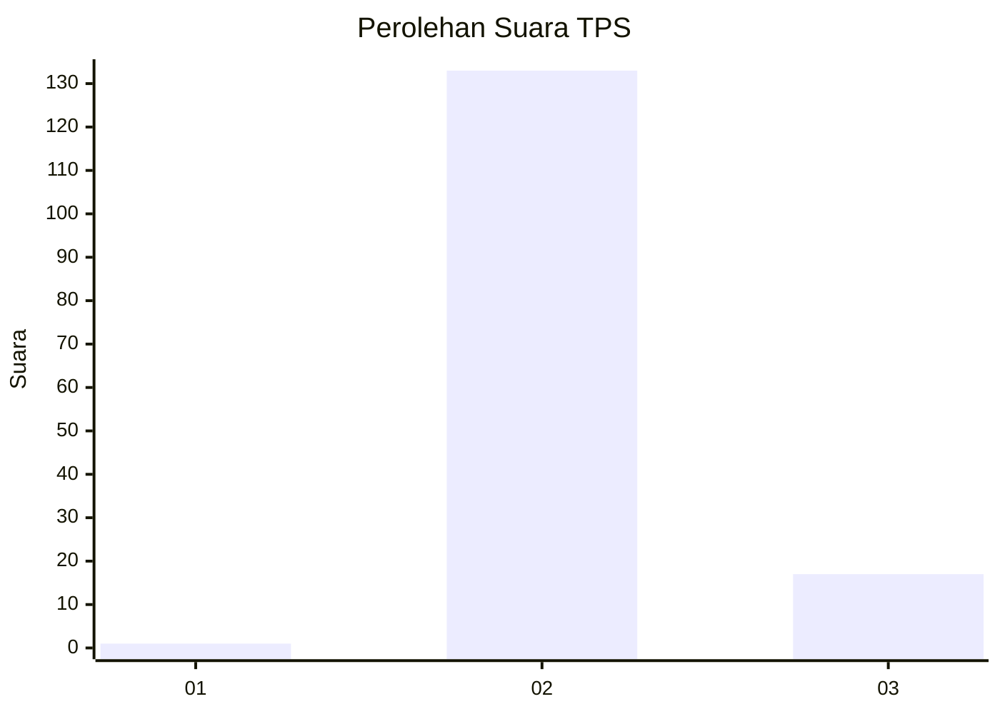
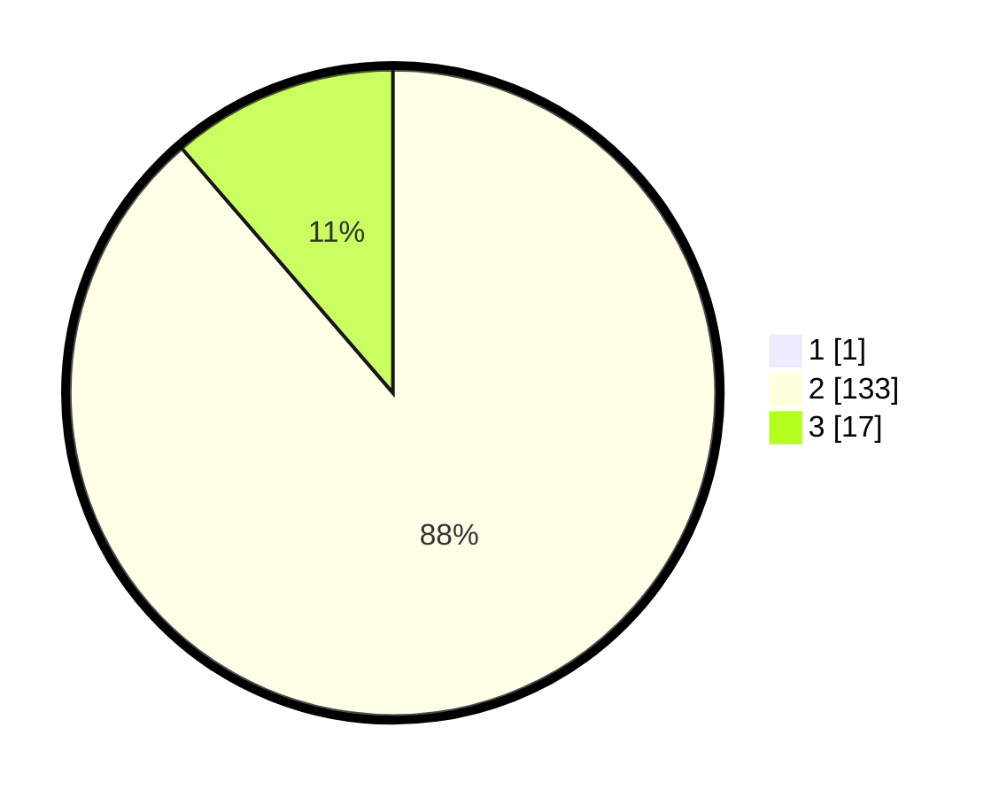

# Hasil

## Grafik

## Tabel

| No. | Nama Paslon    | Suara | Suara (raw) | Persentase |
|:--- |:-------------- | -----:| -----------:| ----------:|
| 1   | ANIES MUHAIMIN | 1     | [1][p-1]    | 0,66       |
| 2   | PRABOWO GIBRAN | 133   | [133][p-2]  | 88,08      |
| 3   | GANJAR MAHFUD  | 17    | [17][p-3]   | 11,26      |

[p-1]: https://github.com/gigit-pemilu/pemilu-2024-12-sumatera-utara/blob/main/pilpres/hitung-suara/sub/12-sumatera-utara/sub/04-nias/sub/21-botomuzoi/sub/2002-lasara-botomuzoi/sub/001-tps/sub/paslon-1.txt
[p-2]: https://github.com/gigit-pemilu/pemilu-2024-12-sumatera-utara/blob/main/pilpres/hitung-suara/sub/12-sumatera-utara/sub/04-nias/sub/21-botomuzoi/sub/2002-lasara-botomuzoi/sub/001-tps/sub/paslon-2.txt
[p-3]: https://github.com/gigit-pemilu/pemilu-2024-12-sumatera-utara/blob/main/pilpres/hitung-suara/sub/12-sumatera-utara/sub/04-nias/sub/21-botomuzoi/sub/2002-lasara-botomuzoi/sub/001-tps/sub/paslon-3.txt

## Foto C Plano

https://sirekap-obj-formc.kpu.go.id/2f7f/pemilu/ppwp/12/04/21/20/02/1204212002001-20240215-004510--3e90ba79-b535-4fa4-aa42-7b64c1f624a9.jpg

https://sirekap-obj-formc.kpu.go.id/2f7f/pemilu/ppwp/12/04/21/20/02/1204212002001-20240215-004633--658a964b-c739-4736-9595-2174980a802a.jpg

https://sirekap-obj-formc.kpu.go.id/2f7f/pemilu/ppwp/12/04/21/20/02/1204212002001-20240215-004756--309a8209-89eb-4726-9559-b2ea151d6aa9.jpg

## Metadata

| Key        | Value               |
| ---------- | ------------------- |
| Time Stamp | 2024-02-16 00:00:26 |

