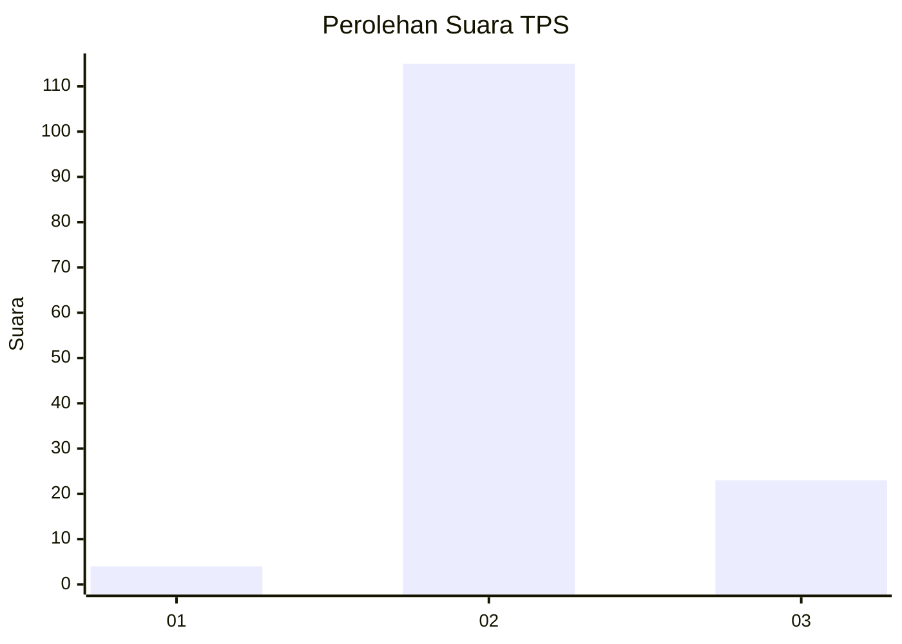
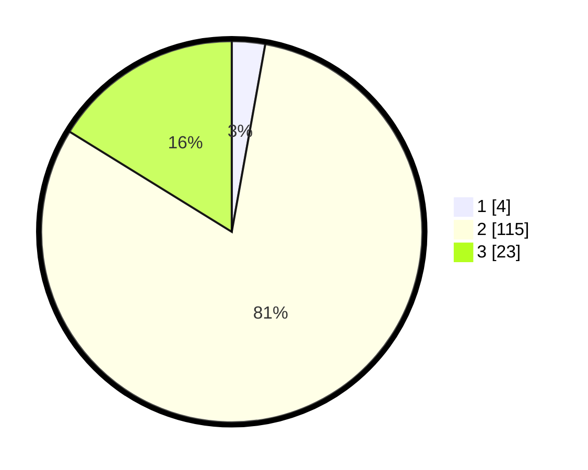

# Hasil

## Grafik

## Tabel

| No. | Nama Paslon    | Suara | Suara (raw) | Persentase |
|:--- |:-------------- | -----:| -----------:| ----------:|
| 1   | ANIES MUHAIMIN | 4     | [4][p-1]    | 2,82       |
| 2   | PRABOWO GIBRAN | 115   | [115][p-2]  | 80,99      |
| 3   | GANJAR MAHFUD  | 23    | [23][p-3]   | 16,20      |

[p-1]: https://github.com/gigit-pemilu/pemilu-2024-12-sumatera-utara/blob/main/pilpres/hitung-suara/sub/12-sumatera-utara/sub/04-nias/sub/21-botomuzoi/sub/2009-hilihambawa-botomuzoi/sub/001-tps/sub/paslon-1.txt
[p-2]: https://github.com/gigit-pemilu/pemilu-2024-12-sumatera-utara/blob/main/pilpres/hitung-suara/sub/12-sumatera-utara/sub/04-nias/sub/21-botomuzoi/sub/2009-hilihambawa-botomuzoi/sub/001-tps/sub/paslon-2.txt
[p-3]: https://github.com/gigit-pemilu/pemilu-2024-12-sumatera-utara/blob/main/pilpres/hitung-suara/sub/12-sumatera-utara/sub/04-nias/sub/21-botomuzoi/sub/2009-hilihambawa-botomuzoi/sub/001-tps/sub/paslon-3.txt

## Foto C Plano

https://sirekap-obj-formc.kpu.go.id/fce1/pemilu/ppwp/12/04/21/20/09/1204212009001-20240215-060357--0862a03b-92f7-4ff3-9fb3-3750e60378e8.jpg

https://sirekap-obj-formc.kpu.go.id/fce1/pemilu/ppwp/12/04/21/20/09/1204212009001-20240215-060632--97646b5b-7dd8-4812-98e9-13993af1a58b.jpg

https://sirekap-obj-formc.kpu.go.id/fce1/pemilu/ppwp/12/04/21/20/09/1204212009001-20240215-060847--e279e1a3-8a69-4377-bd07-969e7de96a05.jpg

## Metadata

| Key        | Value               |
| ---------- | ------------------- |
| Time Stamp | 2024-02-15 15:30:25 |

