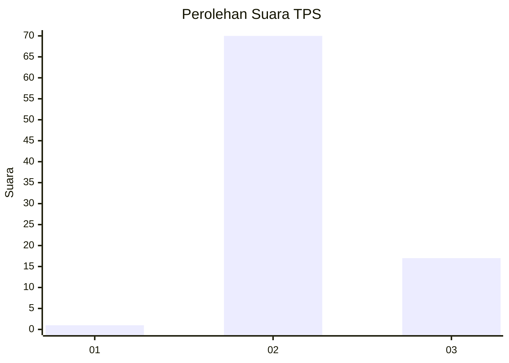
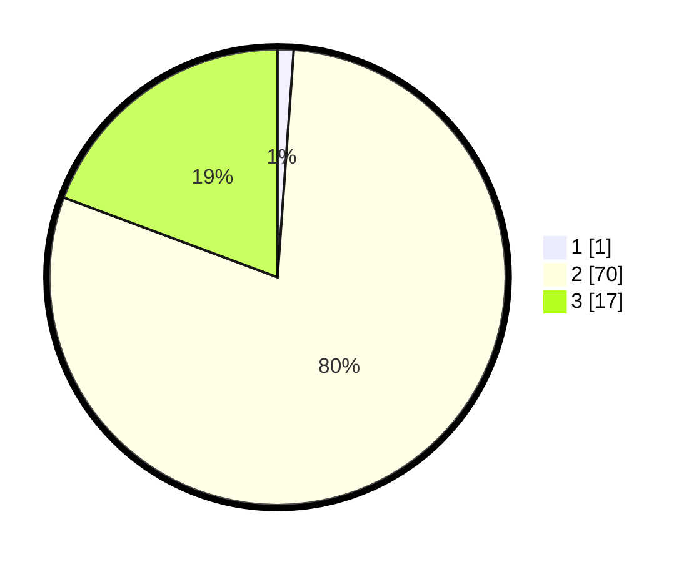

# Hasil

## Grafik

## Tabel

| No. | Nama Paslon    | Suara | Suara (raw) | Persentase |
|:--- |:-------------- | -----:| -----------:| ----------:|
| 1   | ANIES MUHAIMIN | 1     | [1][p-1]    | 1,14       |
| 2   | PRABOWO GIBRAN | 70    | [70][p-2]   | 79,55      |
| 3   | GANJAR MAHFUD  | 17    | [17][p-3]   | 19,32      |

[p-1]: https://github.com/gigit-pemilu/pemilu-2024-12-sumatera-utara/blob/main/pilpres/hitung-suara/sub/12-sumatera-utara/sub/04-nias/sub/21-botomuzoi/sub/2017-talafu/sub/002-tps/sub/paslon-1.txt
[p-2]: https://github.com/gigit-pemilu/pemilu-2024-12-sumatera-utara/blob/main/pilpres/hitung-suara/sub/12-sumatera-utara/sub/04-nias/sub/21-botomuzoi/sub/2017-talafu/sub/002-tps/sub/paslon-2.txt
[p-3]: https://github.com/gigit-pemilu/pemilu-2024-12-sumatera-utara/blob/main/pilpres/hitung-suara/sub/12-sumatera-utara/sub/04-nias/sub/21-botomuzoi/sub/2017-talafu/sub/002-tps/sub/paslon-3.txt

## Foto C Plano

https://sirekap-obj-formc.kpu.go.id/93a3/pemilu/ppwp/12/04/21/20/17/1204212017002-20240214-141041--e45c4b48-b5a1-4bea-86b3-cf59ccf766d2.jpg

https://sirekap-obj-formc.kpu.go.id/93a3/pemilu/ppwp/12/04/21/20/17/1204212017002-20240214-141210--51b8cb7d-da6a-4eb5-a6df-36a968620fcc.jpg

https://sirekap-obj-formc.kpu.go.id/93a3/pemilu/ppwp/12/04/21/20/17/1204212017002-20240214-141325--98a3189e-a6b8-470b-a210-c0ddda869e32.jpg

## Metadata

| Key        | Value               |
| ---------- | ------------------- |
| Time Stamp | 2024-02-14 21:46:01 |

