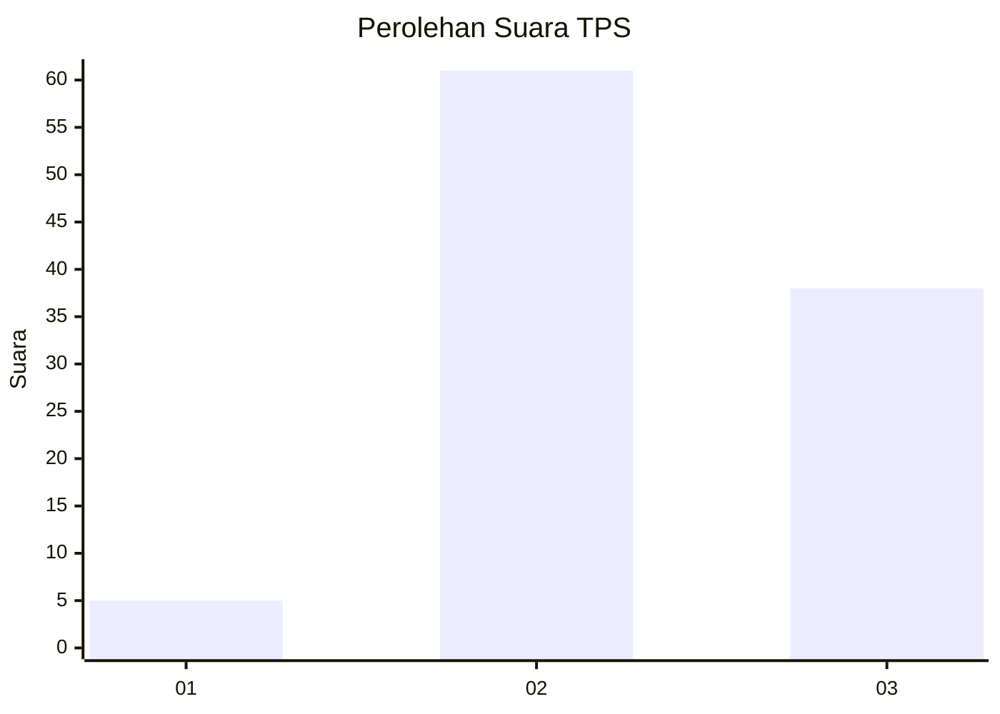
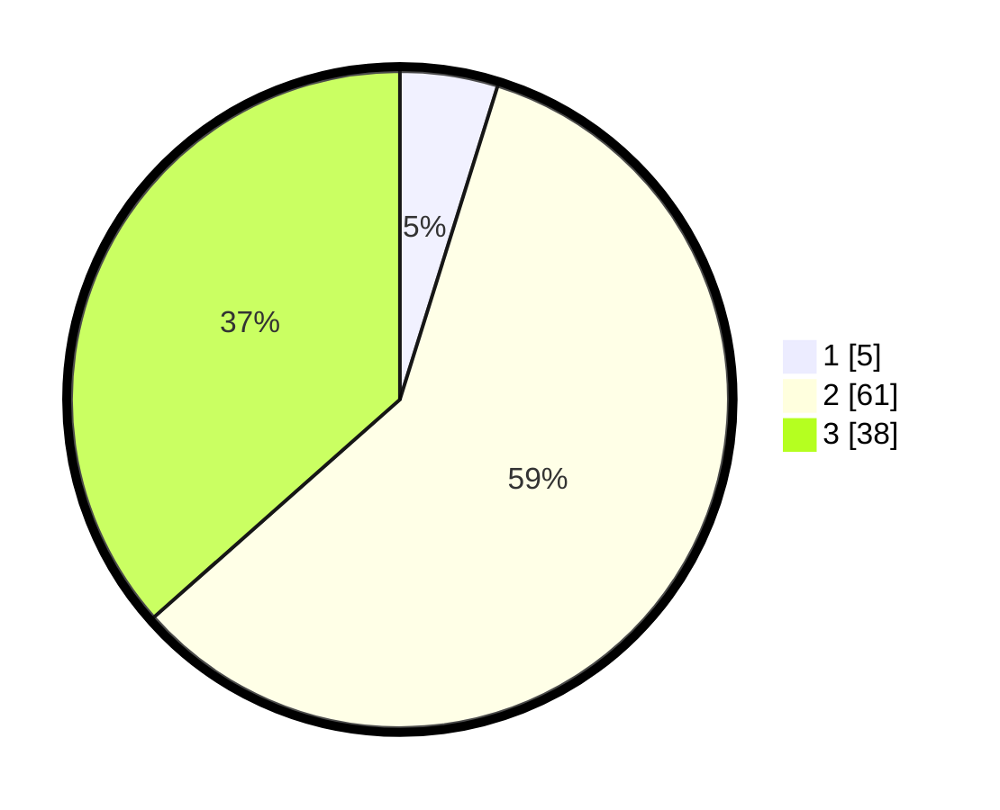

# Hasil

## Grafik

## Tabel

| No. | Nama Paslon    | Suara | Suara (raw) | Persentase |
|:--- |:-------------- | -----:| -----------:| ----------:|
| 1   | ANIES MUHAIMIN | 5     | [5][p-1]    | 4,81       |
| 2   | PRABOWO GIBRAN | 61    | [61][p-2]   | 58,65      |
| 3   | GANJAR MAHFUD  | 38    | [38][p-3]   | 36,54      |

[p-1]: https://github.com/gigit-pemilu/pemilu-2024-12-sumatera-utara/blob/main/pilpres/hitung-suara/sub/12-sumatera-utara/sub/04-nias/sub/21-botomuzoi/sub/2017-talafu/sub/003-tps/sub/paslon-1.txt
[p-2]: https://github.com/gigit-pemilu/pemilu-2024-12-sumatera-utara/blob/main/pilpres/hitung-suara/sub/12-sumatera-utara/sub/04-nias/sub/21-botomuzoi/sub/2017-talafu/sub/003-tps/sub/paslon-2.txt
[p-3]: https://github.com/gigit-pemilu/pemilu-2024-12-sumatera-utara/blob/main/pilpres/hitung-suara/sub/12-sumatera-utara/sub/04-nias/sub/21-botomuzoi/sub/2017-talafu/sub/003-tps/sub/paslon-3.txt

## Foto C Plano

https://sirekap-obj-formc.kpu.go.id/5447/pemilu/ppwp/12/04/21/20/17/1204212017003-20240214-141740--77a77200-aa47-4749-99e2-6c078c4cd2f4.jpg

https://sirekap-obj-formc.kpu.go.id/5447/pemilu/ppwp/12/04/21/20/17/1204212017003-20240214-140954--f14d72ce-02e6-4b50-a581-75b70251decb.jpg

https://sirekap-obj-formc.kpu.go.id/5447/pemilu/ppwp/12/04/21/20/17/1204212017003-20240214-141220--d0221f98-41be-4eb6-943d-7d7405c4cdb3.jpg

## Metadata

| Key        | Value               |
| ---------- | ------------------- |
| Time Stamp | 2024-02-14 21:46:01 |

