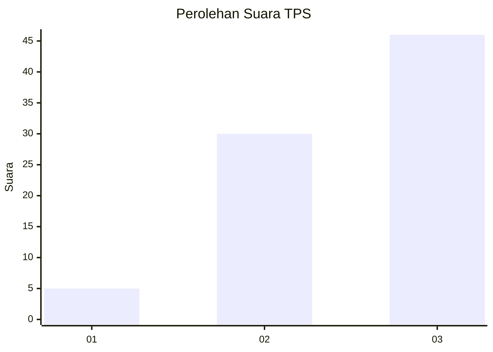
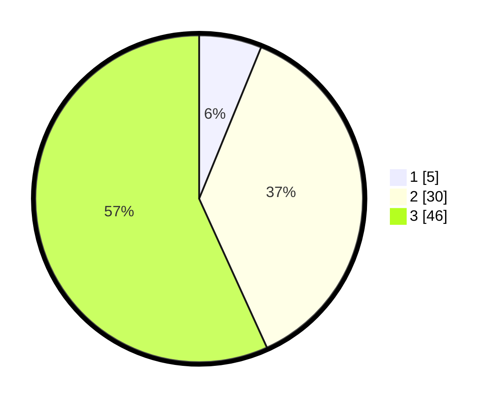

# Hasil

## Grafik

## Tabel

| No. | Nama Paslon    | Suara | Suara (raw) | Persentase |
|:--- |:-------------- | -----:| -----------:| ----------:|
| 1   | ANIES MUHAIMIN | 5     | [5][p-1]    | 6,17       |
| 2   | PRABOWO GIBRAN | 30    | [30][p-2]   | 37,04      |
| 3   | GANJAR MAHFUD  | 46    | [46][p-3]   | 56,79      |

[p-1]: https://github.com/gigit-pemilu/pemilu-2024/blob/main/pilpres/hitung-suara/sub/12-sumatera-utara/sub/04-nias/sub/27-ulugawo/sub/2004-hilimbowo/sub/004-tps/sub/paslon-1.txt
[p-2]: https://github.com/gigit-pemilu/pemilu-2024/blob/main/pilpres/hitung-suara/sub/12-sumatera-utara/sub/04-nias/sub/27-ulugawo/sub/2004-hilimbowo/sub/004-tps/sub/paslon-2.txt
[p-3]: https://github.com/gigit-pemilu/pemilu-2024/blob/main/pilpres/hitung-suara/sub/12-sumatera-utara/sub/04-nias/sub/27-ulugawo/sub/2004-hilimbowo/sub/004-tps/sub/paslon-3.txt

## Foto C Plano

https://sirekap-obj-formc.kpu.go.id/16d9/pemilu/ppwp/12/04/27/20/04/1204272004004-20240215-095758--e26c43a1-4fdd-4cf5-b16e-0fc7baf41ce5.jpg

https://sirekap-obj-formc.kpu.go.id/16d9/pemilu/ppwp/12/04/27/20/04/1204272004004-20240215-100040--15f1a895-a933-425c-a8fd-ec1039f02e18.jpg

https://sirekap-obj-formc.kpu.go.id/16d9/pemilu/ppwp/12/04/27/20/04/1204272004004-20240215-100240--b5bd7199-cb3e-47df-b63d-19882cae97ab.jpg

## Metadata

| Key        | Value               |
| ---------- | ------------------- |
| Time Stamp | 2024-02-15 15:30:25 |

