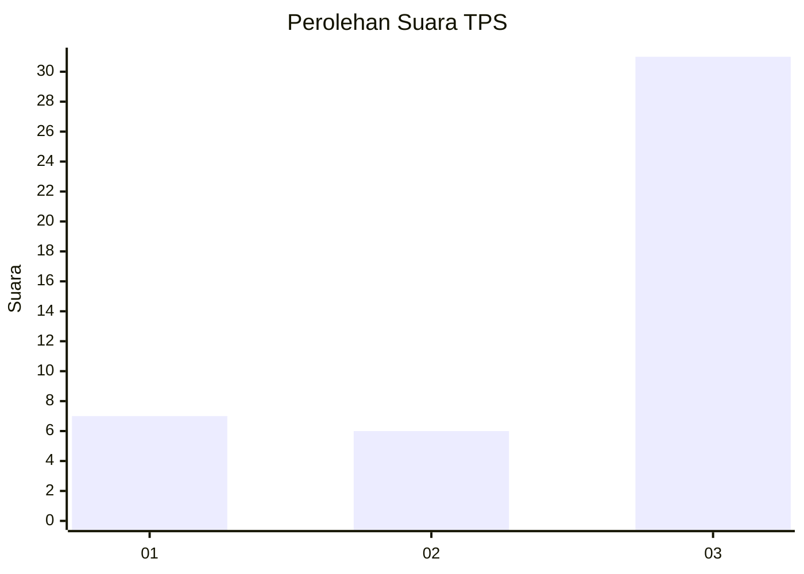
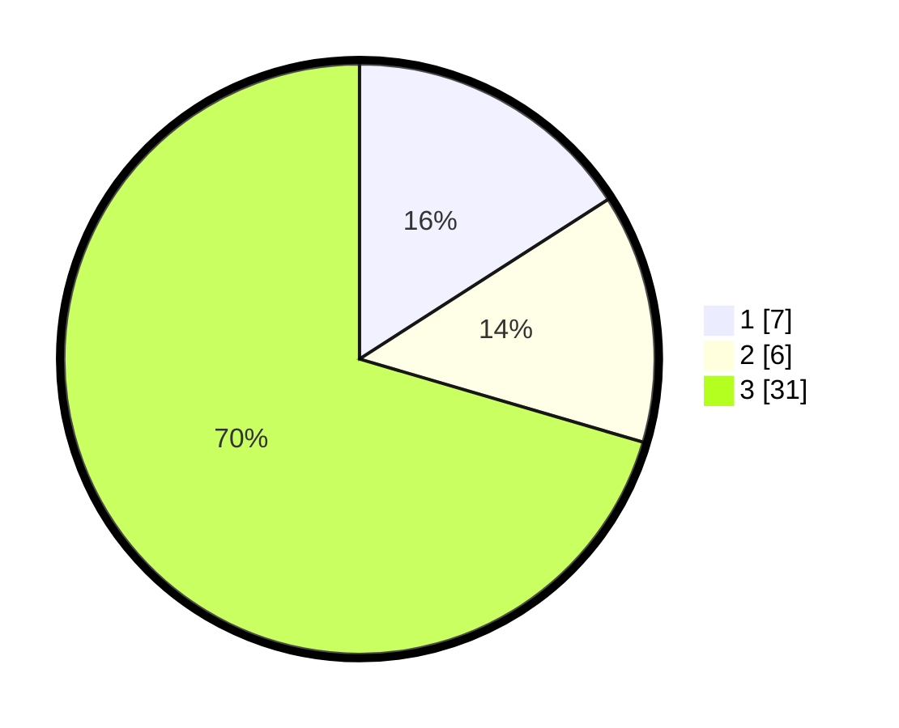

# Hasil

## Grafik

## Tabel

| No. | Nama Paslon    | Suara | Suara (raw) | Persentase |
|:--- |:-------------- | -----:| -----------:| ----------:|
| 1   | ANIES MUHAIMIN | 7     | [7][p-1]    | 15,91      |
| 2   | PRABOWO GIBRAN | 6     | [6][p-2]    | 13,64      |
| 3   | GANJAR MAHFUD  | 31    | [31][p-3]   | 70,45      |

[p-1]: https://github.com/gigit-pemilu/pemilu-2024-12-sumatera-utara/blob/main/pilpres/hitung-suara/sub/12-sumatera-utara/sub/04-nias/sub/27-ulugawo/sub/2005-hilibadalu/sub/002-tps/sub/paslon-1.txt
[p-2]: https://github.com/gigit-pemilu/pemilu-2024-12-sumatera-utara/blob/main/pilpres/hitung-suara/sub/12-sumatera-utara/sub/04-nias/sub/27-ulugawo/sub/2005-hilibadalu/sub/002-tps/sub/paslon-2.txt
[p-3]: https://github.com/gigit-pemilu/pemilu-2024-12-sumatera-utara/blob/main/pilpres/hitung-suara/sub/12-sumatera-utara/sub/04-nias/sub/27-ulugawo/sub/2005-hilibadalu/sub/002-tps/sub/paslon-3.txt

## Foto C Plano

https://sirekap-obj-formc.kpu.go.id/5e79/pemilu/ppwp/12/04/27/20/05/1204272005002-20240214-224011--52687c34-cfe6-4754-bd5c-3c64acc88db9.jpg

https://sirekap-obj-formc.kpu.go.id/5e79/pemilu/ppwp/12/04/27/20/05/1204272005002-20240214-224404--29da1801-9fd9-4638-9c65-0ef3ba8d7489.jpg

https://sirekap-obj-formc.kpu.go.id/5e79/pemilu/ppwp/12/04/27/20/05/1204272005002-20240214-224658--d1011496-2afc-44ad-bba7-2b44f3d67d51.jpg

## Metadata

| Key        | Value               |
| ---------- | ------------------- |
| Time Stamp | 2024-02-25 22:00:00 |

